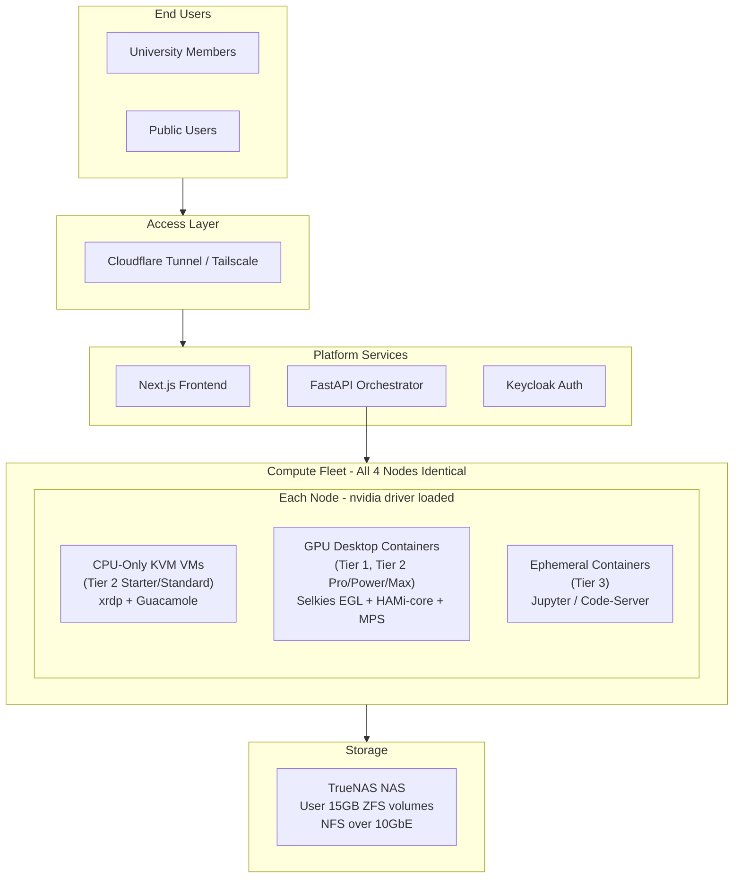

# Fractional GPU Desktop Architecture -- The Differentiator

---

## The Breakthrough: What Was Found

Three technologies, when combined, unlock the user's original vision of fractional GPU tiers for GUI desktops on consumer RTX 5090 GPUs:

### 1. Selkies docker-nvidia-egl-desktop (GPU-Shared Desktop Containers)

- [selkies-project/docker-nvidia-egl-desktop](https://github.com/selkies-project/docker-nvidia-egl-desktop) -- open-source, 325+ stars
- Full KDE Plasma desktop running inside a Docker container
- Uses **VirtualGL with EGL backend** for GPU-accelerated OpenGL/Vulkan rendering
- **Explicitly supports sharing one GPU with many containers simultaneously** (confirmed in project README: "the EGL variant supports sharing one GPU with many containers")
- Streams to the user's browser via **WebRTC** (Selkies-GStreamer) -- no client install, 60fps+ at 1080p
- Uses **NVENC** for hardware-accelerated video encoding of the desktop stream
- Does NOT require host X11 sockets or host-side display configuration
- Requires: NVIDIA driver 450.80.02+ on host, NVIDIA Container Toolkit
- Used in production at: NRP Nautilus (national research platform), universities, HPC clusters

### 2. HAMi-core (libvgpu.so) -- CUDA API Interception for VRAM Limits

- Intercepts `cuMemAlloc` to enforce hard VRAM allocation limits per container
- Intercepts `cuLaunchKernel` for compute rate-limiting per container
- Works standalone with Docker via LD_PRELOAD (no Kubernetes required)
- Confirmed working on consumer GeForce GPUs
- Shows correct limited VRAM in `nvidia-smi` inside the container

### 3. CUDA MPS -- Compute Partitioning

- `CUDA_MPS_PINNED_DEVICE_MEM_LIMIT` for VRAM caps per client
- `CUDA_MPS_ACTIVE_THREAD_PERCENTAGE` for SM partitioning (170 SMs on RTX 5090)
- Volta+ isolated GPU virtual address spaces per client
- Works on consumer GPUs (compute capability 3.5+ requirement met by RTX 5090)

### Combined, these deliver:

Multiple concurrent GPU-accelerated full Linux GUI desktops on a single RTX 5090, each with individually enforced VRAM limits (4GB, 8GB, 16GB, or full 32GB), streaming to the user's browser -- with persistent user storage via NFS.

---

## Revised Architecture

### Eliminating the D3cold Bug Entirely

A major architectural simplification: **all 4 nodes keep the NVIDIA driver loaded on the host at all times.** No vfio-pci mode, no GPU driver mode switching, no D3cold power management bug.

- Tier 1 (Full Machine) uses a container with **exclusive GPU access** (only container allowed on that GPU, 100% VRAM, 100% SM) rather than VM + GPU passthrough
- All GPU tiers (Pro/Power/Max/Full Machine) run as Selkies EGL Desktop containers
- CPU-only tiers (Starter/Standard) run as KVM VMs (strongest isolation, no GPU involvement)




### Node Configuration (All 4 Nodes Identical)

Every node runs:

- Proxmox VE as hypervisor
- NVIDIA driver loaded on host (no vfio-pci)
- nvidia-container-toolkit for Docker GPU access
- CUDA MPS control daemon
- Docker for GPU containers (Selkies EGL Desktop + ephemeral)
- KVM for CPU-only VMs

No static node-role assignment needed. Any node can serve any tier. The orchestrator dynamically places workloads based on current GPU/CPU availability.

---

## Revised Compute Configuration Table (Original Vision Restored)

**Stateful GUI Desktop Configs:**

- **Starter**: 2 vCPU, 4GB RAM, No GPU. KVM VM + xrdp/Guacamole. VM-level isolation.
- **Standard**: 4 vCPU, 8GB RAM, No GPU. KVM VM + xrdp/Guacamole. VM-level isolation.
- **Pro**: 4 vCPU, 8GB RAM, **4GB VRAM**. Selkies EGL container + HAMi-core + MPS. Container-level isolation.
- **Power**: 8 vCPU, 16GB RAM, **8GB VRAM**. Selkies EGL container + HAMi-core + MPS. Container-level isolation.
- **Max**: 8 vCPU, 16GB RAM, **16GB VRAM**. Selkies EGL container + HAMi-core + MPS. Container-level isolation.
- **Full Machine**: 16 vCPU, 48GB RAM, **32GB VRAM (exclusive)**. Selkies EGL container, sole GPU user on node. Container-level isolation.

**Ephemeral Compute Configs:**

- **Ephemeral CPU**: 2 vCPU, 4GB RAM, No GPU. Container.
- **Ephemeral GPU-S/M/L**: Same fractional GPU approach via containers + HAMi-core + MPS.

---

## How a GPU Desktop Session Works (Detailed)

```
User clicks "Launch Pro Session (4 vCPU, 8GB RAM, 4GB VRAM)"
    |
    v
Orchestrator checks fleet for node with sufficient free CPU/RAM + >=4GB free VRAM
    |
    v
Orchestrator starts Docker container on selected node:
    docker run --gpus all \
      --cpus=4 --memory=8g \
      -e CUDA_DEVICE_MEMORY_LIMIT_0=4096m \    # HAMi-core VRAM limit
      -e CUDA_DEVICE_SM_LIMIT=25 \              # HAMi-core compute limit
      -e LD_PRELOAD=/usr/lib/libvgpu.so \       # HAMi-core injection
      -e CUDA_MPS_PINNED_DEVICE_MEM_LIMIT="0=4G" \  # MPS VRAM limit (second layer)
      -e CUDA_MPS_ACTIVE_THREAD_PERCENTAGE=25 \      # MPS SM partition (25% of 170 SMs)
      -e SELKIES_ENCODER=nvh264enc \            # NVENC hardware encoding
      -e SELKIES_BASIC_AUTH_PASSWORD=<token> \   # Session auth
      -v /mnt/nfs/users/<uid>:/home/<uid> \     # Persistent 15GB storage from NAS
      selkies-egl-desktop:ubuntu2204-custom
    |
    v
Container boots KDE Plasma desktop (~5-10 seconds)
VirtualGL initializes EGL backend on shared GPU
Selkies-GStreamer starts WebRTC signaling
NVENC encodes desktop stream at 1080p 60fps
    |
    v
Orchestrator returns WebRTC session URL to frontend
User's browser connects → full GPU-accelerated Linux desktop appears
MATLAB, Blender, Python, all pre-installed software available with GPU acceleration
User sees 4GB VRAM in nvidia-smi (HAMi-core intercepts the display)
```

---

## Isolation Model (Honest Assessment)


| Layer                         | Isolation Type                  | Mechanism                                                                                          |
| ----------------------------- | ------------------------------- | -------------------------------------------------------------------------------------------------- |
| CPU / RAM                     | Hard                            | cgroups v2 (Docker --cpus / --memory)                                                              |
| Filesystem                    | Hard                            | Docker read-only image layers + overlay. User /home on separate NFS mount.                         |
| Process                       | Strong                          | PID namespaces. Users cannot see each other's processes.                                           |
| Network                       | Strong                          | Network namespaces + VLAN. Containers cannot communicate.                                          |
| GPU VRAM allocation           | Enforced (software)             | HAMi-core intercepts cuMemAlloc + MPS PINNED_DEVICE_MEM_LIMIT. Two independent enforcement layers. |
| GPU compute                   | Enforced (software)             | HAMi-core kernel submission limiting + MPS ACTIVE_THREAD_PERCENTAGE.                               |
| GPU virtual address space     | Isolated                        | MPS Volta+ provides per-client isolated GPU address spaces.                                        |
| GPU L2 cache / DRAM bandwidth | Shared                          | Cannot be partitioned on consumer GPUs. Noisy neighbor possible.                                   |
| GPU fatal fault               | Propagates to co-resident users | MPS auto-recovers (Volta+). Watchdog auto-restarts affected containers. User data safe on NAS.     |
| Base software protection      | Absolute                        | Docker read-only image layers. No root/sudo in container.                                          |


### Fault Propagation Risk Assessment

For the actual workloads on this platform (MATLAB, Blender, Python, PyTorch, development tools):

- **OpenGL desktop rendering** (via VirtualGL): Extremely low risk. NVIDIA's OpenGL driver is battle-tested for multi-user rendering. This is the standard mode of operation for HPC visualization clusters.
- **MATLAB GPU computation**: Low risk. MATLAB uses well-tested CUDA libraries (cuBLAS, cuFFT, cuDNN). Fatal faults from MATLAB GPU operations are very rare.
- **Blender GPU rendering**: Low risk. Blender uses OptiX/CUDA through NVIDIA's rendering pipeline. Well-tested.
- **PyTorch/TensorFlow**: Low-medium risk. Standard training loops use tested CUDA operations. Custom CUDA extensions could potentially cause faults.
- **Raw CUDA kernel development**: Medium risk. User-written CUDA kernels are the primary source of fatal GPU faults. Users doing this should use Tier 1 (exclusive GPU).

**Mitigation strategy:**

1. MPS Volta+ auto-recovers after fatal faults (server transitions FAULT -> ACTIVE after affected clients exit)
2. Build a watchdog service that monitors MPS server state, detects FAULT transitions, and auto-restarts affected containers within 30 seconds
3. User data is NEVER at risk (on NAS via NFS, not on local container storage)
4. Affected users see a "GPU session interrupted, relaunching..." message and are back within 30-60 seconds

---

## Why This Is a Genuine Differentiator

No commercial GPU cloud platform (RunPod, Vast.ai, Lambda Labs) offers fractional GPU tiers. They all give exclusive GPU access per user. Research confirmed:

- **RunPod**: "That GPU is exclusively reserved for you" -- one GPU per pod
- **Vast.ai**: "GPUs are exclusive resources and are never shared between multiple users"
- **Lambda Labs**: Dedicated single-tenant model, exclusive GPU access

This platform would be the **first to offer fractional GPU desktop tiers on consumer hardware** for educational/research use. The tradeoff (container-level isolation, GPU fault propagation risk) is acceptable for the target audience (university students, researchers) and is the same model used by university HPC clusters with SLURM + MPS.

---

## Key Architectural Benefits vs. Previous Plan

- **No vfio-pci mode switching**: Eliminates the RTX 5090 D3cold lockup bug entirely
- **No static node roles**: All 4 nodes are identical, flexible scheduling
- **GPU utilization**: 4-8 concurrent GPU users per node instead of 1
- **Original pricing table**: Pro/Power/Max with 4GB/8GB/16GB VRAM tiers become real
- **Simpler infrastructure**: No split between "VM passthrough nodes" and "container shared nodes"

---

## Implementation Steps

### Phase 0 Additions (Burn-in, Weeks 1-3)

1. Build custom Selkies EGL Desktop Docker image based on Ubuntu 22.04 with all proprietary software (MATLAB, Blender, Python, CUDA toolkit, development tools)
2. Test multiple Selkies containers sharing one RTX 5090 GPU simultaneously (target: 4 containers)
3. Build and test HAMi-core (libvgpu.so) with VRAM limits (4GB, 8GB, 16GB)
4. Test CUDA MPS with VRAM limits and SM partitioning alongside HAMi-core
5. Verify VirtualGL GPU-accelerated rendering works correctly with VRAM limits active
6. Verify NVENC encoding works for desktop streaming with multiple concurrent containers
7. Apply nvidia-patch to remove NVENC session limit if needed (12+ concurrent streams)
8. Stress test: run 4 containers (4GB+8GB+8GB+8GB = 28GB of 32GB) for 48+ hours
9. Fault injection: trigger GPU fault in one container, verify others recover via MPS
10. Build MPS watchdog service for auto-recovery

### Phase 1 Additions (Core Infrastructure, Weeks 3-6)

1. All 4 nodes configured identically: NVIDIA driver on host, Docker, nvidia-container-toolkit, CUDA MPS daemon
2. No node-role assignment needed
3. Build orchestrator logic for GPU VRAM accounting (track allocated vs. free VRAM per node)
4. Build container lifecycle: create with HAMi-core + MPS env vars -> start -> NFS mount -> stream -> destroy

