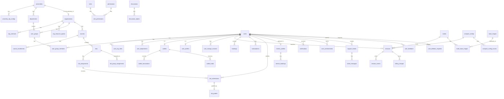

# LaaS Enterprise-Grade Database Design (v3 -- Complete)

## Sources

- [project_context_Beta.txt](project_context_Beta.txt) -- full technical spec
- [Project_Understanding_Document_KSRCE-GKT_AI_Lab-as-a-Service_(LaaS).txt](Project_Understanding_Document_KSRCE-GKT_AI_Lab-as-a-Service_(LaaS).txt) -- business model, revenue streams, all platform features
- [LaaS_Comp/laas_infrastructure_plan_Beta.md](LaaS_Comp/laas_infrastructure_plan_Beta.md) -- nodes, storage, networking
- [Important_docs/LaaS_POC_Runbook_v2.txt](Important_docs/LaaS_POC_Runbook_v2.txt) -- session lifecycle, orchestrator
- [.cursor/plans/laas_tech_stack_365cc328.plan.md](.cursor/plans/laas_tech_stack_365cc328.plan.md) -- tech stack, RBAC hierarchy, JWT

## Access rules (critical business logic)

- **University/institution members** (students, faculty, researchers): Can create stateful desktops (GUI/CLI) AND ephemeral sessions.
- **All others** (public, external students without institutional affiliation): Ephemeral instances ONLY (Jupyter, Code-Server, CLI). No stateful desktops.
- Enforced at DB level via `compute_config_access` + application guards.

---

## 0. Conventions

### Audit columns (on all mutable tables)


| Column     | Type                               | Notes                     |
| ---------- | ---------------------------------- | ------------------------- |
| created_at | TIMESTAMPTZ NOT NULL DEFAULT now() | Immutable after insert    |
| updated_at | TIMESTAMPTZ NOT NULL DEFAULT now() | Updated on every mutation |
| created_by | UUID FK -> users                   | Nullable (system actions) |
| updated_by | UUID FK -> users                   | Nullable                  |

All tables marked with `+ audit` MUST include all four columns above. `created_by` and `updated_by` are nullable (system actions may not have a user actor). Implement via NestJS middleware that auto-populates from JWT context.

### Soft delete


| Column     | Type        | Notes                             |
| ---------- | ----------- | --------------------------------- |
| deleted_at | TIMESTAMPTZ | NULL = active; set = soft-deleted |


Applied to: users, organizations, universities, departments, user_groups, courses, labs, etc.
NOT applied to: append-only tables (audit_log, billing_charges, wallet_transactions, login_history).

### CHECK constraints

Applied to critical tables for data integrity:

| Constraint | Table | Rule |
|---|---|---|
| chk_wallet_balance | wallets | balance_cents >= 0 |
| chk_hold_amount | wallet_holds | amount_cents > 0 |
| chk_charge_amount | billing_charges | amount_cents >= 0 |
| chk_charge_duration | billing_charges | duration_seconds > 0 |
| chk_otp_attempts | otp_verifications | attempts >= 0 AND attempts <= 10 |
| chk_token_version | users | token_version >= 0 |
| chk_vcpu | compute_configs | vcpu > 0 |
| chk_memory | compute_configs | memory_mb > 0 |
| chk_price | compute_configs | base_price_per_hour_cents > 0 |

### Naming

- All table names: `snake_case`, plural.
- All column names: `snake_case`.
- All PKs: `id UUID DEFAULT gen_random_uuid()`.
- All FKs: `<entity>_id`.
- All enums stored as `VARCHAR(32)` or `VARCHAR(64)` (not PG enum types) for migration flexibility.

---

## DOMAIN 1: Identity and Multi-Tenancy

### universities


| Column                | Type                               | Notes                             |
| --------------------- | ---------------------------------- | --------------------------------- |
| id                    | UUID PK                            |                                   |
| name                  | VARCHAR(255) NOT NULL              | "K.S.R. College of Engineering"   |
| short_name            | VARCHAR(64)                        | "KSRCE"                           |
| slug                  | VARCHAR(64) UNIQUE NOT NULL        | "ksrce" -- used in URLs, Keycloak |
| domain_suffixes       | TEXT[]                             | {"ksrce.ac.in","cs.ksrce.ac.in"}  |
| logo_url              | VARCHAR(512)                       |                                   |
| website_url           | VARCHAR(512)                       |                                   |
| contact_email         | VARCHAR(255)                       | Primary IT admin                  |
| contact_phone         | VARCHAR(32)                        |                                   |
| address               | TEXT                               |                                   |
| city                  | VARCHAR(128)                       |                                   |
| state                 | VARCHAR(128)                       |                                   |
| country               | VARCHAR(64) DEFAULT 'IN'           |                                   |
| timezone              | VARCHAR(64) DEFAULT 'Asia/Kolkata' |                                   |
| is_active             | BOOLEAN DEFAULT true               |                                   |
| + audit + soft_delete |                                    |                                   |


### university_idp_configs

One university may have SAML + LDAP + Google Workspace simultaneously.


| Column             | Type                             | Notes                                           |
| ------------------ | -------------------------------- | ----------------------------------------------- |
| id                 | UUID PK                          |                                                 |
| university_id      | UUID FK -> universities NOT NULL |                                                 |
| idp_type           | VARCHAR(32) NOT NULL             | 'saml' / 'oidc' / 'ldap' / 'google_workspace'   |
| idp_entity_id      | VARCHAR(512)                     | SAML Entity ID or OIDC issuer                   |
| idp_metadata_url   | TEXT                             |                                                 |
| idp_config         | JSONB                            | Attribute mapping, LDAP bind DN, hd claim, etc. |
| keycloak_idp_alias | VARCHAR(128)                     | Alias in Keycloak realm                         |
| display_name       | VARCHAR(128)                     | "Sign in with KSRCE Google"                     |
| is_primary         | BOOLEAN DEFAULT false            |                                                 |
| is_active          | BOOLEAN DEFAULT true             |                                                 |
| + audit            |                                  |                                                 |


### organizations

Top-level tenant for RBAC and billing. Every university maps 1:1 to an org. "Public" is a special org.


| Column                | Type                        | Notes                                                      |
| --------------------- | --------------------------- | ---------------------------------------------------------- |
| id                    | UUID PK                     |                                                            |
| name                  | VARCHAR(255) NOT NULL       |                                                            |
| slug                  | VARCHAR(64) UNIQUE NOT NULL |                                                            |
| org_type              | VARCHAR(32) NOT NULL        | 'university' / 'partner_college' / 'enterprise' / 'public' |
| university_id         | UUID FK -> universities     | NULL for non-university orgs                               |
| logo_url              | VARCHAR(512)                |                                                            |
| billing_email         | VARCHAR(255)                |                                                            |
| is_active             | BOOLEAN DEFAULT true        |                                                            |
| + audit + soft_delete |                             |                                                            |


### departments


| Column                | Type                             | Notes                    |
| --------------------- | -------------------------------- | ------------------------ |
| id                    | UUID PK                          |                          |
| university_id         | UUID FK -> universities NOT NULL |                          |
| parent_id             | UUID FK -> departments           | Self-ref for sub-depts   |
| name                  | VARCHAR(255) NOT NULL            | "Computer Science"       |
| code                  | VARCHAR(32)                      | "CS"                     |
| slug                  | VARCHAR(64) NOT NULL             |                          |
| head_user_id          | UUID FK -> users                 | Dept head for delegation |
| is_active             | BOOLEAN DEFAULT true             |                          |
| + audit + soft_delete |                                  |                          |


UNIQUE: (university_id, slug)

### user_groups

Logical groupings: semester, batch, course section, research group.


| Column                | Type                     | Notes                                                                                   |
| --------------------- | ------------------------ | --------------------------------------------------------------------------------------- |
| id                    | UUID PK                  |                                                                                         |
| organization_id       | UUID FK -> organizations | NULL = platform-wide                                                                    |
| department_id         | UUID FK -> departments   | NULL = org-wide                                                                         |
| parent_id             | UUID FK -> user_groups   | Nesting: "BTech > 2024 > Sem 6"                                                         |
| group_type            | VARCHAR(32) NOT NULL     | 'semester' / 'batch' / 'course_section' / 'research_group' / 'faculty_group' / 'custom' |
| name                  | VARCHAR(255) NOT NULL    |                                                                                         |
| slug                  | VARCHAR(64)              |                                                                                         |
| description           | TEXT                     |                                                                                         |
| keycloak_group_id     | VARCHAR(255)             | Sync with Keycloak                                                                      |
| max_members           | INT                      | NULL = unlimited                                                                        |
| is_active             | BOOLEAN DEFAULT true     |                                                                                         |
| + audit + soft_delete |                          |                                                                                         |


---

## DOMAIN 2: Users and RBAC

### users


| Column                  | Type                               | Notes                                              |
| ----------------------- | ---------------------------------- | -------------------------------------------------- |
| id                      | UUID PK                            |                                                    |
| email                   | VARCHAR(255) UNIQUE NOT NULL       |                                                    |
| email_verified_at       | TIMESTAMPTZ                        |                                                    |
| password_hash           | VARCHAR(255)                       | NULL for SSO-only                                  |
| first_name              | VARCHAR(100) NOT NULL              |                                                    |
| last_name               | VARCHAR(100) NOT NULL              |                                                    |
| display_name            | VARCHAR(200)                       |                                                    |
| avatar_url              | VARCHAR(512)                       |                                                    |
| phone                   | VARCHAR(32)                        |                                                    |
| timezone                | VARCHAR(64) DEFAULT 'Asia/Kolkata' |                                                    |
| keycloak_sub            | VARCHAR(255) UNIQUE                |                                                    |
| auth_type               | VARCHAR(32) NOT NULL               | 'university_sso' / 'public_local' / 'public_oauth' |
| oauth_provider          | VARCHAR(32)                        | 'google' / 'github' / NULL                         |
| default_org_id          | UUID FK -> organizations           |                                                    |
| storage_uid             | VARCHAR(64) UNIQUE                 | Immutable; NFS path component                      |
| os_choice               | VARCHAR(32)                        | 'ubuntu_22_04'                                     |
| token_version           | INT DEFAULT 0                      | Bump to revoke all tokens                          |
| two_factor_enabled      | BOOLEAN DEFAULT false              |                                                    |
| last_login_at           | TIMESTAMPTZ                        |                                                    |
| last_login_ip           | INET                               |                                                    |
| locked_at               | TIMESTAMPTZ                        | NULL = unlocked; security lockout (distinct from is_active) |
| lock_reason             | VARCHAR(64)                        | 'brute_force' / 'admin_action' / 'suspicious_activity' |
| lock_expires_at         | TIMESTAMPTZ                        | NULL = permanent lock until admin unlocks          |
| pending_email           | VARCHAR(255)                       | Holds new email during email-change verification   |
| keycloak_last_sync_at   | TIMESTAMPTZ                        | When Keycloak profile data was last synced         |
| onboarding_completed_at | TIMESTAMPTZ                        | NULL = still onboarding                            |
| is_active               | BOOLEAN DEFAULT true               |                                                    |
| + audit + soft_delete   |                                    |                                                    |


### user_profiles

Extended profile data; separated to keep `users` lean.


| Column                   | Type                             | Notes                                  |
| ------------------------ | -------------------------------- | -------------------------------------- |
| id                       | UUID PK                          |                                        |
| user_id                  | UUID FK -> users UNIQUE NOT NULL | 1:1                                    |
| bio                      | TEXT                             |                                        |
| enrollment_number        | VARCHAR(64)                      | Student roll number                    |
| id_proof_url             | VARCHAR(512)                     | Required for external students         |
| id_proof_verified_at     | TIMESTAMPTZ                      | Admin-verified                         |
| id_proof_verified_by     | UUID FK -> users                 |                                        |
| college_name             | VARCHAR(255)                     | For external students (non-partner)    |
| graduation_year          | INT                              |                                        |
| github_url               | VARCHAR(512)                     |                                        |
| linkedin_url             | VARCHAR(512)                     |                                        |
| website_url              | VARCHAR(512)                     |                                        |
| skills                   | TEXT[]                           | e.g. {"python","pytorch","cuda"}       |
| theme_preference         | VARCHAR(16) DEFAULT 'dark'       | 'dark' / 'light' / 'system'            |
| notification_preferences | JSONB DEFAULT '{}'               | {"email":true,"push":true,"sms":false} |
| + audit                  |                                  |                                        |


### roles

Seed data -- not user-editable.


| Column       | Type                        | Notes                         |
| ------------ | --------------------------- | ----------------------------- |
| id           | UUID PK                     |                               |
| name         | VARCHAR(64) UNIQUE NOT NULL |                               |
| display_name | VARCHAR(128)                |                               |
| description  | TEXT                        |                               |
| is_system    | BOOLEAN DEFAULT true        | System roles can't be deleted |
| + audit      |                             |                               |


Seed values: `super_admin`, `org_admin`, `billing_admin`, `faculty`, `lab_instructor`, `mentor`, `student`, `external_student`, `public_user`

### permissions

Granular permission definitions.


| Column      | Type                         | Notes                                                              |
| ----------- | ---------------------------- | ------------------------------------------------------------------ |
| id          | UUID PK                      |                                                                    |
| code        | VARCHAR(128) UNIQUE NOT NULL | e.g. "sessions.create_stateful", "labs.create", "billing.view_org" |
| description | TEXT                         |                                                                    |
| module      | VARCHAR(64)                  | 'sessions' / 'labs' / 'billing' / 'admin' / 'mentorship' / 'users' |
| + audit     |                              |                                                                    |


### role_permissions


| Column                       | Type                   | Notes |
| ---------------------------- | ---------------------- | ----- |
| role_id                      | UUID FK -> roles       |       |
| permission_id                | UUID FK -> permissions |       |
| PK: (role_id, permission_id) |                        |       |


### user_org_roles

A user can hold different roles in different orgs.


| Column          | Type                              | Notes            |
| --------------- | --------------------------------- | ---------------- |
| id              | UUID PK                           |                  |
| user_id         | UUID FK -> users NOT NULL         |                  |
| organization_id | UUID FK -> organizations NOT NULL |                  |
| role_id         | UUID FK -> roles NOT NULL         |                  |
| granted_by      | UUID FK -> users                  |                  |
| expires_at      | TIMESTAMPTZ                       | NULL = permanent |
| + audit         |                                   |                  |


UNIQUE: (user_id, organization_id, role_id)

### user_departments


| Column        | Type                            | Notes |
| ------------- | ------------------------------- | ----- |
| id            | UUID PK                         |       |
| user_id       | UUID FK -> users NOT NULL       |       |
| department_id | UUID FK -> departments NOT NULL |       |
| is_primary    | BOOLEAN DEFAULT false           |       |
| + audit       |                                 |       |


UNIQUE: (user_id, department_id)

### user_group_members


| Column        | Type                            | Notes |
| ------------- | ------------------------------- | ----- |
| id            | UUID PK                         |       |
| user_id       | UUID FK -> users NOT NULL       |       |
| user_group_id | UUID FK -> user_groups NOT NULL |       |
| added_by      | UUID FK -> users                |       |
| + audit       |                                 |       |


UNIQUE: (user_id, user_group_id)

---

## DOMAIN 3: Auth and Security

### refresh_tokens


| Column      | Type                      | Notes                     |
| ----------- | ------------------------- | ------------------------- |
| id          | UUID PK                   |                           |
| user_id     | UUID FK -> users NOT NULL |                           |
| token_hash  | VARCHAR(255) NOT NULL     |                           |
| device_info | JSONB                     | {user_agent, os, browser} |
| ip_address  | INET                      |                           |
| token_version | INT NOT NULL DEFAULT 0  | Must match users.token_version to be valid |
| expires_at  | TIMESTAMPTZ NOT NULL      |                           |
| revoked_at  | TIMESTAMPTZ               |                           |
| created_at  | TIMESTAMPTZ               |                           |


### otp_verifications


| Column     | Type                  | Notes                                                  |
| ---------- | --------------------- | ------------------------------------------------------ |
| id         | UUID PK               |                                                        |
| user_id    | UUID FK -> users      | NULL if pre-registration                               |
| email      | VARCHAR(255) NOT NULL |                                                        |
| code_hash  | VARCHAR(255) NOT NULL |                                                        |
| purpose    | VARCHAR(32) NOT NULL  | 'email_verification' / 'password_reset' / 'two_factor' / 'email_change' |
| attempts   | INT DEFAULT 0         | Rate limit: max 5                                      |
| expires_at | TIMESTAMPTZ NOT NULL  |                                                        |
| used_at    | TIMESTAMPTZ           |                                                        |
| created_at | TIMESTAMPTZ           |                                                        |


### login_history (append-only)


| Column         | Type                      | Notes                                                |
| -------------- | ------------------------- | ---------------------------------------------------- |
| id             | UUID PK                   |                                                      |
| user_id        | UUID FK -> users NOT NULL |                                                      |
| login_method   | VARCHAR(32)               | 'password' / 'sso' / 'google_oauth' / 'github_oauth' |
| ip_address     | INET                      |                                                      |
| user_agent     | TEXT                      |                                                      |
| geo_location   | JSONB                     | {country, city, lat, lon} -- optional                |
| success        | BOOLEAN NOT NULL          |                                                      |
| failure_reason | VARCHAR(64)               | 'invalid_password' / 'account_locked' / 'otp_failed' |
| created_at     | TIMESTAMPTZ               |                                                      |


Partition by created_at (monthly).

### user_policy_consents


| Column         | Type                      | Notes                                                                           |
| -------------- | ------------------------- | ------------------------------------------------------------------------------- |
| id             | UUID PK                   |                                                                                 |
| user_id        | UUID FK -> users NOT NULL |                                                                                 |
| policy_slug    | VARCHAR(64) NOT NULL      | 'acceptable_use' / 'user_content_disclaimer' / 'console_tos' / 'privacy_policy' |
| policy_version | VARCHAR(32)               |                                                                                 |
| agreed_at      | TIMESTAMPTZ NOT NULL      |                                                                                 |
| ip_address     | INET                      |                                                                                 |
| created_at     | TIMESTAMPTZ               |                                                                                 |


---

## DOMAIN 4: Storage and OS Lifecycle

### user_storage_volumes

One active volume per user. OS switch creates a new row and marks old as 'wiped'.


| Column                | Type                       | Notes                                                    |
| --------------------- | -------------------------- | -------------------------------------------------------- |
| id                    | UUID PK                    |                                                          |
| user_id               | UUID FK -> users NOT NULL  |                                                          |
| storage_uid           | VARCHAR(64) NOT NULL       | Same as users.storage_uid                                |
| zfs_dataset_path      | VARCHAR(512)               | "datapool/users/u_a7f3c2"                                |
| nfs_export_path       | VARCHAR(512)               | "nas.laas.internal:/mnt/datapool/users/u_a7f3c2"         |
| container_mount_path  | VARCHAR(256)               | "/home/ubuntu"                                           |
| os_choice             | VARCHAR(32) NOT NULL       |                                                          |
| quota_bytes           | BIGINT DEFAULT 16106127360 | 15 GiB                                                   |
| used_bytes            | BIGINT DEFAULT 0           | Polled periodically                                      |
| used_bytes_updated_at | TIMESTAMPTZ                |                                                          |
| status                | VARCHAR(32) NOT NULL       | 'provisioning' / 'active' / 'wiping' / 'wiped' / 'error' |
| provisioned_at        | TIMESTAMPTZ                |                                                          |
| wiped_at              | TIMESTAMPTZ                |                                                          |
| wipe_reason           | VARCHAR(64)                | 'os_switch' / 'account_deletion' / 'admin_action'        |
| quota_warning_sent_at | TIMESTAMPTZ                | When 80%/90% quota warning was last sent (prevents spam) |
| + audit               |                            |                                                          |


### os_switch_history (append-only)


| Column            | Type                            | Notes                  |
| ----------------- | ------------------------------- | ---------------------- |
| id                | UUID PK                         |                        |
| user_id           | UUID FK -> users NOT NULL       |                        |
| old_os            | VARCHAR(32)                     |                        |
| new_os            | VARCHAR(32) NOT NULL            |                        |
| old_volume_id     | UUID FK -> user_storage_volumes |                        |
| new_volume_id     | UUID FK -> user_storage_volumes |                        |
| confirmation_text | VARCHAR(64)                     | "DELETE" typed by user |
| ip_address        | INET                            |                        |
| created_at        | TIMESTAMPTZ                     |                        |
| created_by        | UUID FK -> users                |                        |


### user_files

Public user notebook/file persistence (Colab model). Also used for assignment submissions.


| Column                | Type                      | Notes                                                   |
| --------------------- | ------------------------- | ------------------------------------------------------- |
| id                    | UUID PK                   |                                                         |
| user_id               | UUID FK -> users NOT NULL |                                                         |
| file_name             | VARCHAR(512) NOT NULL     |                                                         |
| file_path             | VARCHAR(1024) NOT NULL    | Internal storage path                                   |
| file_size_bytes       | BIGINT                    |                                                         |
| mime_type             | VARCHAR(128)              |                                                         |
| file_type             | VARCHAR(32)               | 'notebook' / 'script' / 'data' / 'submission' / 'other' |
| session_id            | UUID FK -> sessions       | Which session produced this                             |
| is_pinned             | BOOLEAN DEFAULT false     |                                                         |
| storage_backend       | VARCHAR(32)               | 'nfs' / 'object_store' — public users use object storage |
| retention_days        | INT                       | NULL = permanent; ephemeral files get auto-delete schedule |
| scheduled_deletion_at | TIMESTAMPTZ               | Computed from retention_days on creation                 |
| + audit + soft_delete |                           |                                                         |


---

## DOMAIN 5: Infrastructure

### nodes


| Column                  | Type                         | Notes                                                           |
| ----------------------- | ---------------------------- | --------------------------------------------------------------- |
| id                      | UUID PK                      |                                                                 |
| hostname                | VARCHAR(255) UNIQUE NOT NULL | "pve-node-1.laas.internal"                                      |
| display_name            | VARCHAR(100)                 | "Node 1"                                                        |
| ip_management           | INET                         | VLAN 10 IP                                                      |
| ip_compute              | INET                         | VLAN 20/30 IP                                                   |
| ip_storage              | INET                         | VLAN 40 IP                                                      |
| cpu_model               | VARCHAR(128)                 | "AMD Ryzen 9 9950X3D"                                           |
| total_vcpu              | INT NOT NULL                 | 16                                                              |
| total_memory_mb         | INT NOT NULL                 | 65536                                                           |
| total_gpu_vram_mb       | INT NOT NULL                 | 32768                                                           |
| gpu_model               | VARCHAR(128)                 | "RTX 5090 32GB"                                                 |
| nvme_total_gb           | INT                          | 2000                                                            |
| allocated_vcpu          | INT DEFAULT 0                | Live; updated by orchestrator                                   |
| allocated_memory_mb     | INT DEFAULT 0                |                                                                 |
| allocated_gpu_vram_mb   | INT DEFAULT 0                |                                                                 |
| max_concurrent_sessions | INT                          | Soft limit per node                                             |
| status                  | VARCHAR(32) NOT NULL         | 'healthy' / 'degraded' / 'offline' / 'maintenance' / 'draining' |
| last_heartbeat_at       | TIMESTAMPTZ                  |                                                                 |
| metadata                | JSONB                        | Driver version, CUDA version, MPS state, temperatures           |
| + audit                 |                              |                                                                 |


### base_images

Docker images deployed across the fleet.


| Column            | Type                         | Notes                                                   |
| ----------------- | ---------------------------- | ------------------------------------------------------- |
| id                | UUID PK                      |                                                         |
| tag               | VARCHAR(255) UNIQUE NOT NULL | "selkies-egl-desktop:ubuntu2204-v3"                     |
| os_name           | VARCHAR(64)                  | "Ubuntu 22.04 LTS"                                      |
| description       | TEXT                         |                                                         |
| size_bytes        | BIGINT                       |                                                         |
| software_manifest | JSONB                        | {"matlab":"R2025a","python":"3.11","blender":"4.1",...} |
| is_default        | BOOLEAN DEFAULT false        | Current default for new sessions                        |
| + audit           |                              |                                                         |

Note: Image pull status per node is tracked in `node_base_images` join table (see below).


### node_base_images

Tracks image pull status per node. Replaces the previous `pulled_on_nodes UUID[]` field on base_images.


| Column        | Type                             | Notes                                    |
| ------------- | -------------------------------- | ---------------------------------------- |
| node_id       | UUID FK -> nodes NOT NULL        | Composite PK                             |
| base_image_id | UUID FK -> base_images NOT NULL  | Composite PK                             |
| status        | VARCHAR(32) NOT NULL             | 'pulling' / 'ready' / 'failed' / 'outdated' |
| pulled_at     | TIMESTAMPTZ                      |                                          |
| error_message | TEXT                             |                                          |
| + audit       |                                  |                                          |


PK: (node_id, base_image_id)

---

## DOMAIN 6: Compute Configs

### compute_configs

Pre-defined tiers (Starter, Standard, Pro, ..., Ephemeral CPU, GPU-S, etc.).


| Column                    | Type                        | Notes                                                                               |
| ------------------------- | --------------------------- | ----------------------------------------------------------------------------------- |
| id                        | UUID PK                     |                                                                                     |
| slug                      | VARCHAR(64) UNIQUE NOT NULL | "starter", "ephemeral_gpu_m"                                                        |
| name                      | VARCHAR(128) NOT NULL       | Display name                                                                        |
| description               | TEXT                        |                                                                                     |
| session_type              | VARCHAR(32) NOT NULL        | 'stateful_desktop' / 'ephemeral_jupyter' / 'ephemeral_codeserver' / 'ephemeral_cli' |
| tier                      | VARCHAR(32)                 | 'tier1_exclusive' / 'tier2_shared' / 'tier3_ephemeral'                              |
| vcpu                      | INT NOT NULL                |                                                                                     |
| memory_mb                 | INT NOT NULL                |                                                                                     |
| gpu_vram_mb               | INT DEFAULT 0               |                                                                                     |
| gpu_exclusive             | BOOLEAN DEFAULT false       |                                                                                     |
| hami_sm_percent           | INT                         |                                                                                     |
| base_price_per_hour_cents | INT NOT NULL                | Base price in smallest currency unit                                                |
| currency                  | CHAR(3) DEFAULT 'INR'       |                                                                                     |
| sort_order                | INT DEFAULT 0               | UI display order                                                                    |
| is_active                 | BOOLEAN DEFAULT true        |                                                                                     |
| + audit                   |                             |                                                                                     |


### compute_config_access

Controls which orgs/roles can see and use each config.


| Column               | Type                                | Notes                                       |
| -------------------- | ----------------------------------- | ------------------------------------------- |
| id                   | UUID PK                             |                                             |
| compute_config_id    | UUID FK -> compute_configs NOT NULL |                                             |
| organization_id      | UUID FK -> organizations            | NULL = platform-wide rule                   |
| role_id              | UUID FK -> roles                    | NULL = all roles in that org                |
| is_allowed           | BOOLEAN DEFAULT true                |                                             |
| price_override_cents | INT                                 | Org-specific pricing; NULL = use base_price |
| + audit              |                                     |                                             |


---

## DOMAIN 7: Sessions and Bookings

### bookings

Scheduled reservation of a compute slot.


| Column              | Type                                | Notes                                                                        |
| ------------------- | ----------------------------------- | ---------------------------------------------------------------------------- |
| id                  | UUID PK                             |                                                                              |
| user_id             | UUID FK -> users NOT NULL           |                                                                              |
| organization_id     | UUID FK -> organizations            | For billing/quota context                                                    |
| compute_config_id   | UUID FK -> compute_configs NOT NULL |                                                                              |
| node_id             | UUID FK -> nodes                    | Nullable. Set for Full Machine to prevent double-booking exclusive resources |
| required_vcpu       | INT                                 | Snapshot of compute_config.vcpu at booking time                              |
| required_memory_mb  | INT                                 | Snapshot of compute_config.memory_mb                                         |
| required_gpu_vram_mb | INT                                 | Snapshot of compute_config.gpu_vram_mb                                       |
| scheduled_start_at  | TIMESTAMPTZ NOT NULL                |                                                                              |
| scheduled_end_at    | TIMESTAMPTZ NOT NULL                |                                                                              |
| status              | VARCHAR(32) NOT NULL                | 'scheduled' / 'launched' / 'completed' / 'cancelled' / 'no_show' / 'expired' |
| session_id          | UUID FK -> sessions                 | Set when session launches                                                    |
| cancellation_reason | TEXT                                |                                                                              |
| + audit             |                                     |                                                                              |


### sessions

One row per container lifecycle.


| Column             | Type                                | Notes                                                                                                                            |
| ------------------ | ----------------------------------- | -------------------------------------------------------------------------------------------------------------------------------- |
| id                 | UUID PK                             |                                                                                                                                  |
| user_id            | UUID FK -> users NOT NULL           |                                                                                                                                  |
| organization_id    | UUID FK -> organizations            |                                                                                                                                  |
| compute_config_id  | UUID FK -> compute_configs NOT NULL |                                                                                                                                  |
| booking_id         | UUID FK -> bookings                 | NULL for on-demand ephemeral                                                                                                     |
| node_id            | UUID FK -> nodes                    |                                                                                                                                  |
| session_type       | VARCHAR(32) NOT NULL                | Mirrors compute_config                                                                                                           |
| container_id       | VARCHAR(64)                         | Docker container ID                                                                                                              |
| container_name     | VARCHAR(128)                        |                                                                                                                                  |
| nginx_port         | INT                                 |                                                                                                                                  |
| selkies_port       | INT                                 |                                                                                                                                  |
| display_number     | INT                                 | :20, :21, etc.                                                                                                                   |
| session_token_hash | VARCHAR(255)                        | SELKIES_BASIC_AUTH_PASSWORD hash                                                                                                 |
| session_url        | VARCHAR(512)                        | Full URL for reconnection                                                                                                        |
| status             | VARCHAR(32) NOT NULL                | 'pending' / 'starting' / 'running' / 'reconnecting' / 'stopping' / 'ended' / 'failed' / 'terminated_idle' / 'terminated_overuse' |
| started_at         | TIMESTAMPTZ                         |                                                                                                                                  |
| ended_at           | TIMESTAMPTZ                         |                                                                                                                                  |
| scheduled_end_at   | TIMESTAMPTZ                         |                                                                                                                                  |
| last_activity_at   | TIMESTAMPTZ                         | For idle detection                                                                                                               |
| nfs_mount_path     | VARCHAR(512)                        |                                                                                                                                  |
| base_image_id      | UUID FK -> base_images              | Image version used for this session                                                                                              |
| actual_gpu_vram_mb | INT                                 | Actual VRAM allocated at launch (may differ from compute_config)                                                                 |
| actual_hami_sm_percent | INT                             | Actual SM% enforced at runtime                                                                                                   |
| reconnect_count    | INT DEFAULT 0                       | Number of browser reconnections during session                                                                                   |
| last_reconnect_at  | TIMESTAMPTZ                         | Most recent reconnect timestamp                                                                                                  |
| auto_preserve_files | BOOLEAN DEFAULT false              | Auto-save notebooks/files to user_files on session end (ephemeral)                                                               |
| avg_rtt_ms         | INT                                 | WebRTC quality rollup from MongoDB webrtc_snapshots at session end                                                               |
| avg_packet_loss_ratio | DECIMAL(5,4)                     | WebRTC quality rollup                                                                                                            |
| termination_reason | VARCHAR(64)                         | 'user_requested' / 'scheduled_end' / 'idle_timeout' / 'overuse' / 'admin_terminated' / 'node_failure' / 'gpu_fault'              |
| resource_snapshot  | JSONB                               | Peak CPU%, RAM%, GPU%, VRAM, disk written, net transferred                                                                       |
| + audit            |                                     |                                                                                                                                  |


### session_events (append-only, high-volume -- consider MongoDB)


| Column     | Type                         | Notes                                                                                                                             |
| ---------- | ---------------------------- | --------------------------------------------------------------------------------------------------------------------------------- |
| id         | UUID PK                      |                                                                                                                                   |
| session_id | UUID FK -> sessions NOT NULL |                                                                                                                                   |
| event_type | VARCHAR(64) NOT NULL         | 'connected' / 'disconnected' / 'reconnected' / 'warning_15min' / 'warning_5min' / 'gpu_fault' / 'gpu_recovered' / 'idle_detected' |
| payload    | JSONB                        |                                                                                                                                   |
| client_ip  | INET                         |                                                                                                                                   |
| created_at | TIMESTAMPTZ                  |                                                                                                                                   |


Partition by created_at (monthly). OR store in MongoDB with TTL.

---

## DOMAIN 8: Billing, Wallet, Subscriptions

### wallets

Every user has one wallet.


| Column                      | Type                             | Notes                         |
| --------------------------- | -------------------------------- | ----------------------------- |
| id                          | UUID PK                          |                               |
| user_id                     | UUID FK -> users UNIQUE NOT NULL |                               |
| balance_cents               | BIGINT DEFAULT 0                 | Current balance               |
| currency                    | CHAR(3) DEFAULT 'INR'            |                               |
| lifetime_credits_cents      | BIGINT DEFAULT 0                 | Total ever added              |
| lifetime_spent_cents        | BIGINT DEFAULT 0                 | Total ever deducted           |
| low_balance_threshold_cents | INT DEFAULT 10000                | ₹100 -- triggers notification |
| is_frozen                   | BOOLEAN DEFAULT false            | Admin freeze                  |
| + audit                     |                                  |                               |


### wallet_holds

Pre-authorization holds to prevent wallet overdraw. Created at booking time, captured at session end.

**Workflow:** Book → hold created (status='active') → session launches → session ends → hold captured (actual charge applied) → wallet_transaction created. If cancelled or expired → hold released.


| Column          | Type                        | Notes                                                   |
| --------------- | --------------------------- | ------------------------------------------------------- |
| id              | UUID PK                     |                                                         |
| wallet_id       | UUID FK -> wallets NOT NULL |                                                         |
| user_id         | UUID FK -> users NOT NULL   | Denormalized for fast query                             |
| amount_cents    | BIGINT NOT NULL             | Amount held (pre-authorized)                            |
| hold_reason     | VARCHAR(64)                 | 'session_booking' / 'admin_hold'                        |
| booking_id      | UUID FK -> bookings         |                                                         |
| session_id      | UUID FK -> sessions         | Set when session launches                               |
| status          | VARCHAR(32) NOT NULL        | 'active' / 'captured' / 'released' / 'expired'         |
| expires_at      | TIMESTAMPTZ                 | Auto-release if no session launches within this window  |
| released_at     | TIMESTAMPTZ                 |                                                         |
| release_reason  | VARCHAR(64)                 | 'session_completed' / 'cancelled' / 'expired'           |
| captured_amount | BIGINT                      | Actual charge amount (may differ from hold)             |
| created_at      | TIMESTAMPTZ NOT NULL        |                                                         |


### wallet_transactions (append-only)

Every credit/debit to the wallet.


| Column              | Type                        | Notes                                                                                                        |
| ------------------- | --------------------------- | ------------------------------------------------------------------------------------------------------------ |
| id                  | UUID PK                     |                                                                                                              |
| wallet_id           | UUID FK -> wallets NOT NULL |                                                                                                              |
| user_id             | UUID FK -> users NOT NULL   | Denormalized for fast query                                                                                  |
| txn_type            | VARCHAR(32) NOT NULL        | 'credit' / 'debit' / 'refund' / 'bonus' / 'adjustment'                                                       |
| amount_cents        | BIGINT NOT NULL             | Positive for credits, negative for debits                                                                    |
| balance_after_cents | BIGINT NOT NULL             | Running balance snapshot                                                                                     |
| reference_type      | VARCHAR(64)                 | 'payment_transaction' / 'session_charge' / 'subscription_allocation' / 'admin_adjustment' / 'credit_package' |
| reference_id        | UUID                        | FK to the source entity                                                                                      |
| description         | VARCHAR(512)                |                                                                                                              |
| created_at          | TIMESTAMPTZ                 |                                                                                                              |
| created_by          | UUID FK -> users            |                                                                                                              |


### credit_packages

Recharge packages: "₹500 + 50 bonus minutes", "₹1000 + 2hr free".


| Column        | Type                  | Notes                              |
| ------------- | --------------------- | ---------------------------------- |
| id            | UUID PK               |                                    |
| name          | VARCHAR(128) NOT NULL | "Silver Recharge"                  |
| amount_cents  | INT NOT NULL          | What user pays                     |
| credit_cents  | INT NOT NULL          | What they receive (includes bonus) |
| bonus_cents   | INT DEFAULT 0         | Bonus portion                      |
| validity_days | INT                   | NULL = never expires               |
| is_active     | BOOLEAN DEFAULT true  |                                    |
| sort_order    | INT DEFAULT 0         |                                    |
| + audit       |                       |                                    |


### subscription_plans

Tiered passes: Bronze, Silver, Gold (from Understanding Doc).


| Column                   | Type                        | Notes                                       |
| ------------------------ | --------------------------- | ------------------------------------------- |
| id                       | UUID PK                     |                                             |
| slug                     | VARCHAR(64) UNIQUE NOT NULL | "bronze", "silver", "gold"                  |
| name                     | VARCHAR(128) NOT NULL       |                                             |
| description              | TEXT                        |                                             |
| price_cents              | INT NOT NULL                |                                             |
| currency                 | CHAR(3) DEFAULT 'INR'       |                                             |
| billing_period           | VARCHAR(32)                 | 'monthly' / 'semester' / 'annual'           |
| gpu_hours_included       | INT                         |                                             |
| mentor_sessions_included | INT DEFAULT 0               |                                             |
| features                 | JSONB                       | {"priority_booking":true,"cert_vouchers":2} |
| is_active                | BOOLEAN DEFAULT true        |                                             |
| sort_order               | INT DEFAULT 0               |                                             |
| + audit                  |                             |                                             |


### subscriptions

User's active subscription.


| Column                    | Type                                   | Notes                                           |
| ------------------------- | -------------------------------------- | ----------------------------------------------- |
| id                        | UUID PK                                |                                                 |
| user_id                   | UUID FK -> users NOT NULL              |                                                 |
| plan_id                   | UUID FK -> subscription_plans NOT NULL |                                                 |
| organization_id           | UUID FK -> organizations               |                                                 |
| status                    | VARCHAR(32) NOT NULL                   | 'active' / 'past_due' / 'cancelled' / 'expired' |
| starts_at                 | TIMESTAMPTZ NOT NULL                   |                                                 |
| ends_at                   | TIMESTAMPTZ                            |                                                 |
| gpu_hours_remaining       | DECIMAL(10,2)                          |                                                 |
| mentor_sessions_remaining | INT                                    |                                                 |
| auto_renew                | BOOLEAN DEFAULT true                   |                                                 |
| cancellation_requested_at | TIMESTAMPTZ                            | When user initiated cancel (vs actual end date) |
| cancel_at_period_end      | BOOLEAN DEFAULT false                  | Cancel at billing period end vs immediate       |
| grace_period_until        | TIMESTAMPTZ                            | Payment failure grace period before access revocation |
| payment_transaction_id    | UUID FK -> payment_transactions        |                                                 |
| + audit                   |                                        |                                                 |


### org_contracts

University/partner-college contract with the platform.


| Column              | Type                              | Notes                                            |
| ------------------- | --------------------------------- | ------------------------------------------------ |
| id                  | UUID PK                           |                                                  |
| organization_id     | UUID FK -> organizations NOT NULL |                                                  |
| contract_name       | VARCHAR(255)                      | "KSRCE AY 2026-27 Sem 1"                         |
| starts_at           | TIMESTAMPTZ NOT NULL              |                                                  |
| ends_at             | TIMESTAMPTZ                       |                                                  |
| max_seats           | INT                               |                                                  |
| billing_model       | VARCHAR(32)                       | 'per_hour' / 'flat_semester' / 'prepaid_credits' |
| total_credits_cents | BIGINT                            |                                                  |
| used_credits_cents  | BIGINT DEFAULT 0                  |                                                  |
| status              | VARCHAR(32) NOT NULL              | 'draft' / 'active' / 'expired' / 'terminated'    |
| notes               | TEXT                              |                                                  |
| + audit             |                                   |                                                  |


### org_resource_quotas


| Column                    | Type                                     | Notes                |
| ------------------------- | ---------------------------------------- | -------------------- |
| id                        | UUID PK                                  |                      |
| organization_id           | UUID FK -> organizations UNIQUE NOT NULL |                      |
| max_concurrent_sessions_per_org   | INT                            | Total org-wide limit (replaces max_concurrent_sessions) |
| max_concurrent_stateful_per_user  | INT DEFAULT 1                  | Enforces "one user, one stateful machine" rule |
| max_concurrent_ephemeral_per_user | INT DEFAULT 3                  | Per-user ephemeral session limit |
| max_registered_users      | INT                                      |                      |
| max_storage_per_user_mb   | INT DEFAULT 15360                        |                      |
| allowed_session_types     | TEXT[]                                   |                      |
| max_booking_hours_per_day | INT                                      |                      |
| max_gpu_vram_mb_total     | INT                                      | Org-wide VRAM budget |
| + audit                   |                                          |                      |


### payment_transactions

External payment gateway records (Razorpay / Stripe).


| Column             | Type                      | Notes                                                         |
| ------------------ | ------------------------- | ------------------------------------------------------------- |
| id                 | UUID PK                   |                                                               |
| user_id            | UUID FK -> users NOT NULL |                                                               |
| gateway            | VARCHAR(32) NOT NULL      | 'razorpay' / 'stripe'                                         |
| gateway_order_id   | VARCHAR(255)              | Razorpay order_id or Stripe PaymentIntent ID                  |
| gateway_payment_id | VARCHAR(255)              |                                                               |
| gateway_signature  | VARCHAR(512)              | For verification                                              |
| amount_cents       | INT NOT NULL              |                                                               |
| currency           | CHAR(3)                   |                                                               |
| status             | VARCHAR(32) NOT NULL      | 'created' / 'authorized' / 'captured' / 'failed' / 'refunded' |
| payment_method     | VARCHAR(64)               | 'card' / 'upi' / 'netbanking' / 'wallet'                      |
| metadata           | JSONB                     | Gateway-specific response data                                |
| created_at         | TIMESTAMPTZ               |                                                               |
| updated_at         | TIMESTAMPTZ               |                                                               |


### billing_charges (append-only)

Per-session usage charge. Immutable.


| Column                | Type                           | Notes                                                   |
| --------------------- | ------------------------------ | ------------------------------------------------------- |
| id                    | UUID PK                        |                                                         |
| user_id               | UUID FK -> users NOT NULL      |                                                         |
| organization_id       | UUID FK -> organizations       |                                                         |
| session_id            | UUID FK -> sessions            |                                                         |
| compute_config_id     | UUID FK -> compute_configs     |                                                         |
| wallet_transaction_id | UUID FK -> wallet_transactions |                                                         |
| amount_cents          | INT NOT NULL                   |                                                         |
| currency              | CHAR(3)                        |                                                         |
| duration_seconds      | INT NOT NULL                   |                                                         |
| rate_cents_per_hour   | INT                            | Effective rate at time of charge                        |
| period_start          | TIMESTAMPTZ                    |                                                         |
| period_end            | TIMESTAMPTZ                    |                                                         |
| charge_type           | VARCHAR(32)                    | 'session_usage' / 'overuse_penalty' / 'booking_no_show' |
| metadata              | JSONB                          | Resource usage snapshot, tamper-evidence hash           |
| created_at            | TIMESTAMPTZ                    |                                                         |
| created_by            | UUID FK -> users               |                                                         |


### invoices

Monthly or per-event invoice.


| Column                 | Type                            | Notes                                            |
| ---------------------- | ------------------------------- | ------------------------------------------------ |
| id                     | UUID PK                         |                                                  |
| invoice_number         | VARCHAR(64) UNIQUE NOT NULL     | "INV-2026-03-0001"                               |
| user_id                | UUID FK -> users                | NULL for org-level invoices                      |
| organization_id        | UUID FK -> organizations        |                                                  |
| status                 | VARCHAR(32) NOT NULL            | 'draft' / 'issued' / 'paid' / 'overdue' / 'void' |
| subtotal_cents         | INT                             |                                                  |
| tax_cents              | INT DEFAULT 0                   | GST                                              |
| total_cents            | INT NOT NULL                    |                                                  |
| currency               | CHAR(3)                         |                                                  |
| issued_at              | TIMESTAMPTZ                     |                                                  |
| due_at                 | TIMESTAMPTZ                     |                                                  |
| paid_at                | TIMESTAMPTZ                     |                                                  |
| payment_transaction_id | UUID FK -> payment_transactions |                                                  |
| pdf_url                | VARCHAR(512)                    | Generated invoice PDF                            |
| + audit                |                                 |                                                  |


### invoice_line_items


| Column           | Type                         | Notes                                                |
| ---------------- | ---------------------------- | ---------------------------------------------------- |
| id               | UUID PK                      |                                                      |
| invoice_id       | UUID FK -> invoices NOT NULL |                                                      |
| description      | VARCHAR(512) NOT NULL        | "Pro tier - 12.5 hours"                              |
| quantity         | DECIMAL(10,2)                | Hours, sessions, etc.                                |
| unit_price_cents | INT                          |                                                      |
| amount_cents     | INT NOT NULL                 |                                                      |
| reference_type   | VARCHAR(64)                  | 'billing_charge' / 'subscription' / 'mentor_booking' |
| reference_id     | UUID                         |                                                      |
| created_at       | TIMESTAMPTZ                  |                                                      |


---

## DOMAIN 9: Academic / LMS

### courses

Faculty creates courses; students enroll.


| Column                    | Type                              | Notes                                  |
| ------------------------- | --------------------------------- | -------------------------------------- |
| id                        | UUID PK                           |                                        |
| organization_id           | UUID FK -> organizations NOT NULL |                                        |
| department_id             | UUID FK -> departments            |                                        |
| instructor_id             | UUID FK -> users NOT NULL         | Faculty who owns the course            |
| title                     | VARCHAR(255) NOT NULL             |                                        |
| code                      | VARCHAR(32)                       | "CS6012"                               |
| description               | TEXT                              |                                        |
| semester                  | VARCHAR(32)                       | "2026-odd"                             |
| academic_year             | VARCHAR(16)                       | "2026-27"                              |
| status                    | VARCHAR(32)                       | 'draft' / 'active' / 'archived'        |
| default_compute_config_id | UUID FK -> compute_configs        | Default config for labs in this course |
| max_students              | INT                               |                                        |
| + audit + soft_delete     |                                   |                                        |


### course_enrollments


| Column      | Type                        | Notes                                |
| ----------- | --------------------------- | ------------------------------------ |
| id          | UUID PK                     |                                      |
| course_id   | UUID FK -> courses NOT NULL |                                      |
| user_id     | UUID FK -> users NOT NULL   |                                      |
| status      | VARCHAR(32)                 | 'enrolled' / 'dropped' / 'completed' |
| enrolled_at | TIMESTAMPTZ                 |                                      |
| + audit     |                             |                                      |


UNIQUE: (course_id, user_id)

### labs

Created by Lab Instructor. A lab is a template that defines what compute environment and materials students get.


| Column                 | Type                              | Notes                              |
| ---------------------- | --------------------------------- | ---------------------------------- |
| id                     | UUID PK                           |                                    |
| course_id              | UUID FK -> courses                | NULL = standalone lab              |
| organization_id        | UUID FK -> organizations NOT NULL |                                    |
| created_by_user_id     | UUID FK -> users NOT NULL         | Lab Instructor                     |
| title                  | VARCHAR(255) NOT NULL             |                                    |
| description            | TEXT                              |                                    |
| instructions           | TEXT                              | Rich text / markdown               |
| compute_config_id      | UUID FK -> compute_configs        | Required config for this lab       |
| base_image_id          | UUID FK -> base_images            | Override image if needed           |
| preloaded_notebook_url | VARCHAR(512)                      | Template notebook to clone         |
| preloaded_dataset_urls | TEXT[]                            | Datasets to make available         |
| max_duration_minutes   | INT                               | Time limit per attempt             |
| status                 | VARCHAR(32)                       | 'draft' / 'published' / 'archived' |
| + audit + soft_delete  |                                   |                                    |


### lab_group_assignments

Assign a lab to one or more user groups (batch, section, etc.).


| Column          | Type                            | Notes          |
| --------------- | ------------------------------- | -------------- |
| id              | UUID PK                         |                |
| lab_id          | UUID FK -> labs NOT NULL        |                |
| user_group_id   | UUID FK -> user_groups NOT NULL |                |
| assigned_by     | UUID FK -> users NOT NULL       | Lab Instructor |
| available_from  | TIMESTAMPTZ                     |                |
| available_until | TIMESTAMPTZ                     |                |
| + audit         |                                 |                |


UNIQUE: (lab_id, user_group_id)

### lab_assignments

A graded assignment within a lab.


| Column                | Type                     | Notes                         |
| --------------------- | ------------------------ | ----------------------------- |
| id                    | UUID PK                  |                               |
| lab_id                | UUID FK -> labs NOT NULL |                               |
| title                 | VARCHAR(255) NOT NULL    |                               |
| description           | TEXT                     |                               |
| instructions          | TEXT                     |                               |
| due_at                | TIMESTAMPTZ              |                               |
| max_score             | DECIMAL(6,2) DEFAULT 100 |                               |
| allow_late_submission | BOOLEAN DEFAULT false    |                               |
| late_penalty_percent  | INT DEFAULT 0            |                               |
| max_attempts          | INT DEFAULT 1            |                               |
| rubric                | JSONB                    | Structured rubric for grading |
| sort_order            | INT DEFAULT 0            |                               |
| + audit + soft_delete |                          |                               |


### lab_submissions


| Column            | Type                                | Notes                                               |
| ----------------- | ----------------------------------- | --------------------------------------------------- |
| id                | UUID PK                             |                                                     |
| lab_assignment_id | UUID FK -> lab_assignments NOT NULL |                                                     |
| user_id           | UUID FK -> users NOT NULL           |                                                     |
| session_id        | UUID FK -> sessions                 | Which session the work was done in                  |
| attempt_number    | INT DEFAULT 1                       |                                                     |
| status            | VARCHAR(32) NOT NULL                | 'in_progress' / 'submitted' / 'graded' / 'returned' |
| submitted_at      | TIMESTAMPTZ                         |                                                     |
| file_ids          | UUID[]                              | FK -> user_files; submitted artifacts               |
| notes             | TEXT                                | Student notes                                       |
| + audit           |                                     |                                                     |


### lab_grades


| Column        | Type                                       | Notes                                           |
| ------------- | ------------------------------------------ | ----------------------------------------------- |
| id            | UUID PK                                    |                                                 |
| submission_id | UUID FK -> lab_submissions UNIQUE NOT NULL |                                                 |
| graded_by     | UUID FK -> users NOT NULL                  | Faculty / Lab Instructor                        |
| score         | DECIMAL(6,2)                               |                                                 |
| max_score     | DECIMAL(6,2)                               | Copied from assignment at grade time            |
| feedback      | TEXT                                       |                                                 |
| rubric_scores | JSONB                                      | Per-criterion scores matching assignment rubric |
| graded_at     | TIMESTAMPTZ                                |                                                 |
| + audit       |                                            |                                                 |


### coursework_content

Tutorials, preloaded notebooks, sample datasets, project templates (from Understanding Doc).


| Column                | Type                     | Notes                                                    |
| --------------------- | ------------------------ | -------------------------------------------------------- |
| id                    | UUID PK                  |                                                          |
| organization_id       | UUID FK -> organizations | NULL = platform-wide                                     |
| category              | VARCHAR(64) NOT NULL     | 'tutorial' / 'notebook' / 'dataset' / 'project_template' |
| title                 | VARCHAR(255) NOT NULL    |                                                          |
| description           | TEXT                     |                                                          |
| content_url           | VARCHAR(512)             | Link to resource                                         |
| thumbnail_url         | VARCHAR(512)             |                                                          |
| difficulty_level      | VARCHAR(32)              | 'beginner' / 'intermediate' / 'advanced'                 |
| tags                  | TEXT[]                   | {"pytorch","nlp","computer_vision"}                      |
| is_featured           | BOOLEAN DEFAULT false    |                                                          |
| view_count            | INT DEFAULT 0            |                                                          |
| + audit + soft_delete |                          |                                                          |


---

## DOMAIN 10: Mentorship (future scope -- design now)

### mentor_profiles


| Column               | Type                             | Notes                                     |
| -------------------- | -------------------------------- | ----------------------------------------- |
| id                   | UUID PK                          |                                           |
| user_id              | UUID FK -> users UNIQUE NOT NULL |                                           |
| headline             | VARCHAR(255)                     | "Senior ML Engineer, 8yrs exp"            |
| bio                  | TEXT                             |                                           |
| expertise_areas      | TEXT[]                           | {"deep_learning","nlp","computer_vision"} |
| experience_years     | INT                              |                                           |
| price_per_hour_cents | INT NOT NULL                     |                                           |
| currency             | CHAR(3) DEFAULT 'INR'            |                                           |
| is_available         | BOOLEAN DEFAULT true             |                                           |
| avg_rating           | DECIMAL(3,2) DEFAULT 0           |                                           |
| total_reviews        | INT DEFAULT 0                    |                                           |
| total_sessions       | INT DEFAULT 0                    |                                           |
| + audit              |                                  |                                           |


### mentor_availability_slots


| Column            | Type                                | Notes                                  |
| ----------------- | ----------------------------------- | -------------------------------------- |
| id                | UUID PK                             |                                        |
| mentor_profile_id | UUID FK -> mentor_profiles NOT NULL |                                        |
| day_of_week       | INT                                 | 0=Mon...6=Sun; NULL for specific dates |
| specific_date     | DATE                                | For one-off slots                      |
| start_time        | TIME NOT NULL                       |                                        |
| end_time          | TIME NOT NULL                       |                                        |
| is_recurring      | BOOLEAN DEFAULT true                |                                        |
| + audit           |                                     |                                        |


### mentor_bookings


| Column                 | Type                                | Notes                                               |
| ---------------------- | ----------------------------------- | --------------------------------------------------- |
| id                     | UUID PK                             |                                                     |
| mentor_profile_id      | UUID FK -> mentor_profiles NOT NULL |                                                     |
| student_user_id        | UUID FK -> users NOT NULL           |                                                     |
| scheduled_at           | TIMESTAMPTZ NOT NULL                |                                                     |
| duration_minutes       | INT DEFAULT 60                      |                                                     |
| status                 | VARCHAR(32) NOT NULL                | 'scheduled' / 'completed' / 'cancelled' / 'no_show' |
| meeting_url            | VARCHAR(512)                        | Video call link                                     |
| payment_transaction_id | UUID FK -> payment_transactions     |                                                     |
| amount_cents           | INT                                 |                                                     |
| notes                  | TEXT                                |                                                     |
| + audit                |                                     |                                                     |


### mentor_reviews


| Column            | Type                                       | Notes   |
| ----------------- | ------------------------------------------ | ------- |
| id                | UUID PK                                    |         |
| mentor_booking_id | UUID FK -> mentor_bookings UNIQUE NOT NULL |         |
| reviewer_user_id  | UUID FK -> users NOT NULL                  | Student |
| rating            | INT NOT NULL                               | 1-5     |
| review_text       | TEXT                                       |         |
| + audit           |                                            |         |


---

## DOMAIN 11: Community and Gamification (future scope -- design now)

### discussions

Forum-style threads scoped to a course, lab, or platform-wide.


| Column                | Type                      | Notes                     |
| --------------------- | ------------------------- | ------------------------- |
| id                    | UUID PK                   |                           |
| organization_id       | UUID FK -> organizations  |                           |
| course_id             | UUID FK -> courses        | NULL = general discussion |
| lab_id                | UUID FK -> labs           | NULL unless lab-specific  |
| author_id             | UUID FK -> users NOT NULL |                           |
| title                 | VARCHAR(255) NOT NULL     |                           |
| body                  | TEXT NOT NULL             |                           |
| is_pinned             | BOOLEAN DEFAULT false     |                           |
| is_locked             | BOOLEAN DEFAULT false     |                           |
| reply_count           | INT DEFAULT 0             | Denormalized              |
| + audit + soft_delete |                           |                           |


### discussion_replies


| Column                | Type                            | Notes                |
| --------------------- | ------------------------------- | -------------------- |
| id                    | UUID PK                         |                      |
| discussion_id         | UUID FK -> discussions NOT NULL |                      |
| parent_reply_id       | UUID FK -> discussion_replies   | For threaded replies |
| author_id             | UUID FK -> users NOT NULL       |                      |
| body                  | TEXT NOT NULL                   |                      |
| is_accepted_answer    | BOOLEAN DEFAULT false           |                      |
| + audit + soft_delete |                                 |                      |


### project_showcases

Students publish AI models, papers, hackathon results.


| Column                | Type                      | Notes                              |
| --------------------- | ------------------------- | ---------------------------------- |
| id                    | UUID PK                   |                                    |
| user_id               | UUID FK -> users NOT NULL |                                    |
| organization_id       | UUID FK -> organizations  |                                    |
| title                 | VARCHAR(255) NOT NULL     |                                    |
| description           | TEXT                      |                                    |
| project_url           | VARCHAR(512)              | GitHub repo, demo link             |
| thumbnail_url         | VARCHAR(512)              |                                    |
| tags                  | TEXT[]                    |                                    |
| is_featured           | BOOLEAN DEFAULT false     |                                    |
| view_count            | INT DEFAULT 0             |                                    |
| like_count            | INT DEFAULT 0             |                                    |
| status                | VARCHAR(32)               | 'draft' / 'published' / 'archived' |
| + audit + soft_delete |                           |                                    |


### achievements

Badge/trophy definitions for gamification.


| Column      | Type                        | Notes                                          |
| ----------- | --------------------------- | ---------------------------------------------- |
| id          | UUID PK                     |                                                |
| slug        | VARCHAR(64) UNIQUE NOT NULL | "first_session", "100_gpu_hours"               |
| name        | VARCHAR(128) NOT NULL       |                                                |
| description | TEXT                        |                                                |
| icon_url    | VARCHAR(512)                |                                                |
| category    | VARCHAR(64)                 | 'usage' / 'academic' / 'community' / 'special' |
| criteria    | JSONB                       | Machine-readable unlock condition              |
| points      | INT DEFAULT 0               | For leaderboard                                |
| + audit     |                             |                                                |


### user_achievements


| Column         | Type                             | Notes |
| -------------- | -------------------------------- | ----- |
| id             | UUID PK                          |       |
| user_id        | UUID FK -> users NOT NULL        |       |
| achievement_id | UUID FK -> achievements NOT NULL |       |
| earned_at      | TIMESTAMPTZ NOT NULL             |       |
| + audit        |                                  |       |


UNIQUE: (user_id, achievement_id)

---

## DOMAIN 12: Notifications

### notification_templates


| Column           | Type                         | Notes                                                          |
| ---------------- | ---------------------------- | -------------------------------------------------------------- |
| id               | UUID PK                      |                                                                |
| slug             | VARCHAR(128) UNIQUE NOT NULL | "session_warning_15min", "low_wallet_balance", "welcome_email" |
| channel          | VARCHAR(32) NOT NULL         | 'email' / 'push' / 'sms' / 'in_app'                            |
| subject_template | VARCHAR(512)                 | For email                                                      |
| body_template    | TEXT NOT NULL                | Handlebars/Mustache template                                   |
| + audit          |                              |                                                                |


### notifications


| Column      | Type                              | Notes                                                |
| ----------- | --------------------------------- | ---------------------------------------------------- |
| id          | UUID PK                           |                                                      |
| user_id     | UUID FK -> users NOT NULL         |                                                      |
| template_id | UUID FK -> notification_templates |                                                      |
| channel     | VARCHAR(32) NOT NULL              |                                                      |
| title       | VARCHAR(255)                      |                                                      |
| body        | TEXT                              | Rendered body                                        |
| data        | JSONB                             | Action URLs, metadata                                |
| status      | VARCHAR(32)                       | 'pending' / 'sent' / 'delivered' / 'read' / 'failed' |
| sent_at     | TIMESTAMPTZ                       |                                                      |
| read_at     | TIMESTAMPTZ                       |                                                      |
| delivery_attempts      | INT DEFAULT 0             | Retry count for this notification                    |
| last_delivery_error    | VARCHAR(512)              | Error from last failed delivery attempt              |
| delivery_confirmed_at  | TIMESTAMPTZ               | When notification was confirmed received/viewed      |
| created_at  | TIMESTAMPTZ                       |                                                      |


---

## DOMAIN 13: Audit

### audit_log (append-only)


| Column        | Type                     | Notes                                                         |
| ------------- | ------------------------ | ------------------------------------------------------------- |
| id            | UUID PK                  |                                                               |
| actor_id      | UUID FK -> users         | NULL for system                                               |
| actor_role    | VARCHAR(64)              | Role at time of action                                        |
| org_id        | UUID FK -> organizations |                                                               |
| action        | VARCHAR(64) NOT NULL     | "session.launch", "user.update", "lab.create", "wallet.debit" |
| resource_type | VARCHAR(64) NOT NULL     |                                                               |
| resource_id   | UUID                     |                                                               |
| old_data      | JSONB                    | Before snapshot                                               |
| new_data      | JSONB                    | After snapshot                                                |
| client_ip     | INET                     |                                                               |
| user_agent    | TEXT                     |                                                               |
| action_reason | TEXT                     | Why the action was performed (especially for admin actions)   |
| request_id    | VARCHAR(64)              | Trace ID for distributed tracing                              |
| created_at    | TIMESTAMPTZ NOT NULL     |                                                               |


Partition by created_at (monthly). REVOKE UPDATE, DELETE on this table.

---

## DOMAIN 13b: User Lifecycle

### user_deletion_requests

Tracks account deletion with grace period for recovery and GDPR compliance.


| Column                | Type                      | Notes                                                        |
| --------------------- | ------------------------- | ------------------------------------------------------------ |
| id                    | UUID PK                   |                                                              |
| user_id               | UUID FK -> users NOT NULL |                                                              |
| requested_at          | TIMESTAMPTZ NOT NULL      |                                                              |
| requested_by          | UUID FK -> users          | Admin or self                                                |
| reason                | TEXT                      |                                                              |
| grace_period_days     | INT DEFAULT 30            |                                                              |
| scheduled_deletion_at | TIMESTAMPTZ NOT NULL      | requested_at + grace_period_days                             |
| status                | VARCHAR(32) NOT NULL      | 'pending' / 'cancelled' / 'processing' / 'completed' / 'failed' |
| cancelled_at          | TIMESTAMPTZ               |                                                              |
| completed_at          | TIMESTAMPTZ               |                                                              |
| completion_details    | JSONB                     | What was deleted: ZFS dataset, NFS exports, user_files, etc. |
| + audit               |                           |                                                              |


---

## DOMAIN 14: Utility and Platform Config

### system_settings

Key-value store for platform-wide config.


| Column      | Type                         | Notes                                                                  |
| ----------- | ---------------------------- | ---------------------------------------------------------------------- |
| id          | UUID PK                      |                                                                        |
| key         | VARCHAR(128) UNIQUE NOT NULL | "platform.name", "session.idle_timeout_minutes", "billing.gst_percent" |
| value       | TEXT NOT NULL                |                                                                        |
| value_type  | VARCHAR(32)                  | 'string' / 'int' / 'boolean' / 'json'                                  |
| description | TEXT                         |                                                                        |
| + audit     |                              |                                                                        |


### feature_flags


| Column          | Type                         | Notes                                                               |
| --------------- | ---------------------------- | ------------------------------------------------------------------- |
| id              | UUID PK                      |                                                                     |
| key             | VARCHAR(128) UNIQUE NOT NULL | "mentorship.enabled", "gamification.enabled", "marketplace.enabled" |
| enabled         | BOOLEAN DEFAULT false        |                                                                     |
| rollout_percent | INT DEFAULT 100              | 0-100; for gradual rollout                                          |
| allowed_org_ids | UUID[]                       | NULL = all orgs                                                     |
| + audit         |                              |                                                                     |


### announcements

Platform-wide or org-scoped announcements.


| Column                | Type                     | Notes                           |
| --------------------- | ------------------------ | ------------------------------- |
| id                    | UUID PK                  |                                 |
| organization_id       | UUID FK -> organizations | NULL = platform-wide            |
| title                 | VARCHAR(255) NOT NULL    |                                 |
| body                  | TEXT                     |                                 |
| severity              | VARCHAR(32)              | 'info' / 'warning' / 'critical' |
| published_at          | TIMESTAMPTZ              |                                 |
| expires_at            | TIMESTAMPTZ              |                                 |
| + audit + soft_delete |                          |                                 |


---

## DOMAIN 15: Support and Feedback

### support_tickets

User-facing support requests with assignment and resolution tracking.


| Column                | Type                           | Notes                                                        |
| --------------------- | ------------------------------ | ------------------------------------------------------------ |
| id                    | UUID PK                        |                                                              |
| user_id               | UUID FK -> users NOT NULL      |                                                              |
| organization_id       | UUID FK -> organizations       |                                                              |
| subject               | VARCHAR(255) NOT NULL          |                                                              |
| description           | TEXT NOT NULL                  |                                                              |
| category              | VARCHAR(64) NOT NULL           | 'billing' / 'technical' / 'account' / 'session_issue' / 'feature_request' / 'other' |
| priority              | VARCHAR(32) DEFAULT 'medium'   | 'low' / 'medium' / 'high' / 'critical'                      |
| status                | VARCHAR(32) NOT NULL           | 'open' / 'in_progress' / 'waiting_on_user' / 'resolved' / 'closed' |
| assigned_to           | UUID FK -> users               | Admin/support staff handling this ticket                     |
| related_session_id    | UUID FK -> sessions            | If ticket is about a specific session                        |
| related_billing_id    | UUID FK -> billing_charges     | If ticket is about a billing charge                          |
| resolved_at           | TIMESTAMPTZ                    |                                                              |
| resolution_notes      | TEXT                           |                                                              |
| satisfaction_rating   | INT                            | 1-5, filled by user after resolution                         |
| + audit + soft_delete |                                |                                                              |


### ticket_messages

Threaded conversation on a support ticket. Both user and admin can post.


| Column      | Type                                | Notes                                          |
| ----------- | ----------------------------------- | ---------------------------------------------- |
| id          | UUID PK                             |                                                |
| ticket_id   | UUID FK -> support_tickets NOT NULL |                                                |
| sender_id   | UUID FK -> users NOT NULL           |                                                |
| body        | TEXT NOT NULL                       |                                                |
| is_internal | BOOLEAN DEFAULT false               | Admin-only notes not visible to user           |
| attachments | JSONB                               | [{url, filename, size_bytes, mime_type}]       |
| created_at  | TIMESTAMPTZ NOT NULL                |                                                |


### user_feedback

Proactive feedback, session ratings, feature requests. Separate from reactive support tickets.


| Column        | Type                      | Notes                                                                              |
| ------------- | ------------------------- | ---------------------------------------------------------------------------------- |
| id            | UUID PK                   |                                                                                    |
| user_id       | UUID FK -> users NOT NULL |                                                                                    |
| session_id    | UUID FK -> sessions       | Optional: feedback about a specific session                                        |
| feedback_type | VARCHAR(64) NOT NULL      | 'session_quality' / 'platform_rating' / 'bug_report' / 'feature_request' / 'general' |
| rating        | INT                       | 1-5 (optional, for quality/rating types)                                           |
| subject       | VARCHAR(255)              |                                                                                    |
| body          | TEXT                      |                                                                                    |
| status        | VARCHAR(32) DEFAULT 'submitted' | 'submitted' / 'acknowledged' / 'in_review' / 'actioned' / 'wont_fix'         |
| admin_response | TEXT                      | Admin reply visible to user                                                        |
| responded_by  | UUID FK -> users          | Which admin responded                                                              |
| responded_at  | TIMESTAMPTZ               |                                                                                    |
| + audit       |                           |                                                                                    |


---

## Entity Relationship Diagram (key relationships)




---

## Row-Level Security (RLS)

- **Tenant isolation**: All tables with `organization_id` get RLS policy filtering by the JWT-derived org context.
- **User isolation**: `sessions`, `bookings`, `wallets`, `wallet_transactions`, `lab_submissions` filtered by `user_id` for end-users; org_admin sees their org; super_admin sees all.
- **Lab access**: `labs` and `lab_assignments` visible to enrolled students (via `course_enrollments` + `lab_group_assignments`), faculty (via `courses.instructor_id`), and lab instructors (via `labs.created_by_user_id`).
- **Billing**: `billing_charges`, `invoices` filtered by `organization_id` for billing_admin / org_admin; user sees own.
- **Audit**: `audit_log` read-only for super_admin and org_admin (filtered by org_id).

Implementation: Set `app.current_user_id` and `app.current_org_id` via `SET LOCAL` in the NestJS transaction middleware before every query.

---

## Performance Indexes

Non-unique indexes for production query performance. Applied in addition to unique constraints and PK indexes.

```sql
-- Sessions (most queried table at runtime)
CREATE INDEX idx_sessions_user_status ON sessions (user_id, status);
CREATE INDEX idx_sessions_node_status ON sessions (node_id, status);
CREATE INDEX idx_sessions_started_at ON sessions (started_at);
CREATE INDEX idx_sessions_compute_config ON sessions (compute_config_id);

-- Bookings
CREATE INDEX idx_bookings_user_status ON bookings (user_id, status, scheduled_start_at);
CREATE INDEX idx_bookings_node_time ON bookings (node_id, scheduled_start_at, scheduled_end_at)
  WHERE node_id IS NOT NULL;

-- Billing / Financial
CREATE INDEX idx_wallet_txn_wallet_time ON wallet_transactions (wallet_id, created_at);
CREATE INDEX idx_wallet_txn_user_time ON wallet_transactions (user_id, created_at);
CREATE INDEX idx_billing_charges_user ON billing_charges (user_id, created_at);
CREATE INDEX idx_billing_charges_session ON billing_charges (session_id);
CREATE INDEX idx_wallet_holds_wallet_status ON wallet_holds (wallet_id, status);

-- Auth / Security
CREATE INDEX idx_login_history_user ON login_history (user_id, created_at);
CREATE INDEX idx_otp_email_expires ON otp_verifications (email, expires_at);
CREATE INDEX idx_refresh_tokens_user ON refresh_tokens (user_id);

-- Notifications
CREATE INDEX idx_notifications_user_status ON notifications (user_id, status, created_at);

-- User Org Roles
CREATE INDEX idx_uor_org ON user_org_roles (organization_id);
CREATE INDEX idx_uor_role ON user_org_roles (role_id);

-- User Storage
CREATE INDEX idx_usv_user_status ON user_storage_volumes (user_id, status);

-- Support
CREATE INDEX idx_tickets_user_status ON support_tickets (user_id, status, created_at);
CREATE INDEX idx_tickets_assigned ON support_tickets (assigned_to, status);
CREATE INDEX idx_tickets_org ON support_tickets (organization_id, status);
CREATE INDEX idx_ticket_messages_thread ON ticket_messages (ticket_id, created_at);
CREATE INDEX idx_feedback_user ON user_feedback (user_id, created_at);
```

---

## Redis key layout


| Key pattern                      | Value                          | TTL        | Purpose                                                        |
| -------------------------------- | ------------------------------ | ---------- | -------------------------------------------------------------- |
| `refresh:{token_hash}`           | user_id, device_info           | 7d         | Refresh token store                                            |
| `blacklist:access:{jti}`         | "1"                            | 15min      | Revoked access token                                           |
| `session:state:{session_id}`     | JSON: status, node, ports, URL | 24h        | Real-time session state for dashboard                          |
| `session:heartbeat:{session_id}` | "1"                            | 60s        | Client activity heartbeat; absence triggers idle detection     |
| `permissions:{user_id}:{org_id}` | JSON: permission set           | 15min      | Cached role->permission resolution; invalidated on role change |
| `node:budget:{node_id}`          | JSON: allocated CPU/RAM/VRAM   | persistent | Orchestrator resource accounting                               |
| `user:wallet:{user_id}`          | balance_cents                  | sync       | Cached wallet balance for fast deduction checks                |
| `booking:lock:{config}:{slot}`   | booking_id                     | 10min      | Prevents double-booking during checkout                        |
| `rate:login:{ip}`                | count                          | 15min      | Login rate limiting                                            |
| `rate:otp:{email}`               | count                          | 1h         | OTP rate limiting                                              |


---

## MongoDB collections (high-volume telemetry)

### session_events_mongo

Same schema as `session_events` but for write-heavy workloads. TTL index: 90 days.

```json
{ "sessionId": "uuid", "eventType": "string", "payload": {}, "clientIp": "string", "createdAt": "ISODate" }
```

### webrtc_snapshots

Periodic quality metrics pushed from browser (every 5s).

```json
{ "sessionId": "uuid", "userId": "uuid", "nodeId": "uuid", "packetLossRatio": 0.01, "rttMs": 45, "fps": 60, "bitrateBps": 8000000, "createdAt": "ISODate" }
```

TTL index: 30 days. Aggregated into `sessions.resource_snapshot` JSONB at session end.

---

## Complete table inventory: 67 PostgreSQL tables


| Domain                           | Tables                                                                                                                                                                                    | Count      |
| -------------------------------- | ----------------------------------------------------------------------------------------------------------------------------------------------------------------------------------------- | ---------- |
| Identity and Multi-Tenancy       | universities, university_idp_configs, organizations, departments, user_groups                                                                                                             | 5          |
| Users and RBAC                   | users, user_profiles, roles, permissions, role_permissions, user_org_roles, user_departments, user_group_members                                                                          | 8          |
| Auth and Security                | refresh_tokens, otp_verifications, login_history, user_policy_consents                                                                                                                    | 4          |
| Storage and OS Lifecycle         | user_storage_volumes, os_switch_history, user_files                                                                                                                                       | 3          |
| Infrastructure                   | nodes, base_images, node_base_images                                                                                                                                                      | 3          |
| Compute Configs                  | compute_configs, compute_config_access                                                                                                                                                    | 2          |
| Sessions and Bookings            | bookings, sessions, session_events                                                                                                                                                        | 3          |
| Billing / Wallet / Subscriptions | wallets, wallet_holds, wallet_transactions, credit_packages, subscription_plans, subscriptions, org_contracts, org_resource_quotas, payment_transactions, billing_charges, invoices, invoice_line_items | 12         |
| Academic / LMS                   | courses, course_enrollments, labs, lab_group_assignments, lab_assignments, lab_submissions, lab_grades, coursework_content                                                                | 8          |
| Mentorship                       | mentor_profiles, mentor_availability_slots, mentor_bookings, mentor_reviews                                                                                                               | 4          |
| Community / Gamification         | discussions, discussion_replies, project_showcases, achievements, user_achievements                                                                                                       | 5          |
| Notifications                    | notification_templates, notifications                                                                                                                                                     | 2          |
| Audit                            | audit_log                                                                                                                                                                                 | 1          |
| Utility / Config                 | system_settings, feature_flags, announcements                                                                                                                                             | 3          |
| User Lifecycle                   | user_deletion_requests                                                                                                                                                                    | 1          |
| Support and Feedback             | support_tickets, ticket_messages, user_feedback                                                                                                                                           | 3          |
| **MongoDB**                      | session_events_mongo, webrtc_snapshots                                                                                                                                                    | 2          |
| **Total**                        |                                                                                                                                                                                           | **67 + 2** |


---

## Implementation phases

**Phase 1 (MVP -- Sign-up/Sign-in + Sessions):** universities, university_idp_configs, organizations, departments, user_groups, users, user_profiles, roles, permissions, role_permissions, user_org_roles, user_departments, user_group_members, refresh_tokens, otp_verifications, user_policy_consents, user_storage_volumes, os_switch_history, nodes, base_images, node_base_images, compute_configs, compute_config_access, bookings, sessions, wallets, wallet_holds, wallet_transactions, billing_charges, audit_log, system_settings, notification_templates, notifications, user_deletion_requests (34 tables)

**Phase 2 (Billing + Academic):** payment_transactions, credit_packages, subscription_plans, subscriptions, org_contracts, org_resource_quotas, invoices, invoice_line_items, courses, course_enrollments, labs, lab_group_assignments, lab_assignments, lab_submissions, lab_grades, coursework_content, login_history, session_events, user_files, feature_flags, announcements, support_tickets, ticket_messages (23 tables)

**Phase 3 (Mentorship + Community):** mentor_profiles, mentor_availability_slots, mentor_bookings, mentor_reviews, discussions, discussion_replies, project_showcases, achievements, user_achievements, user_feedback (10 tables) + MongoDB collections (2)