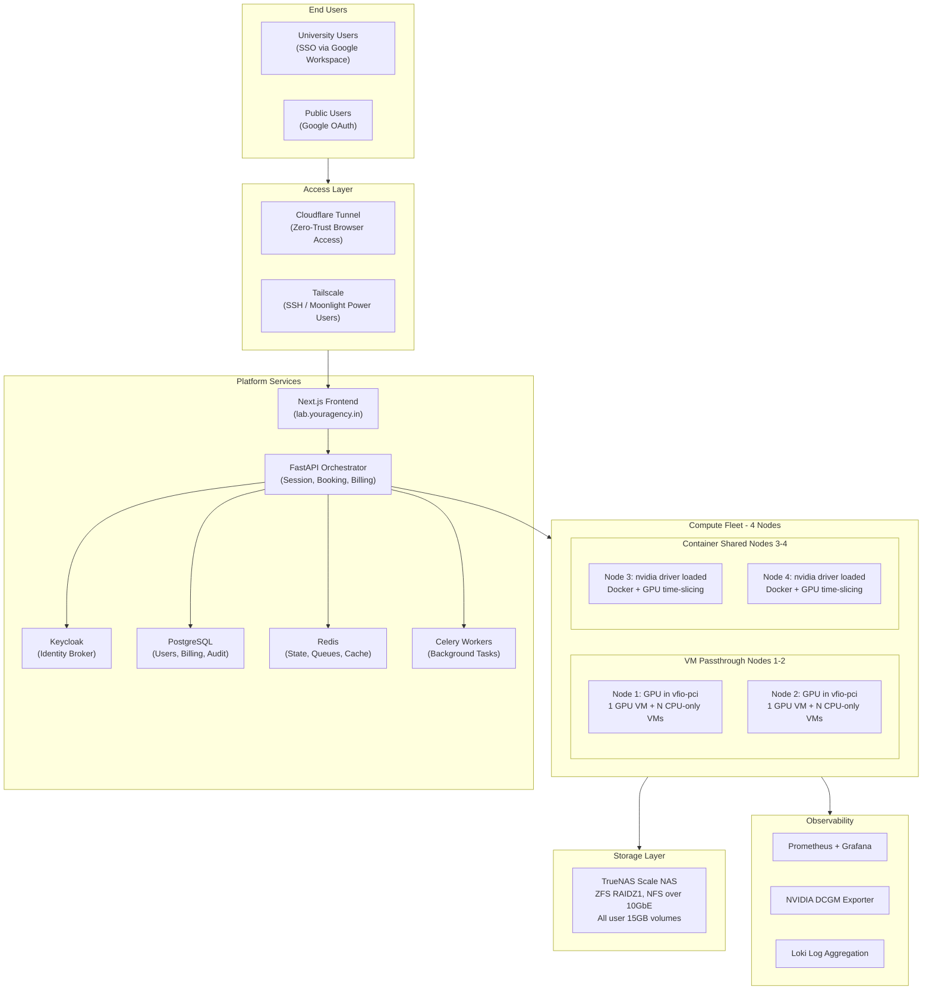
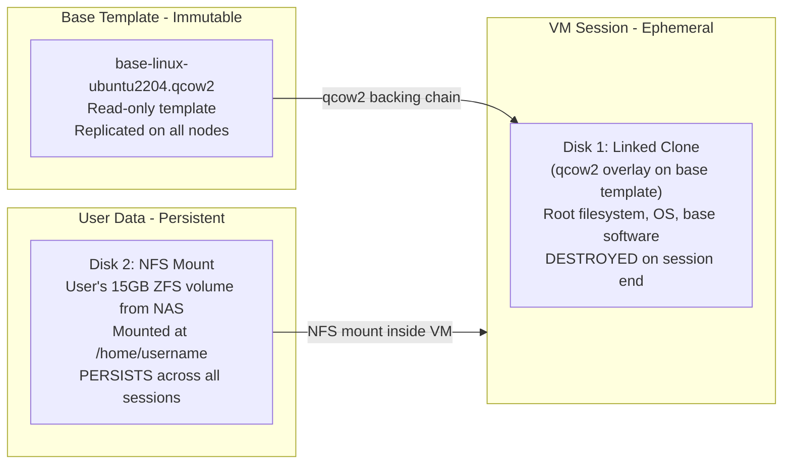
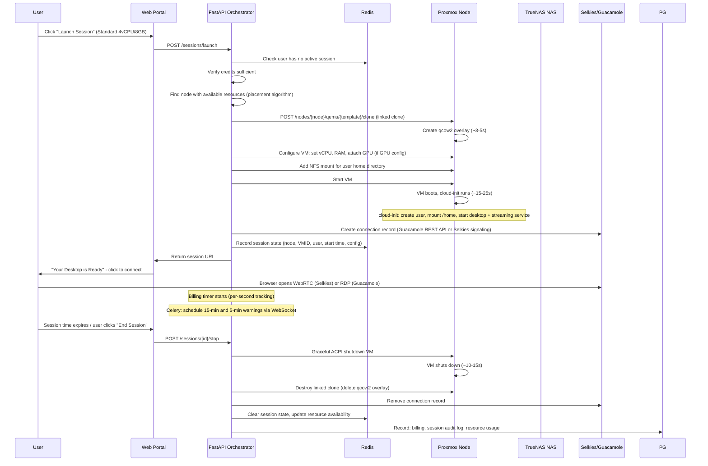

# Lab as a Service (LaaS) -- Infrastructure and Architecture Plan

---

## PART 1: Critical Corrections and False Assumptions

Before presenting the architecture, these findings from deep technical research **must** be addressed. Each one could cause project failure if ignored.

### CORRECTION 1: GPU VRAM Tiers (4GB / 8GB / 16GB) Are Not Implementable

The pricing table proposes fractional VRAM allocation (Pro=4GB, Power=8GB, Max=16GB). This is **impossible** with RTX 5090 (a consumer GPU).

- **No vGPU**: NVIDIA vGPU requires enterprise/datacenter GPUs (A100, L40S, etc.). RTX 5090 is explicitly excluded from the [NVIDIA vGPU supported GPU list](https://docs.nvidia.com/vgpu/gpus-supported-by-vgpu.html). Source: [Proxmox Forum](https://forum.proxmox.com/threads/geforce-rtx-5090-as-vgpu.164081/)
- **No SR-IOV**: Not supported on GeForce cards
- **No MIG**: Multi-Instance GPU is only on A100/H100/B200 datacenter SKUs
- **vgpu_unlock hack**: Only works on Maxwell 2.0 through Turing architectures. RTX 5090 (Blackwell) is NOT supported

**Reality**: GPU passthrough to a VM gives the FULL 32GB VRAM to one VM exclusively. You cannot carve out 4GB or 8GB slices. For containers, time-slicing provides NO VRAM isolation -- all containers see and can use the full 32GB.

**Impact on pricing**: GPU configs (Pro/Power/Max) all get the full GPU. Pricing differentiation must be based on CPU/RAM allocation, not VRAM. The revised config table is in Part 3.

---

### CORRECTION 2: Multiple Concurrent GPU GUI Sessions on Same Node -- NOT Possible

The proposal states "Multiple users can run stateful GUI sessions simultaneously on the same physical machine (each in their own isolated session/compute)" with GPU access. This requires vGPU, which is not available on consumer GPUs (see Correction 1).

**Reality per node**:

- **ONE** GPU-passthrough VM at a time (exclusive access to the full RTX 5090)
- **Multiple** CPU-only VMs concurrently (no GPU access, but full CPU/RAM isolation)
- GPU sharing is only possible in **containers** (LXC/Docker) via NVIDIA time-slicing -- NOT in KVM VMs

Source: [Proxmox Forum](https://forum.proxmox.com/threads/you-cant-have-it-both-ways.168046/), [Medium -- "The Hard Truth About Sharing a Single GPU Between VMs and LXC in Proxmox"](https://medium.com/aws-in-plain-english/you-cant-have-it-both-ways-the-hard-truth-about-sharing-a-single-gpu-between-vms-and-lxc-in-3a938e47aab8)

---

### CORRECTION 3: "Combination Can Be Anything" Has Hard Constraints

The GPU driver mode on a node determines what's possible:

- **vfio-pci mode** (GPU bound to VFIO): GPU passthrough to ONE VM. Host and containers CANNOT access GPU.
- **nvidia driver mode** (host driver loaded): Containers share GPU via time-slicing. VMs CANNOT get GPU passthrough.

These modes are **mutually exclusive at the kernel level**. Runtime switching is fragile and unreliable, especially on RTX 5090 which has a documented D3cold power management bug (GPU enters deep sleep after VM shutdown and fails to wake -- requires host reboot). Source: [Proxmox Forum](https://forum.proxmox.com/threads/passthrough-rtx-6000-5090-cpu-soft-bug-lockup-d3cold-to-d0-after-guest-shutdown.168424/), [igor'sLAB](https://www.igorslab.de/en/when-high-end-becomes-a-risk-rtx-5090-rtx-pro-6000-struggle-with-virtualization-bug/)

**Resolution**: Static node-role assignment. Roles are reconfigured only during planned maintenance windows (drain sessions, reboot, switch driver mode).

CPU-only workloads (stateful VMs or ephemeral containers without GPU) CAN run on ANY node regardless of role.

---

### CORRECTION 4: RTX 5090 D3cold Lockup Bug -- No Official Fix

After GPU VM shutdown, the RTX 5090 can enter D3cold and fail to transition back to D0, causing host CPU soft lockups. NVIDIA has reproduced the issue but has **no official fix** as of March 2026.

**Workarounds** (partial success):

- Kernel param: `disable_idle_d3=1`
- Modprobe option: `options vfio-pci disable_idle_d3=1`
- `d3cold_allowed=0` via sysfs for NVIDIA devices
- NVIDIA GPU UEFI firmware update (confirmed working for RTX 5060/5070/5080; may help 5090)
- Only use graceful guest shutdowns -- **never force-stop** GPU VMs (force-stop causes `VFIO_MAP_DMA failed` and host crash)
- Hookscript to pre-validate GPU state before next VM start

Source: [Proxmox Forum](https://forum.proxmox.com/threads/host-reboots-only-on-force-stop-qm-stop-of-vm-w-nvidia-rtx-5090-passthrough-vfio-dma-errors.165115/)

**Risk mitigation**: Budget 2-4 weeks for Phase 0 burn-in testing. Include GPU health watchdog with auto-remediation. Have a decision gate: if GPU passthrough is unstable after burn-in, consider adding one enterprise GPU (e.g., NVIDIA L4 or T4) to a node for reliable vGPU.

---

### CORRECTION 5: Ryzen 9950X3D + Proxmox Stability Concerns

Multiple reports of VM instability on Zen 5 CPUs with Proxmox: VM reboots/hangs every 1.5-2 days, memory-related errors, kernel panics. ASUS ProArt X670E-Creator has reported IOMMU grouping issues.

Source: [Proxmox Forum -- Persistent VM instability with Ryzen 9 9950X3D](https://forum.proxmox.com/threads/persistent-vm-instability-with-ryzen-9-9950x3d-and-proxmox-8-9.169989/)

**Mitigations**:

- Disable XMP/EXPO; run RAM at JEDEC speeds during burn-in
- Update to latest BIOS firmware and AMD microcode
- Pin to a stable kernel (test 6.8.x LTS before 6.14+)
- Run memtest86+ for 48+ hours before deployment
- Replace RAM if instability persists (documented cases of bad DIMMs)
- ACS override patch (`pcie_acs_override=downstream`) may be needed -- avoid `multifunction` variant (security risk: VMs could access host memory)

---

### CORRECTION 6: Guacamole Cannot Stream GPU-Rendered Linux Content

Apache Guacamole uses VNC or RDP protocols. When a GPU is passed through to a VM, QEMU cannot access the GPU framebuffer. Guacamole via VNC will show only software-rendered output -- any GPU-accelerated content (3D rendering, GPU-backed compositing) is invisible.

**Alternatives for GPU-rendered Linux desktops**:

- **Selkies-GStreamer** (RECOMMENDED): Open-source WebRTC streaming platform. Browser-based, no client install. GPU-accelerated encoding via NVENC. Supports 60fps+ at 1080p. Used by Google Cloud, academic HPC clusters. Source: [selkies-project.github.io](https://selkies-project.github.io/selkies-gstreamer/)
- **Sunshine + Moonlight**: Very low latency (~15ms). Captures GPU framebuffer via NVFBC. Requires Moonlight client install. Best for power users needing lowest latency. Source: [LizardByte docs](https://docs.lizardbyte.dev/projects/sunshine/)
- **xrdp + Guacamole**: For CPU-only VMs, xrdp on Linux provides adequate desktop streaming via RDP through Guacamole.

**Recommended stack**:

- CPU-only GUI VMs: Guacamole + xrdp
- GPU GUI VMs: Selkies-GStreamer (browser-based) + Sunshine/Moonlight (optional client)
- CLI sessions: Guacamole + SSH
- Jupyter/Code-Server: Direct browser access (no streaming needed)

---

### CORRECTION 7: User's 15GB Storage Location Contradiction

The proposal says user volumes are "LVM thin volume (`lv_user_<uid>`) on VG_STATEFUL" (local NVMe) but also mentions a centralized NAS for user data. These are contradictory.

**Correct approach**: User's 15GB is on the **centralized NAS** (TrueNAS Scale, ZFS dataset with quota). NOT on local NVMe. This is essential because:

- User can launch sessions on ANY node (their data follows them via NFS)
- Node failure doesn't lose user data
- Backup is centralized (ZFS snapshots)

Local NVMe (VG_STATEFUL) is for: base image templates and ephemeral linked clone deltas only.

---

### CORRECTION 8: LibreBooking Is Not Suitable

LibreBooking is a room/resource booking system for physical spaces (meeting rooms, labs). It does not model compute resources (CPU, RAM, GPU availability) or handle real-time resource capacity checking.

**Resolution**: Build a custom booking/scheduling system within the FastAPI orchestrator. It must track per-node resource availability (vCPU, RAM, GPU status) and make placement decisions based on capacity.

---

### MISSING CONSIDERATIONS Not in Original Proposal

1. **Session idle timeout**: Sessions consuming resources while user is idle. Implement 30-minute idle detection with warning, auto-terminate at 45 minutes. Credits still deducted during idle time.
2. **Session extension**: Allow users to extend a running session in real-time (if resources and credits permit).
3. **Queue/waitlist**: When resources are full, users should see estimated wait time and optionally join a queue.
4. **Fair usage limits**: Maximum hours/day or hours/week per user to prevent resource monopolization.
5. **Internet bandwidth**: 20+ concurrent remote desktop streams at 5-15 Mbps each = 100-300 Mbps upstream. Indian business internet (symmetric) costs Rs 30,000-80,000/month for 500Mbps+. Verify ISP can provide this.
6. **ISP redundancy**: Single ISP failure = platform offline. Consider dual ISP with failover.
7. **UPS**: 4 machines at ~600-800W each + NAS + switch = 3-4kW total. Minimum 5kVA online UPS for graceful shutdown time.
8. **Physical cooling**: 3-4kW of heat requires dedicated cooling. Mini-split AC or server room cooling.
9. **Physical security**: Machines need locked, access-controlled environment.
10. **Software licensing for base image**: MATLAB requires network license for shared hosting (Campus-Wide or Concurrent license from university). CUDA toolkit is free. Blender is free. Other proprietary software needs ISV hosting agreements.
11. **GPU thermal throttling**: RTX 5090 is a consumer card, not rated for 24/7 datacenter operation. Active temperature monitoring with throttle alerts at 80C and emergency shutdown at 90C.
12. **Node failure during active session**: User data is safe (on NAS). Session is lost. UI must show clear "Node unavailable, please relaunch" message.
13. **Base image versioning**: When updating base image software, you must create a new template version. Old linked clones must complete (sessions must end) before old template can be removed.
14. **Data protection compliance**: India's Digital Personal Data Protection Act (DPDPA) 2023 applies to user data. Ensure consent, data minimization, and breach notification procedures.
15. **Anti-abuse**: Detect crypto mining via GPU utilization pattern monitoring. Block outbound connections to known mining pools. Rate-limit network egress.
16. **Noisy neighbor on time-sliced GPU**: One container can exhaust all 32GB VRAM, starving others. Set per-container CUDA_VISIBLE_DEVICES and CUDA_MPS_ACTIVE_THREAD_PERCENTAGE. Monitor and kill runaway GPU processes.
17. **15GB storage may be tight**: conda environments, large datasets, model weights can easily fill 15GB. Consider offering paid storage upgrades in future.
18. **Scaling beyond 4 nodes**: Architecture should accommodate adding nodes without redesign. The orchestrator and NAS approach supports this naturally.

---

## PART 2: Revised Architecture

### 2.1 System Architecture Overview




### 2.2 Node Role Assignment

**Static role model** (roles switched only during maintenance windows):

- **Nodes 1-2 (VM Passthrough)**: GPU bound to `vfio-pci` at boot. Runs Tier 1 (full machine) and Tier 2 (stateful GUI desktops). One GPU VM at a time per node. Multiple CPU-only VMs can run concurrently alongside the GPU VM.
- **Nodes 3-4 (Container Shared)**: NVIDIA driver loaded on host. Runs Tier 3 ephemeral sessions (Jupyter, Code-Server, SSH) via Docker containers with GPU time-slicing. Also runs CPU-only stateful VMs if demand requires.

Role reassignment procedure: drain active sessions -> wait for graceful completion -> reboot node -> apply new GPU mode -> bring online. Schedule during low-usage windows (2-4 AM).

---

## PART 3: Compute Configuration (Revised)

### Revised Pricing Configs (GPU Is All-or-Nothing)

**Stateful GUI Desktop Configs (KVM VMs, Tier 1-2)**:

- **Starter**: 2 vCPU, 4GB RAM, No GPU. CPU-only, light coding/docs. Can run 6-7 per node.
- **Standard**: 4 vCPU, 8GB RAM, No GPU. MATLAB, office, development. Can run 3-4 per node.
- **Pro GPU**: 4 vCPU, 8GB RAM, Full 32GB GPU. Blender, ML inference. 1 per node (exclusive GPU).
- **Power GPU**: 8 vCPU, 16GB RAM, Full 32GB GPU. Heavy simulation, 3D render. 1 per node.
- **Full Machine**: 14 vCPU, 56GB RAM, Full 32GB GPU. Entire node dedicated. 1 per node.

**Ephemeral Session Configs (Docker containers, Tier 3)**:

- **Ephemeral CPU**: 2 vCPU, 4GB RAM, No GPU. Jupyter/Code-Server/SSH. 6-8 per node.
- **Ephemeral GPU**: 2-4 vCPU, 8GB RAM, Time-sliced GPU (shared 32GB). 4-6 per node (no hard VRAM isolation -- documented to users).

All configs include access to user's 15GB personal storage (for university/member users). Public users on ephemeral sessions: notebook files saved to platform storage (like Google Colab), no persistent VM storage.

### Fleet Capacity Estimates

- VM Passthrough Nodes (2): up to 2 concurrent GPU users + 6-8 concurrent CPU-only users
- Container Shared Nodes (2): up to 8-12 concurrent ephemeral users
- **Total concurrent: ~16-22 users**
- **Peak throughput with scheduling**: ~40-60 users/day in 2-4 hour slots

---

## PART 4: Storage Architecture (Detailed)

### 4.1 Per-Node NVMe Layout (2TB)

```
nvme0n1p1  100GB  EXT4   -> Proxmox OS + swap (8GB swap)
nvme0n1p2  900GB  LVM PV -> VG_STATEFUL (base templates + linked clone deltas)
nvme0n1p3  760GB  LVM PV -> VG_EPHEMERAL (Docker images, container scratch)
nvme0n1p4  240GB  EXT4   -> Shared read-only datasets (models, research data)
```

Hard partition between VG_STATEFUL and VG_EPHEMERAL ensures an ephemeral session crash/corruption cannot affect stateful data. This is sound and retained.

**LVM Thin Pool monitoring**: If a thin pool reaches 100% usage, ALL VMs/containers on it pause. Set Prometheus alerts at 80% utilization with auto-cleanup of orphaned clones.

### 4.2 Centralized NAS

- **Hardware**: 5th machine or dedicated NAS appliance. TrueNAS Scale (Debian-based, ZFS native).
- **Disks**: 4x4TB HDDs in RAIDZ1 (~12TB usable). Or 4x8TB for more headroom.
- **Networking**: 10GbE NIC (Intel X550-T1 or SFP+ adapter) connected to the Mikrotik switch.
- **User volumes**: ZFS datasets with per-user 15GB quota:

```
  zfs create -o quota=15G pool/users/<uid>
  

```

- **NFS export**: NFSv4.2 to all 4 compute nodes over 10GbE VLAN 40.
- **Mount options on compute nodes** (for acceptable remote desktop latency):

```
  rw,hard,intr,nfsvers=4.2,rsize=1048576,wsize=1048576,nconnect=4,async
  

```

- **Backup**: ZFS auto-snapshots -- 7 daily + 4 weekly retention. Optionally replicate to offsite backup.
- **Public user notebook storage**: PostgreSQL BYTEA or S3-compatible object storage (MinIO on NAS) for saved .ipynb files.

### 4.3 Base Image Strategy

- One base VM template: `base-linux-ubuntu2204` (~60GB qcow2)
  - Contents: Ubuntu 22.04 LTS + XFCE or GNOME desktop + MATLAB + Python (Anaconda) + CUDA toolkit + Blender + development tools (gcc, git, vim, etc.)
  - Template is converted to read-only in Proxmox (mode 0444, immutable flag)
  - Replicated on all 4 nodes' VG_STATEFUL
- **Linked clones**: Proxmox creates qcow2 overlay per session (~starting at 100KB, growing to ~5-20GB during session). Copy-on-write from base template. Created in ~3-5 seconds.
- **Destroyed after session end**: linked clone deleted, all system-level changes discarded
- **Template updates**: Create new template version, keep old version until all linked clones referencing it are destroyed. Gradual rollover.

### 4.4 User Data Persistence Model




**User experience**: Each session boots with a clean system (from base template) + user's personal files/settings/conda-envs in `/home/<uid>`. User-level software (pip --user, conda create, npm install) persists because it installs to `/home`. System-level apt installs do NOT persist (acceptable -- users don't have root/sudo anyway).

**Protection of base software**: Users have NO root access inside VMs. Standard Linux file permissions protect system-level software in /usr, /opt, etc. Users cannot modify or delete base-installed software.

---

## PART 5: Virtualization and GPU Strategy

### 5.1 Hypervisor

**Proxmox VE 8.x or 9.x** (latest stable at deployment time) on all 4 compute nodes.

- KVM/QEMU for stateful VMs (Tiers 1, 2)
- Docker (running on host or in a management LXC) for ephemeral containers (Tier 3)
- Proxmox API via `proxmoxer` Python library (v2.3.0+) for all automation

### 5.2 GPU Management

**VM Passthrough Nodes (1-2)**:

- IOMMU enabled: `amd_iommu=on iommu=pt` in GRUB
- GPU bound to vfio-pci at boot:

```
  # /etc/modprobe.d/vfio.conf
  options vfio-pci ids=<RTX5090_VENDOR:DEVICE_ID> disable_vga=1 disable_idle_d3=1
  

```

- Additional kernel params: `disable_idle_d3=1`, `vfio_iommu_type1.allow_unsafe_interrupts=1` (if needed)
- D3cold mitigation: Set `d3cold_allowed=0` for NVIDIA devices via udev rule
- Hookscript: Pre-start validation of GPU state, post-stop GPU health check
- **NEVER force-stop GPU VMs** -- always graceful shutdown via ACPI

**Container Shared Nodes (3-4)**:

- NVIDIA driver loaded on host (latest stable production driver)
- `nvidia-container-toolkit` installed for Docker GPU access
- GPU time-slicing: Each container sees the full GPU but shares execution time
- No hard VRAM isolation -- monitor VRAM usage, kill runaway processes
- Set `CUDA_MPS_ACTIVE_THREAD_PERCENTAGE` per container for approximate fairness

**All nodes**:

- Dummy HDMI dongle (4K HDMI 2.1) plugged into each RTX 5090
- NVIDIA DCGM Exporter for GPU telemetry
- Temperature alerts at 80C (warning) and 90C (emergency shutdown)

### 5.3 IOMMU and PCIe Considerations

- X670E chipset has known IOMMU grouping issues. GPU + audio device should be in their own group.
- If IOMMU groups are too large: apply `pcie_acs_override=downstream` kernel param. **AVOID** `multifunction` variant (allows VMs to access host memory).
- RTX 5090 runs at PCIe 4.0 x16 on X670E (not PCIe 5.0). Performance impact is 2-5% for most workloads -- acceptable.
- Use OVMF (UEFI) + Q35 machine type for all VMs (required for modern GPU passthrough).

---

## PART 6: Remote Desktop and Access Layer

### 6.1 Protocol Matrix

- **CPU-only GUI VMs**: Guacamole via xrdp (RDP protocol). xrdp installed in base image. Guacamole provides browser-based access. Medium latency (~30-50ms).
- **GPU GUI VMs**: Selkies-GStreamer (WebRTC). Installed in base image. GPU-accelerated encoding via NVENC. Browser-based, no client install. 60fps+ at 1080p. Low latency (~20-30ms over LAN).
- **GPU GUI VMs (power users)**: Sunshine (in VM) + Moonlight (client). Requires client install. Very low latency (~15ms).
- **CLI sessions**: Guacamole via SSH. Browser-based.
- **Jupyter/Code-Server**: Direct browser access via reverse proxy. No streaming protocol needed.

### 6.2 Selkies-GStreamer Deployment

- Installed inside GPU VM base template as a systemd service
- Configured with NVENC encoder for hardware-accelerated streaming
- X.Org display server with dummy driver for headless operation
- WebRTC signaling via TURN server (deployed on NAS or management node)
- Accessed through Cloudflare Tunnel like any HTTPS endpoint

### 6.3 Session Reconnection

- When browser closes: VM continues running (billing continues)
- User reopens portal -> "Reconnect" button -> connects to the still-running VM's Selkies/Guacamole session
- VM only stops when: user clicks "End Session", session time expires, or credits reach zero
- Guacamole auto-reconnect: prioritizes most recent session (v1.1.0+), limited to 4 retry attempts

### 6.4 External Access

- **Cloudflare Tunnel** (`cloudflared` running on a management LXC or NAS):
  - Routes `lab.youragency.in` to internal reverse proxy
  - Zero open inbound ports on firewall
  - DDoS protection included
  - WebSocket support for Guacamole and Selkies
  - Cloudflare Access policies for additional authentication layer
- **Tailscale** (subnet router on management LXC):
  - Advertises internal subnets to authorized Tailscale users
  - For SSH direct access and Moonlight power users
  - Works through university firewalls (DERP relay fallback)
- **Reverse Proxy**: Traefik or Caddy on management node
  - TLS termination (via Cloudflare origin certificates)
  - Path-based routing to Guacamole, Selkies, JupyterHub, Code-Server, web portal, Keycloak
  - WebSocket support (critical for remote desktop)

---

## PART 7: Networking

### 7.1 Hardware Additions (per node)

- 1x Intel X550-T1 10GbE PCIe NIC (~$80 each, $320 total)
- 1x Mikrotik CRS309-1G-8S+ 10GbE SFP+ managed switch (~$300)
- SFP+ DAC cables for 10GbE connections (~$10 each)
- 4x HDMI dummy dongles (~$10 each)

### 7.2 VLAN Layout

- **VLAN 10 (Management)**: Proxmox Web UI, SSH, node management. Uses onboard 2.5GbE NIC. Subnet: 10.10.10.0/24.
- **VLAN 20 (VM Traffic)**: Stateful VM network traffic (RDP, Selkies streams). Uses 10GbE NIC. Subnet: 10.10.20.0/24.
- **VLAN 30 (Container Traffic)**: Ephemeral container traffic (Jupyter, Code-Server). Uses 10GbE NIC. Subnet: 10.10.30.0/24.
- **VLAN 40 (Storage)**: NFS traffic between nodes and NAS. Uses 10GbE NIC. Subnet: 10.10.40.0/24.
- **VLAN 50 (Services)**: Web portal, Guacamole, Keycloak, reverse proxy. Uses 10GbE NIC. Subnet: 10.10.50.0/24.

Mikrotik CRS309 configured with VLAN filtering on bridge, trunk ports to each compute node, and tagged VLANs per service.

Each Proxmox node has a VLAN-aware Linux bridge on the 10GbE NIC. VMs and containers are assigned to their respective VLANs via Proxmox network configuration.

### 7.3 Bandwidth Considerations

- **Upstream internet**: Minimum 500Mbps symmetric for 20+ concurrent remote desktop streams. Indian business internet at this tier costs Rs 30,000-80,000/month depending on location.
- **Internal**: 10GbE for NFS storage and remote desktop traffic. NFS with nconnect=4 can achieve 3-4 Gbps throughput -- more than sufficient for 20+ user home directories.
- **Dual ISP recommended**: Single point of failure. Use two ISPs with BGP or DNS failover.

---

## PART 8: Authentication and User Management

### 8.1 Keycloak as Identity Broker

**You host Keycloak** on the NAS or a management LXC. Universities do NOT need Keycloak. Keycloak federates with whatever identity provider the university uses.

- **University users**: Keycloak configured with Google Workspace as OIDC/Social Identity Provider (most Indian universities use Google Workspace). User authenticates with `priya@cs.university.ac.in` via Google OAuth. Keycloak receives the Google token and issues platform JWT tokens.
  - If university uses LDAP: Keycloak supports LDAP User Federation as an identity source.
  - One Keycloak realm per university for clean tenant separation.
- **Public users**: Separate Keycloak realm with Google OAuth social login. Restricted to ephemeral-only access (enforced at API level).
- **RBAC roles**: Platform Admin, University Admin, Student, Researcher, Faculty, Public User.
- **Groups**: Map to university/department/semester. Used for authorization (resource quotas, pricing tiers, access policies).

### 8.2 User Account Lifecycle

1. User registers on `lab.youragency.in` with university email
2. Keycloak authenticates via university Google Workspace
3. Platform creates user record in PostgreSQL
4. User selects OS (Ubuntu 22.04 for now)
5. Orchestrator provisions 15GB ZFS dataset on NAS: `zfs create -o quota=15G pool/users/<uid>`
6. Account is active -- user can book sessions

### 8.3 OS Switch Flow

1. User goes to Account Settings -> Switch OS
2. Platform shows warning: "This will PERMANENTLY DELETE all your files and settings"
3. User must type "DELETE" to confirm
4. Orchestrator: destroys old ZFS dataset, creates fresh 15GB dataset
5. User starts clean on new OS

---

## PART 9: Session Lifecycle (Detailed)

### 9.1 Stateful VM Session Flow




**Total launch time**: ~20-35 seconds (clone creation + VM boot + cloud-init + streaming setup).

### 9.2 Ephemeral Container Session Flow

1. User clicks "Launch Ephemeral" -> selects Jupyter/Code-Server/SSH + config (CPU or GPU)
2. Orchestrator finds container node with available resources
3. Creates Docker container from pre-built image:
  - Jupyter: `nvidia/cuda:12.x-base-ubuntu22.04` + JupyterLab
  - Code-Server: `codercom/code-server:latest` + CUDA
  - SSH: minimal Ubuntu + CUDA + development tools
4. Mounts user's NFS home directory at `/home/<uid>` (for university users)
5. Assigns GPU via nvidia-container-toolkit (if GPU config)
6. Container starts in ~5-10 seconds
7. Returns URL to Jupyter/Code-Server or SSH credentials
8. On session end: container destroyed, scratch wiped. User files on NFS persist.
9. **Public users**: No NFS mount. Jupyter notebook files saved to platform storage (PostgreSQL or MinIO) on session end, accessible from user dashboard. Works like Google Colab.

### 9.3 Resource Placement Algorithm

The orchestrator must make placement decisions:

1. Parse requested config (vCPU, RAM, GPU requirement)
2. Query Redis for current resource usage per node
3. Filter nodes by GPU compatibility:
  - GPU VM config -> only VM-passthrough nodes with GPU available
  - GPU container config -> only container-sharing nodes
  - CPU-only -> any node with sufficient CPU/RAM
4. Select node with best fit (most available resources, or least loaded)
5. If no node available: return estimated wait time, offer queue

---

## PART 10: Billing Architecture

- **Model**: Prepaid wallet (credit-based). Users add credits via Razorpay (UPI, cards, netbanking).
- **Tracking**: Per-second granularity, billed per-minute. Celery worker polls session state every 30 seconds and deducts credits.
- **Auto-terminate**: When credits reach zero, send 5-minute warning via WebSocket. If no top-up, graceful session shutdown.
- **University bulk pricing**: Departments purchase semester credit packages. Admin allocates credits to student accounts.
- **Invoicing**: Monthly PDF invoices with detailed usage breakdown (session times, configs used, total hours, total cost).
- **Razorpay Integration**: Python SDK (`razorpay-python`). Use Razorpay Orders + Payments for credit top-ups. Store wallet balance in PostgreSQL.

---

## PART 11: Monitoring, Audit, and Security

### 11.1 Monitoring Stack

- **Prometheus**: Scrapes metrics from all nodes, NAS, services
- **Grafana**: Dashboards for fleet overview, per-node status, per-user sessions, GPU health, billing
- **NVIDIA DCGM Exporter**: GPU temperature, utilization, VRAM, power draw, ECC errors
- **Node Exporter**: CPU, RAM, disk, network per node
- **Loki**: Centralized log aggregation from all services
- **Alerting**: Slack/email/PagerDuty for: GPU temp >80C, disk >85%, node offline, NAS degraded, GPU unresponsive

### 11.2 Audit Logging

Every session generates: start/end timestamps, user identity, IP address, device fingerprint, resource utilization (CPU%, RAM%, GPU%, VRAM peak, disk I/O, network I/O), duration, billable amount, all events (connect, disconnect, reconnect, warnings sent, shutdown sequence). Stored in PostgreSQL `audit_sessions` table.

### 11.3 Security Measures

- **Data isolation**: Hard disk partition (VG_STATEFUL vs VG_EPHEMERAL). VM-level isolation via KVM (hardware virtualization). Container isolation via cgroups v2 + namespaces.
- **Memory isolation**: KVM VMs have hardware-enforced memory isolation via VT-x/AMD-V. Containers use cgroup v2 memory limits (strict enforcement on kernel 6.x).
- **Process isolation**: VMs: absolute (separate kernel). Containers: strong (namespaces + seccomp + AppArmor).
- **Network isolation**: VLAN separation. VMs/containers cannot communicate with each other. Only outbound internet access (via NAT).
- **Anti-abuse**: GPU utilization pattern monitoring for crypto mining detection. Block outbound connections to known mining pools via iptables/nftables. Rate-limit egress bandwidth per VM/container. Kill sessions exhibiting mining signatures.
- **No root in VMs**: Users are non-root, no sudo. Cannot modify system files.
- **Firewall**: Zero inbound ports (Cloudflare Tunnel). Host firewall allows only management VLAN SSH.

---

## PART 12: Technology Stack Summary

- **Hypervisor**: Proxmox VE 8.x/9.x (KVM/QEMU + LXC)
- **GPU Passthrough**: VFIO-PCI (VMs), nvidia-container-toolkit (containers)
- **Storage**: TrueNAS Scale (ZFS, NFS), LVM thin pools (local NVMe)
- **Networking**: Mikrotik CRS309 (10GbE), VLANs, Cloudflare Tunnel, Tailscale
- **Remote Desktop**: Selkies-GStreamer (GPU VMs), Apache Guacamole + xrdp (CPU VMs), Sunshine/Moonlight (optional)
- **Auth**: Keycloak 26.x (OIDC broker for Google Workspace + Google OAuth)
- **Backend**: FastAPI (Python), Celery, Redis, PostgreSQL
- **Frontend**: Next.js (React)
- **Billing**: Razorpay Python SDK
- **Monitoring**: Prometheus, Grafana, NVIDIA DCGM Exporter, Loki
- **Ephemeral Compute**: Docker + JupyterHub (DockerSpawner) + Code-Server
- **Proxy/Routing**: Traefik or Caddy (reverse proxy with WebSocket support)

---

## PART 13: Implementation Phases

### Phase 0: Hardware Prep and Burn-In (Weeks 1-3)

- Assemble 4 machines, install Proxmox VE on each
- Update BIOS, AMD microcode, NVIDIA GPU firmware
- memtest86+ (48+ hours), GPU stress tests (furmark, cuda-memcheck)
- Test GPU passthrough on one node: IOMMU grouping, vfio-pci binding, D3cold workaround
- Test VM start/stop cycles (50+ cycles) -- verify GPU recovers every time
- Install 10GbE NICs, configure Mikrotik switch with VLANs
- Set up TrueNAS Scale, create ZFS pool, benchmark NFS performance
- **DECISION GATE**: If GPU passthrough is unstable after 2 weeks, evaluate: (a) adding enterprise GPU, (b) different motherboard, (c) architecture pivot to container-only GPU sharing

### Phase 1: Core Infrastructure (Weeks 3-6)

- Form Proxmox cluster (4 nodes + QDevice on NAS for quorum)
- Assign node roles: 2 VM-passthrough, 2 container-shared
- Build Ubuntu 22.04 base VM template (install all software, configure desktop, install Selkies + xrdp)
- Test linked clone lifecycle: clone -> boot -> NFS mount -> use -> destroy
- Set up ZFS user directory provisioning on NAS
- Deploy Keycloak (Docker on NAS)
- Build Docker images for ephemeral containers (Jupyter, Code-Server)

### Phase 2: Orchestration and Remote Access (Weeks 6-10)

- Build FastAPI orchestrator: session CRUD, Proxmox API integration, resource placement
- Deploy Guacamole (Docker on NAS), integrate REST API
- Configure Selkies-GStreamer in GPU VM template, test WebRTC streaming
- Configure Cloudflare Tunnel, Tailscale, Traefik reverse proxy
- Build booking/scheduling system with availability tracking
- Test end-to-end: user -> Cloudflare -> Traefik -> Selkies/Guacamole -> VM
- Test ephemeral container lifecycle: JupyterHub + DockerSpawner + GPU

### Phase 3: Web Portal and Auth Integration (Weeks 10-14)

- Build Next.js frontend: dashboard, booking UI, session management, admin panel
- Integrate Keycloak auth (university Google Workspace + public Google OAuth)
- User registration flow with OS selection and NAS provisioning
- Session reconnection UI
- Admin panel: fleet overview, user management, GPU health

### Phase 4: Billing, Monitoring, Polish (Weeks 14-18)

- Integrate Razorpay billing (wallet top-up, real-time credit deduction)
- Deploy Prometheus + Grafana + DCGM Exporter + Loki
- Build audit logging system
- Implement session warnings (15-min, 5-min), idle detection, auto-terminate
- Implement OS switch with DELETE confirmation
- Anti-abuse measures: GPU mining detection, egress rate limiting
- Fair usage policy enforcement

### Phase 5: Beta Testing (Weeks 18-22)

- Onboard 10-20 beta users from one university
- Load test: simulate maximum concurrent sessions
- Security audit: VLAN isolation verification, container escape testing, NFS permission audit
- Performance tuning: NFS caching, Selkies quality settings, GPU driver stability
- Documentation: user guides, admin runbooks

### Phase 6: Production Launch (Week 22+)

- Gradual university rollout
- Public user access (ephemeral only)
- Operational monitoring and on-call

---

## PART 14: Risk Register

- **RTX 5090 D3cold lockup** -- Severity: HIGH, Likelihood: MEDIUM. Mitigation: `disable_idle_d3=1`, GPU watchdog, graceful-only shutdowns, NVIDIA firmware update.
- **Ryzen 9950X3D kernel panics** -- Severity: HIGH, Likelihood: MEDIUM. Mitigation: pin stable kernel, burn-in testing, BIOS/microcode updates, JEDEC RAM speeds.
- **IOMMU grouping issues** -- Severity: MEDIUM, Likelihood: HIGH. Mitigation: ACS override patch (downstream only), test during Phase 0.
- **NFS latency affecting UX** -- Severity: MEDIUM, Likelihood: MEDIUM. Mitigation: 10GbE, nconnect=4, async mount, local NVMe for heavy I/O.
- **GPU time-slicing unfairness** -- Severity: MEDIUM, Likelihood: MEDIUM. Mitigation: set thread percentage per container, monitor VRAM, kill runaway processes.
- **Single NAS failure** -- Severity: CRITICAL, Likelihood: LOW. Mitigation: ZFS snapshots, offsite backup, consider NAS HA pair in future.
- **Software licensing violation** -- Severity: CRITICAL, Likelihood: MEDIUM. Mitigation: verify MATLAB network license from university, audit all pre-installed software before launch.
- **Internet connectivity loss** -- Severity: HIGH, Likelihood: MEDIUM. Mitigation: dual ISP with failover.
- **Crypto mining abuse** -- Severity: MEDIUM, Likelihood: HIGH. Mitigation: GPU utilization monitoring, outbound port blocking, egress rate limits.
- **Power outage** -- Severity: HIGH, Likelihood: MEDIUM. Mitigation: 5kVA UPS, graceful shutdown scripts.

---

## PART 15: Additional Findings from Cross-Research (Claude Session Synthesis)

The following gaps, techniques, and architectural refinements were identified from a parallel deep-research session and are incorporated here.

### ADDITIONAL CORRECTION: CUDA MPS IS Supported on Consumer GPUs

The Claude research session confirmed that **CUDA MPS (Multi-Process Service) works on consumer GeForce GPUs**, including RTX 5090. This is a critical finding that the earlier plan's existing doc (which said "MPS is documented for Tesla, Quadro, and datacenter GPUs only") got WRONG.

CUDA MPS on Blackwell architecture (RTX 5090, 170 SMs) provides:

- Up to 48 concurrent CUDA contexts on a single GPU
- Per-client SM percentage limiting (`CUDA_MPS_ACTIVE_THREAD_PERCENTAGE=25` gives each of 4 users ~42 SMs)
- Per-client VRAM limiting (`CUDA_MPS_PINNED_DEVICE_MEM_LIMIT=0=8192M` caps each user at 8GB)
- Isolated GPU virtual address spaces on Volta+ architectures (memory protection between clients)
- True concurrent kernel execution (not just time-slicing)

This means: for container-shared nodes (Nodes 3-4), CUDA MPS should be deployed ON TOP of nvidia-container-toolkit time-slicing for better performance and per-user resource limits. This is a significant improvement over pure time-slicing alone.

Source: [NVIDIA MPS Documentation](https://docs.nvidia.com/deploy/mps/index.html), [Google GKE MPS Guide](https://docs.google.com/kubernetes-engine/docs/how-to/nvidia-mps-gpus)

### ADDITIONAL GAP: "GPU Never Moves" Philosophy for Container Nodes

The Claude research identified a key architectural principle: **on container-shared nodes, the GPU should NEVER be given to a VM via passthrough**. The NVIDIA driver stays loaded on the host permanently. LXC/Docker containers access the GPU via device node sharing (`/dev/nvidia0`, `/dev/nvidiactl`, `/dev/nvidia-uvm`).

This eliminates the FLR/D3cold reset bug entirely on container nodes because the GPU never changes ownership. This is the safest and highest-performance configuration for Tier 3 ephemeral workloads.

For VM-passthrough nodes (Nodes 1-2), the FLR mitigations from Part 2 still apply.

### ADDITIONAL GAP: Pre-Warming VMs for Instant Session Start

Current design boots VMs on-demand (~20-35s). For better UX:

- **Booked sessions**: Pre-warm the VM 15 minutes before the scheduled time. VM boots, reaches login screen, and idles. When user clicks "Launch", Guacamole/Selkies connects instantly.
- **Ephemeral sessions**: Maintain a warm pool of 2-3 pre-started containers per node. User clicks "Launch" -> assigned a warm container -> sub-5 second start. Pool replenished asynchronously.
- **Resource cost**: A pre-warmed idle Ubuntu VM uses ~500MB RAM, ~2% CPU. Manageable within fleet capacity.

### ADDITIONAL GAP: Session Recording for Academic Integrity

Apache Guacamole has native session recording capability -- records RDP/VNC/SSH sessions as `.guac` files playable in-browser. This is important for:

- Academic integrity (exam sessions, graded lab work)
- Dispute resolution ("the system crashed and I lost my work")
- Security forensics
- Configure Guacamole's `recording-path` per connection type
- Store recordings on NAS with 30-90 day retention policy

### ADDITIONAL GAP: Clipboard and Data Transfer Policy (DLP)

Not addressed in original proposal. Important for exam/restricted sessions:

- Guacamole: configurable clipboard direction (`disable-copy`, `disable-paste` per connection profile)
- File upload/download restrictions: control whether users can transfer files between local device and session
- Per-session-type policy: regular session = clipboard enabled; exam session = clipboard disabled

### ADDITIONAL GAP: Idle Session Management (Nuanced)

Simple timeout is insufficient. Implement:

- **Desktop idle**: No keyboard/mouse input via Guacamole for N minutes
- **Compute idle**: No GPU/CPU activity above 5% for N minutes
- **Active job exception**: If SLURM job running or GPU SM > 10%, never considered idle regardless of browser state
- **Escalation**: 30 min idle -> warning; 45 min idle -> session suspended (VM paused, resources held); 60 min idle -> session terminated
- **VM heartbeat**: QEMU guest agent ping every 60 seconds. No response for 5 minutes -> mark as crashed -> cleanup

### ADDITIONAL GAP: Base Image Versioning Strategy (Zero-Downtime Updates)

When updating base image software:

1. Create `base-linux-v2` (full copy of v1)
2. Boot v2, apply changes (software installs, patches), shutdown, mark as template
3. Schedule cutover: new sessions use v2; existing sessions continue on v1
4. Once all v1-based sessions end naturally, delete v1
5. This is zero-downtime for users

### ADDITIONAL GAP: User Self-Service File Recovery

ZFS snapshots on NAS should be user-accessible:

- ZFS snapshots every 6 hours, retained 7 days
- Users can access `.zfs/snapshot/` directory within their NFS-mounted home to browse and restore previous file versions without admin intervention
- User portal: "Restore previous version" button via API

### ADDITIONAL TECHNIQUE: QEMU Guest Agent

Install `qemu-guest-agent` in all base VM templates. This enables:

- Graceful shutdown from host: `qm guest cmd <vmid> shutdown`
- Run commands inside VM from host: `qm guest exec <vmid> -- rmmod nvidia` (critical for GPU driver unload before passthrough release)
- Query VM filesystem and memory state
- More reliable than ACPI signals for session lifecycle management

### ADDITIONAL TECHNIQUE: Infrastructure as Code (Ansible + Terraform)

Codify all infrastructure configuration:

- **Ansible playbooks**: Proxmox cluster setup, NVIDIA driver installation, Keycloak configuration, NAS NFS exports
- **Terraform with Proxmox provider**: VM template creation, LVM provisioning, network configuration
- **Git repository**: All configuration, playbooks, docker-compose files
- Benefit: If a node needs replacement, rebuild entire software stack in 30 minutes via playbook

### ADDITIONAL CONSIDERATION: IsardVDI as Potential Accelerator

[IsardVDI](https://gitlab.com/isard/isardvdi) is an open-source VDI platform built on KVM with linked clone support, booking system, GPU reservation, and user management. It could serve as a foundation for the stateful desktop tier, potentially saving 3-6 months of development on the VDI broker layer. Evaluate during Phase 1 whether to build custom on Proxmox API or adapt IsardVDI.

### ADDITIONAL CONSIDERATION: KasmVNC as Streaming Alternative

[KasmVNC](https://github.com/kasmtech/KasmVNC) is an open-source fork of TigerVNC with adaptive bitrate, mobile support, WebRTC transport, and built-in DLP controls. It could complement or replace parts of the Guacamole+Selkies stack, particularly for Linux GUI sessions on variable-quality Indian internet connections.

---

## PART 16: Cost Estimates

**One-Time Hardware Additions**:

- 4x Intel X550-T1 10GbE NIC: ~Rs 26,000
- 1x Mikrotik CRS309 switch: ~Rs 25,000
- SFP+ DAC cables (6x): ~Rs 5,000
- 4x HDMI dummy dongles: ~Rs 3,000
- NAS hardware (if not existing): ~Rs 1,25,000 - 2,50,000
- UPS (5kVA online): ~Rs 40,000 - 80,000
- **Total: Rs 2,25,000 - 3,90,000 (~$2,600-4,500)**

**Monthly Operating Costs**:

- Internet (500Mbps+ symmetric business): Rs 30,000 - 80,000/month
- Electricity (~4kW, 24/7, commercial rate): Rs 25,000 - 40,000/month
- Domain + Cloudflare: Rs 1,500/month
- Proxmox subscription (optional, enterprise support): ~Rs 30,000/year per node
- MATLAB network license: Depends on university agreement
- Cooling (mini-split AC for server room): Rs 3,000 - 5,000/month electricity

