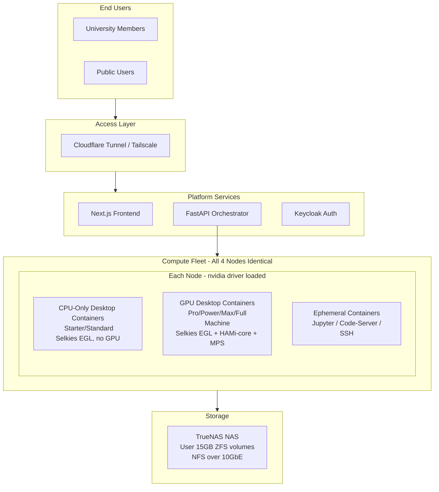

# LaaS Infrastructure Setup and Implementation Plan

---

## Part 1: Hardware Inventory and Procurement

### Existing Hardware (4 Identical Compute Nodes)

- CPU: AMD Ryzen 9 9950X3D (16C/32T, 3D V-Cache)
- Motherboard: ASUS ProArt X670E-Creator WiFi DDR5
- GPU: Zotac RTX 5090 Solid OC 32GB
- RAM: G.SKILL DDR5 Trident Z5 NEO 6000MHz 64GB (2x32GB) CL30
- Storage: Samsung 990 EVO Plus NVMe 2TB (7250 MB/s)
- PSU: Corsair AX1600i 1600W
- Cabinet: Corsair 3500X (3 ARGB fans)
- Cooler: Corsair Nautilus RS ARGB 360mm AIO

Fleet total: 64 cores, 256GB RAM, 128GB VRAM, 8TB NVMe

### Required Procurement (Before Phase 0)

**Networking:**

- 4x Intel X550-T1 10GbE PCIe NIC (~Rs 6,500 each, Rs 26,000 total) -- one per compute node
- 1x Mikrotik CRS309-1G-8S+ 10GbE SFP+ managed switch (~Rs 25,000) -- the backbone switch
- 6x SFP+ DAC cables (~Rs 800 each, Rs 5,000 total) -- 4 for compute nodes + 1 for NAS + 1 spare
- 1x TP-Link TL-SG108E 8-port 1GbE managed switch (~Rs 3,000) -- for management VLAN fallback

**GPU/Display:**

- 4x HDMI 2.1 4K dummy dongles (~Rs 700 each, Rs 2,800 total) -- required for headless GPU rendering and NVENC encoding

**NAS Hardware (5th Machine):**

- Option A (Build): Any budget ATX system + 4x4TB WD Red Plus HDDs (~Rs 40,000 for drives) + Intel X550-T1 10GbE NIC + 16GB RAM minimum
- Option B (Buy): Synology DS923+ or similar 4-bay NAS with 10GbE expansion card (~Rs 80,000-1,20,000)
- TrueNAS Scale (free) recommended over Synology for ZFS flexibility

**Power and Environment:**

- 1x 5kVA Online UPS (~Rs 40,000-80,000) -- 4 nodes at ~600-800W each + NAS + switch = ~3.5-4kW
- Dedicated cooling: mini-split AC or server room AC for the machine room (3-4kW continuous heat)
- Physical lock/access control for the server room

**Estimated total procurement: Rs 2,25,000 - 3,50,000 ($2,600 - $4,000)**

---

## Part 2: Known Hardware Constraints and Risks

### CONSTRAINT 1: RTX 5090 -- Consumer GPU Limitations

The RTX 5090 is a GeForce consumer GPU. The following enterprise GPU features are NOT available:

- No NVIDIA vGPU (requires RTX PRO 6000 / L40S / A100)
- No MIG (Multi-Instance GPU) -- only A100/H100/B200
- No SR-IOV GPU partitioning on GeForce cards
- No Hyper-V GPU-P support
- vgpu_unlock hack does NOT work on Blackwell architecture

**Impact**: GPU cannot be hardware-partitioned across VMs. All GPU sharing must be software-based (containers + CUDA MPS + HAMi-core) or all-or-nothing VM passthrough.

### CONSTRAINT 2: RTX 5090 D3cold Reset Bug (Confirmed by NVIDIA)

After a GPU-passthrough VM shuts down, the GPU can enter D3cold power state and fail to wake, causing host CPU soft lockups. Only a full machine reboot recovers.

Sources: Proxmox Forum, NVIDIA Developer Forums, Tom's Hardware, igor'sLAB

**Impact**: VM-based GPU passthrough (vfio-pci) is unreliable for production multi-tenant sequential sessions without extensive mitigation.

### CONSTRAINT 3: Ryzen 9950X3D + Proxmox Stability Reports

Multiple reports of VM instability on Zen 5 CPUs with Proxmox: VM reboots/hangs every 1.5-2 days, memory-related errors, kernel panics. ASUS ProArt X670E-Creator has reported IOMMU grouping issues.

**Mitigations**: Disable XMP/EXPO during burn-in, update BIOS + AMD microcode, pin to stable kernel (6.8.x LTS), memtest86+ for 48+ hours, ACS override patch if IOMMU groups are too large.

### CONSTRAINT 4: NVIDIA Driver Modes Are Mutually Exclusive

On each node, the GPU can be in ONE of two modes:

- **vfio-pci mode**: GPU bound to VFIO driver. ONE VM gets exclusive GPU passthrough. Host and containers CANNOT access GPU.
- **nvidia driver mode**: Host NVIDIA driver loaded. Containers share GPU. VMs CANNOT get GPU passthrough.

These modes require a reboot to switch. Runtime switching is fragile and unreliable.

---

## Part 3: The Two Architecture Options

The unified container architecture (Selkies EGL Desktop for all sessions) is the committed primary architecture. ALL user sessions (CPU-only and GPU, Starter through Full Machine) run as Selkies containers. Architecture B (VM Passthrough) is retained only as an optional fallback tested during Phase 0 burn-in. The plan, tooling, and infrastructure are built around the unified container architecture succeeding.

### Architecture A: Selkies Fractional GPU (PRIMARY)

All 4 nodes are identical. NVIDIA driver loaded on host at all times. No vfio-pci mode. No D3cold bug.

**All Tiers via Selkies EGL Desktop containers (unified container architecture):**

- Starter (2 vCPU, 4GB RAM, No GPU) -- Selkies EGL container, no GPU access. Container-level isolation.
- Standard (4 vCPU, 8GB RAM, No GPU) -- Selkies EGL container, no GPU access. Container-level isolation.
- Pro (4 vCPU, 8GB RAM, 4GB VRAM) -- Selkies EGL container + HAMi-core + MPS. Container-level isolation.
- Power (8 vCPU, 16GB RAM, 8GB VRAM) -- Selkies EGL container + HAMi-core + MPS. Container-level isolation.
- Max (8 vCPU, 16GB RAM, 16GB VRAM) -- Selkies EGL container + HAMi-core + MPS. Container-level isolation.
- Full Machine (16 vCPU, 48GB RAM, 32GB VRAM exclusive) -- Selkies EGL container, sole GPU user on node. Container-level isolation.

All tiers use the same base Docker image, same KDE Plasma desktop, same WebRTC streaming. CPU-only configs (Starter/Standard) are the same container launched without GPU access (`--gpus none` or with a minimal GPU slice for compositor smoothness). This guarantees seamless cross-tier switching -- a user moving from Starter to Pro finds the exact same desktop, libraries, and tools.

**Ephemeral Compute Configs:**

- Ephemeral CPU (2 vCPU, 4GB RAM, No GPU) -- Docker container (Jupyter/Code-Server/SSH).
- Ephemeral GPU-S (2 vCPU, 4GB RAM, 4GB VRAM) -- Docker container + HAMi-core + MPS.
- Ephemeral GPU-M (4 vCPU, 8GB RAM, 8GB VRAM) -- Docker container + HAMi-core + MPS.
- Ephemeral GPU-L (8 vCPU, 16GB RAM, 16GB VRAM) -- Docker container + HAMi-core + MPS.

#### 3.1 The Three Breakthrough Technologies

Three technologies, when combined, unlock fractional GPU tiers for GUI desktops on consumer RTX 5090 GPUs. No single technology achieves this alone -- it is their combination that makes the architecture viable.

**Technology 1: Selkies docker-nvidia-egl-desktop (GPU-Shared Desktop Containers)**

- [selkies-project/docker-nvidia-egl-desktop](https://github.com/selkies-project/docker-nvidia-egl-desktop) -- open-source, 325+ stars
- Full KDE Plasma desktop running inside a Docker container
- Uses **VirtualGL with EGL backend** for GPU-accelerated OpenGL/Vulkan rendering
- Explicitly supports sharing one GPU with many containers simultaneously (confirmed in project README: "the EGL variant supports sharing one GPU with many containers")
- Streams to the user's browser via **WebRTC** (Selkies-GStreamer) -- no client install required, 60fps+ at 1080p
- Uses **NVENC** for hardware-accelerated video encoding of the desktop stream
- Does NOT require host X11 sockets or host-side display configuration
- Requires: NVIDIA driver 450.80.02+ on host, NVIDIA Container Toolkit
- Used in production at: NRP Nautilus (national research platform), universities, HPC clusters

**Technology 2: HAMi-core (libvgpu.so) -- CUDA API Interception for VRAM Limits**

- [Project-HAMi/HAMi-core](https://github.com/Project-HAMi/HAMi-core) -- open-source
- Intercepts `cuMemAlloc` at the CUDA driver API level to enforce hard VRAM allocation limits per container
- Intercepts `cuLaunchKernel` for compute rate-limiting per container
- Works standalone with Docker via `LD_PRELOAD=/usr/lib/libvgpu.so` (no Kubernetes required)
- Confirmed working on consumer GeForce GPUs
- Shows correct limited VRAM in `nvidia-smi` inside the container (user sees only their allocated slice)
- Controlled via environment variables: `CUDA_DEVICE_MEMORY_LIMIT_0=4096m` (VRAM cap), `CUDA_DEVICE_SM_LIMIT=25` (compute cap as percentage)

**Technology 3: CUDA MPS -- Compute Partitioning**

- NVIDIA's Multi-Process Service, built into the CUDA toolkit
- `CUDA_MPS_PINNED_DEVICE_MEM_LIMIT` for per-client VRAM caps (second enforcement layer alongside HAMi-core)
- `CUDA_MPS_ACTIVE_THREAD_PERCENTAGE` for SM (Streaming Multiprocessor) partitioning -- RTX 5090 has 170 SMs, allowing fine-grained compute allocation
- Volta+ architecture provides **isolated GPU virtual address spaces** per MPS client -- one client cannot read/write another client's GPU memory
- Supports up to 48 concurrent CUDA contexts
- Works on consumer GPUs (compute capability 3.5+ requirement met by RTX 5090 at 12.0)
- MPS server auto-recovers from GPU faults on Volta+ (server transitions FAULT -> ACTIVE after affected clients exit)

**Combined, these deliver:** Multiple concurrent GPU-accelerated full Linux GUI desktops on a single RTX 5090, each with individually enforced VRAM limits (4GB, 8GB, 16GB, or full 32GB), streaming to the user's browser -- with persistent user storage via NFS.

#### 3.2 Node Configuration (All 4 Nodes Identical)

Every node runs:

- Proxmox VE as host OS (node management only -- not used for user compute sessions)
- NVIDIA driver loaded on host (no vfio-pci)
- nvidia-container-toolkit for Docker GPU access
- CUDA MPS control daemon (systemd service)
- Docker for ALL user sessions (Selkies EGL Desktop for stateful, Jupyter/Code-Server for ephemeral)

No static node-role assignment. Any node can serve any tier. The orchestrator dynamically places workloads based on current GPU VRAM availability, CPU, and RAM on each node.




#### 3.3 How a GPU Desktop Session Works (End-to-End)

```
User clicks "Launch Pro Session (4 vCPU, 8GB RAM, 4GB VRAM)"
    |
    v
Orchestrator queries fleet state: for each node, check allocated vs. free
CPU, RAM, and GPU VRAM. Selects node with sufficient free resources.
    |
    v
Orchestrator starts Docker container on selected node:

    docker run --gpus all \
      --cpus=4 --memory=8g \
      -e CUDA_DEVICE_MEMORY_LIMIT_0=4096m \    # HAMi-core: hard VRAM allocation cap
      -e CUDA_DEVICE_SM_LIMIT=25 \              # HAMi-core: compute rate limit (25% of SMs)
      -e LD_PRELOAD=/usr/lib/libvgpu.so \       # HAMi-core: CUDA API interception library
      -e CUDA_MPS_PINNED_DEVICE_MEM_LIMIT="0=4G" \  # MPS: second-layer VRAM cap
      -e CUDA_MPS_ACTIVE_THREAD_PERCENTAGE=25 \      # MPS: SM partition (25% of 170 SMs = 42 SMs)
      -e SELKIES_ENCODER=nvh264enc \            # NVENC hardware encoding for desktop stream
      -e SELKIES_BASIC_AUTH_PASSWORD=<token> \   # Per-session auth token from orchestrator
      -v /mnt/nfs/users/<uid>:/home/<uid> \     # Persistent 15GB user storage from NAS
      --read-only \                              # Base image layers are immutable
      --tmpfs /tmp:size=2g \                     # Writable scratch space, destroyed on stop
      --security-opt no-new-privileges \         # No privilege escalation
      --pids-limit 512 \                         # Prevent fork bombs
      selkies-egl-desktop:ubuntu2204-custom
    |
    v
Container boots KDE Plasma desktop (~5-10 seconds)
VirtualGL initializes EGL backend on shared GPU
Selkies-GStreamer starts WebRTC signaling server
NVENC encodes desktop stream at 1080p 60fps
    |
    v
Orchestrator returns WebRTC session URL to frontend
User's browser connects via WebRTC -> full GPU-accelerated Linux desktop appears
MATLAB, Blender, Python, all pre-installed software available with GPU acceleration
User sees 4GB VRAM in nvidia-smi (HAMi-core intercepts the query)
    |
    v
Session end (user clicks "End Session" or timer expires):
Container is stopped and removed (writable overlay destroyed)
NFS-mounted /home/<uid> remains intact on NAS
CPU/RAM/VRAM resources freed on node
Billing record written to database
```

**Scenario: 4 concurrent users on one node (32GB VRAM fully utilized)**


| User      | Config | vCPU   | RAM      | VRAM     | SM%      | SMs     |
| --------- | ------ | ------ | -------- | -------- | -------- | ------- |
| Priya     | Pro    | 4      | 8GB      | 4GB      | 15%      | 25      |
| Rahul     | Power  | 8      | 16GB     | 8GB      | 25%      | 42      |
| Ananya    | Power  | 8      | 16GB     | 8GB      | 25%      | 42      |
| Karthik   | Max    | 8      | 16GB     | 16GB     | 35%      | 59      |
| **Total** |        | **28** | **56GB** | **36GB** | **100%** | **168** |


Note: total VRAM exceeds 32GB in this example. The orchestrator must enforce that allocated VRAM never exceeds physical VRAM (32GB) per node. The SM percentages can slightly overcommit because HAMi-core rate-limits at the kernel submission level, but VRAM is a hard physical limit. A practical allocation for this node would be 4+8+8+8=28GB or 4+4+8+16=32GB.

#### 3.4 Isolation Model (Honest Assessment)


| Layer                         | Isolation Level                 | Mechanism                                                                                                                                                                                                                                                                                                          |
| ----------------------------- | ------------------------------- | ------------------------------------------------------------------------------------------------------------------------------------------------------------------------------------------------------------------------------------------------------------------------------------------------------------------ |
| CPU / RAM                     | Hard                            | cgroups v2 (`docker run --cpus / --memory`). Kernel-enforced, cannot be exceeded.                                                                                                                                                                                                                                  |
| Filesystem                    | Hard                            | Docker read-only image layers + overlay filesystem. User `/home` on separate NFS mount. Base software cannot be modified.                                                                                                                                                                                          |
| Process                       | Strong                          | PID namespaces. Users cannot see each other's processes. Not hardware-boundary isolation like VMs.                                                                                                                                                                                                                 |
| Network                       | Strong                          | Network namespaces + VLAN segmentation. Containers cannot communicate with each other.                                                                                                                                                                                                                             |
| GPU VRAM allocation           | Enforced (software)             | HAMi-core intercepts `cuMemAlloc` + MPS `PINNED_DEVICE_MEM_LIMIT`. Two independent enforcement layers. A process attempting to allocate beyond its limit gets CUDA_ERROR_OUT_OF_MEMORY.                                                                                                                            |
| GPU compute                   | Enforced (software)             | HAMi-core `cuLaunchKernel` rate-limiting + MPS `ACTIVE_THREAD_PERCENTAGE`. Prevents one user from monopolizing GPU compute.                                                                                                                                                                                        |
| GPU virtual address space     | Isolated                        | MPS on Volta+ provides per-client isolated GPU virtual address spaces. One client cannot read/write another client's GPU memory.                                                                                                                                                                                   |
| GPU L2 cache / DRAM bandwidth | Shared                          | Cannot be partitioned on consumer GPUs (no MIG). Noisy neighbor effect possible: 10-30% performance variability under peak co-tenancy.                                                                                                                                                                             |
| GPU fatal fault               | Propagates to co-resident users | If one user's CUDA operation causes a fatal GPU error, all MPS clients on that GPU are affected. MPS auto-recovers on Volta+ (server transitions FAULT -> ACTIVE after affected clients exit). Watchdog service auto-restarts affected containers within 30-60 seconds. User data is safe on NAS -- never at risk. |
| Base software protection      | Absolute                        | Docker read-only image layers. No root/sudo access inside container. System-level changes are impossible.                                                                                                                                                                                                          |


**CPU-only sessions (Starter/Standard) run as Selkies containers without GPU access.** They get the same container-level (strong) isolation as GPU sessions for CPU, RAM, process, and filesystem. They are not affected by the GPU sharing considerations above (no GPU involvement). This unified container approach ensures seamless cross-tier switching at the cost of using container isolation (strong) instead of VM isolation (absolute) for CPU-only sessions -- an acceptable tradeoff for authenticated educational/research users.

#### 3.5 Fault Propagation Risk Assessment

The practical risk of GPU faults depends on the workloads running on the platform:

- **OpenGL desktop rendering** (via VirtualGL): **Extremely low risk.** NVIDIA's OpenGL driver is battle-tested for multi-user rendering. This is the standard mode of operation for HPC visualization clusters.
- **MATLAB GPU computation**: **Low risk.** MATLAB uses well-tested CUDA libraries (cuBLAS, cuFFT, cuDNN). Fatal faults from MATLAB GPU operations are very rare.
- **Blender GPU rendering**: **Low risk.** Blender uses OptiX/CUDA through NVIDIA's rendering pipeline. Well-tested codepath.
- **PyTorch/TensorFlow training**: **Low-medium risk.** Standard training loops use tested CUDA operations. Custom CUDA C++ extensions could potentially cause faults.
- **Raw CUDA kernel development**: **Medium risk.** User-written CUDA kernels are the primary source of fatal GPU faults (out-of-bounds memory access, infinite loops). Users doing raw CUDA development should be recommended to use Tier 1 Full Machine (exclusive GPU) to avoid impacting others.

**4-Point Mitigation Strategy:**

1. **MPS auto-recovery**: On Volta+ GPUs, the MPS server transitions from FAULT to ACTIVE after all affected clients exit. The GPU does not need a reset or host reboot.
2. **Watchdog service**: A systemd service on each node polls MPS server state every 5 seconds. On FAULT detection: logs the event, identifies affected containers by PID, waits for MPS recovery, then auto-restarts affected containers with their original configuration. If recovery fails after 60 seconds, the watchdog kills and restarts the MPS daemon, then restarts all GPU containers on that node. Admin is alerted via Telegram/webhook on every FAULT event.
3. **User data safety**: All persistent user data lives on NAS via NFS (`/home/<uid>`), not on local container storage. A container crash or GPU fault cannot corrupt or lose user files.
4. **User-facing recovery UX**: Affected users see a "GPU session interrupted, relaunching..." notification with a countdown. Recovery takes 30-60 seconds. The user is reconnected to a fresh container with their NFS home directory intact.

#### 3.6 Why This Is a Genuine Differentiator

No commercial GPU cloud platform offers fractional GPU tiers with GPU-accelerated desktop streaming. Research confirmed:

- **RunPod**: "That GPU is exclusively reserved for you" -- one GPU per pod
- **Vast.ai**: "GPUs are exclusive resources and are never shared between multiple users"
- **Lambda Labs**: Dedicated single-tenant model, exclusive GPU access
- **Google Colab**: Shared GPU but no persistent desktop -- notebook interface only

This platform would be the **first to offer fractional GPU desktop tiers on consumer hardware** for educational and research use. The tradeoff (container-level isolation instead of VM-level for GPU sessions, GPU fault propagation risk) is acceptable for the target audience (university students, researchers) and matches the model used by university HPC clusters running SLURM + MPS.

#### 3.7 Key Architectural Benefits vs VM Passthrough


| Aspect                    | Architecture A (Selkies)                                   | Architecture B (VM Passthrough)                                       |
| ------------------------- | ---------------------------------------------------------- | --------------------------------------------------------------------- |
| D3cold bug                | Eliminated entirely (GPU never changes ownership)          | Must be mitigated with 5-layer FLR stack; risk of host lockup remains |
| Node roles                | All 4 nodes identical, dynamic scheduling                  | Static split: 2 passthrough + 2 container nodes                       |
| GPU concurrency           | 4-8 concurrent GPU users per node                          | 1 GPU user per passthrough node (2 fleet-wide)                        |
| Fractional VRAM tiers     | 4GB / 8GB / 16GB / 32GB -- original pricing table realized | All-or-nothing 32GB per user; no fractional tiers                     |
| Infrastructure complexity | Single mode (nvidia driver on host), uniform config        | Dual-mode (vfio-pci + nvidia driver), different configs per node      |
| GPU isolation             | Software-enforced (HAMi-core + MPS)                        | Hardware-enforced (IOMMU + vfio-pci)                                  |
| Fault blast radius        | GPU fault affects co-resident GPU users on same node       | GPU fault affects only the single passthrough VM                      |


### Architecture B: Conservative VM Passthrough (FALLBACK -- if burn-in fails)

Static node roles. 2 nodes in vfio-pci mode (GPU passthrough), 2 nodes in nvidia driver mode (container GPU sharing).

**Configs:**

- Starter (2 vCPU, 4GB, No GPU) -- KVM VM, any node
- Standard (4 vCPU, 8GB, No GPU) -- KVM VM, any node
- Pro/Power/Max GPU -- All get full 32GB GPU. KVM VM with vfio-pci passthrough. 1 GPU user per node at a time. Nodes 1-2.
- Full Machine -- 1 per node exclusive. Nodes 1-2 preferred.
- Ephemeral GPU -- Docker containers with CUDA MPS time-slicing on Nodes 3-4. No hard VRAM isolation.

**Drawbacks:**

- D3cold bug must be mitigated with 5-layer FLR stack
- Only 2 concurrent GPU GUI sessions fleet-wide (on passthrough nodes)
- No fractional VRAM tiers -- GPU is all-or-nothing for VMs
- Static node roles reduce scheduling flexibility

---

## Part 4: Proxmox VE Installation and Cluster Configuration

### 4.1 Pre-Installation BIOS Configuration (All 4 Nodes)

On each ASUS ProArt X670E-Creator:

- Enable AMD-Vi (IOMMU): Advanced -> AMD CBS -> NBIO -> IOMMU -> Enabled
- Enable ACS: Advanced -> AMD CBS -> NBIO -> ACS Enable -> Enabled
- Enable SVM (AMD-V): Advanced -> AMD CBS -> CPU -> SVM Mode -> Enabled
- Enable Resizable BAR / Smart Access Memory: leave enabled initially
- Disable CSM: Boot -> CSM -> Disabled (pure UEFI mode required for OVMF/Q35 VMs)
- RAM: Start at JEDEC defaults (no XMP/EXPO) for stability testing during Phase 0
- Enable EXPO/XMP only after 48+ hours of stable operation

### 4.2 Proxmox VE Installation

Install Proxmox VE 8.x (latest stable) on each node:

- Install target: `nvme0n1p1` (128GB partition, details in Part 6)
- Use the Proxmox ISO installer, UEFI boot
- Set static IP on management interface (onboard 2.5GbE)
- Hostname pattern: `pve-node-{1,2,3,4}.laas.internal`
- DNS: internal DNS server or `/etc/hosts` entries for all nodes

### 4.3 Post-Installation (Each Node)

```
# Add no-subscription repo
echo "deb http://download.proxmox.com/debian/pve bookworm pve-no-subscription" > /etc/apt/sources.list.d/pve-no-subscription.list

# Disable enterprise repo (unless licensed)
# Comment out the line in /etc/apt/sources.list.d/pve-enterprise.list

apt update && apt full-upgrade -y

# Install essential tools
apt install -y lm-sensors htop iotop nvme-cli smartmontools pve-headers

# Update AMD microcode
apt install -y amd64-microcode
```

### 4.4 Kernel Parameters (All Nodes)

Edit `/etc/kernel/cmdline`:

**For Architecture A (Selkies -- primary):**

```
root=ZFS=rpool/ROOT/pve-1 boot=zfs amd_iommu=on iommu=pt
```

No vfio-pci binding. NVIDIA driver loads on host.

**For Architecture B (VM passthrough nodes 1-2):**

```
root=ZFS=rpool/ROOT/pve-1 boot=zfs amd_iommu=on iommu=pt vfio-pci.ids=10de:2b85,10de:22e8 disable_idle_d3=1
```

After editing: `proxmox-boot-tool refresh` then reboot.

### 4.5 Proxmox Cluster Formation

```
# On Node 1 (first node):
pvecm create laas-cluster

# On Nodes 2, 3, 4 (join cluster):
pvecm add <node-1-ip>

# If using NAS as QDevice (for 4-node quorum stability):
apt install corosync-qdevice  # on all nodes
# Set up QDevice on NAS (requires corosync-qnetd package)
pvecm qdevice setup <nas-ip>
```

### 4.6 IOMMU Grouping Validation

```
# Check IOMMU groups on each node:
for d in /sys/kernel/iommu_groups/*/devices/*; do
  n=${d#*/iommu_groups/*}; n=${n%%/*}
  printf "Group %s: %s\n" "$n" "$(lspci -nns ${d##*/})"
done
```

RTX 5090 (GPU + audio device) should ideally be in its own IOMMU group. If grouped with other devices, apply ACS override:

```
# Add to kernel cmdline (ONLY if needed):
pcie_acs_override=downstream
# DO NOT use pcie_acs_override=multifunction (security risk)
```

---

## Part 5: GPU Configuration

### 5.1 Architecture A: NVIDIA Driver on Host (Selkies Mode)

**Install NVIDIA driver on Proxmox host:**

```
# Blacklist nouveau
echo "blacklist nouveau" > /etc/modprobe.d/blacklist-nouveau.conf
echo "options nouveau modeset=0" >> /etc/modprobe.d/blacklist-nouveau.conf
update-initramfs -u

# Install NVIDIA driver (use NVIDIA's .run installer or Proxmox packages)
# Check https://www.nvidia.com/Download/index.aspx for latest production driver
# Requires pve-headers package installed
chmod +x NVIDIA-Linux-x86_64-*.run
./NVIDIA-Linux-x86_64-*.run --dkms

# Verify
nvidia-smi
```

**Install NVIDIA Container Toolkit:**

```
# Add NVIDIA container toolkit repo
curl -fsSL https://nvidia.github.io/libnvidia-container/gpgkey | gpg --dearmor -o /usr/share/keyrings/nvidia-container-toolkit-keyring.gpg
curl -s -L https://nvidia.github.io/libnvidia-container/stable/deb/nvidia-container-toolkit.list | \
  sed 's#deb https://#deb [signed-by=/usr/share/keyrings/nvidia-container-toolkit-keyring.gpg] https://#g' | \
  tee /etc/apt/sources.list.d/nvidia-container-toolkit.list
apt update
apt install -y nvidia-container-toolkit

# Configure Docker runtime
nvidia-ctk runtime configure --runtime=docker
systemctl restart docker
```

**Install Docker CE:**

```
apt install -y docker-ce docker-ce-cli containerd.io docker-buildx-plugin docker-compose-plugin
```

**Start CUDA MPS Daemon (systemd service):**

Create `/etc/systemd/system/cuda-mps.service`:

```
[Unit]
Description=CUDA MPS Control Daemon
After=nvidia-persistenced.service

[Service]
Type=forking
ExecStartPre=/usr/bin/nvidia-smi -pm 1
ExecStart=/usr/bin/nvidia-cuda-mps-control -d
ExecStop=/bin/bash -c "echo quit | /usr/bin/nvidia-cuda-mps-control"
Restart=on-failure
RestartSec=10

[Install]
WantedBy=multi-user.target
```

```
systemctl enable --now cuda-mps
```

**Build HAMi-core (libvgpu.so):**

```
git clone https://github.com/Project-HAMi/HAMi-core.git
cd HAMi-core
mkdir build && cd build
cmake ..
make -j$(nproc)
# Output: libvgpu.so -- copy to /usr/lib/libvgpu.so on all nodes
```

#### 5.1.1 Dual-Layer VRAM Enforcement: Why Both HAMi-core AND MPS

A single enforcement layer is insufficient for production reliability. HAMi-core and MPS operate at different levels of the CUDA stack, and combining them provides defense-in-depth:

**HAMi-core (Layer 1 -- CUDA Driver API interception):**

- Intercepts `cuMemAlloc` / `cuMemAllocManaged` calls before they reach the driver
- Maintains a per-process allocation counter and rejects allocations that would exceed the limit
- Intercepts `cuDeviceGetAttribute` and `cuMemGetInfo` so that `nvidia-smi` and CUDA queries inside the container report the limited VRAM (e.g., 4GB instead of 32GB) -- this is critical for applications like PyTorch that auto-detect available VRAM
- Intercepts `cuLaunchKernel` to rate-limit compute submissions (prevents one container from saturating the GPU's SM schedulers)
- Injected via `LD_PRELOAD=/usr/lib/libvgpu.so` -- no kernel module, no driver modification

**CUDA MPS (Layer 2 -- kernel-level enforcement):**

- Operates inside the NVIDIA driver, below the CUDA API
- `CUDA_MPS_PINNED_DEVICE_MEM_LIMIT` enforces a hard cap at the driver level -- even if HAMi-core is bypassed (e.g., by a statically linked CUDA binary), MPS still enforces the limit
- `CUDA_MPS_ACTIVE_THREAD_PERCENTAGE` partitions SM (Streaming Multiprocessor) resources -- the GPU's hardware scheduler only assigns the specified percentage of SMs to that client's kernels
- Volta+ isolated GPU virtual address spaces ensure one MPS client cannot access another client's GPU memory, even via pointer arithmetic

**Why both are needed:** HAMi-core provides the user-facing VRAM visibility (nvidia-smi shows the correct limit) and catches most allocation attempts at the API level. MPS provides a second safety net at the driver level and adds SM partitioning + address space isolation that HAMi-core alone cannot provide. Together, they create a robust dual-layer enforcement where bypassing one layer does not compromise the other.

#### 5.1.2 SM Partitioning Calculations for RTX 5090

The RTX 5090 (Blackwell, GB202) has **170 Streaming Multiprocessors (SMs)**. `CUDA_MPS_ACTIVE_THREAD_PERCENTAGE` and `CUDA_DEVICE_SM_LIMIT` allocate a percentage of these SMs to each container.

**Allocation per compute config:**


| Config                           | SM% (MPS) | SM% (HAMi) | Effective SMs | VRAM |
| -------------------------------- | --------- | ---------- | ------------- | ---- |
| Pro (4 vCPU, 8GB RAM)            | 15%       | 15         | ~25 SMs       | 4GB  |
| Power (8 vCPU, 16GB RAM)         | 25%       | 25         | ~42 SMs       | 8GB  |
| Max (8 vCPU, 16GB RAM)           | 40%       | 40         | ~68 SMs       | 16GB |
| Full Machine (16 vCPU, 48GB RAM) | 100%      | 100        | 170 SMs       | 32GB |
| Ephemeral GPU-S                  | 10%       | 10         | ~17 SMs       | 4GB  |
| Ephemeral GPU-M                  | 20%       | 20         | ~34 SMs       | 8GB  |
| Ephemeral GPU-L                  | 35%       | 35         | ~59 SMs       | 16GB |


SM percentages can be overcommitted (total > 100%) because MPS time-slices kernel execution when all clients are active simultaneously. However, VRAM allocations are **hard physical limits** and must never exceed 32GB per node. The orchestrator tracks VRAM as a consumable resource (like CPU cores and RAM) and rejects session launches that would over-allocate.

**Overcommit guidance:** Keep total SM allocation at or below 120% for predictable performance. Higher overcommit ratios increase noisy-neighbor effects. VRAM must never be overcommitted -- always keep 1-2GB reserved for the NVENC encoding overhead and GPU driver state.

#### 5.1.3 NVENC Concurrent Session Limit and nvidia-patch

Consumer GeForce GPUs impose a firmware-level limit on concurrent NVENC hardware encoding sessions:

- RTX 30-series: 3 concurrent sessions
- RTX 40-series: 3-5 concurrent sessions (varies by driver version)
- RTX 50-series (Blackwell): Expected 3-5 concurrent sessions (must be verified during Phase 0)

Each Selkies desktop container uses one NVENC session to encode the desktop stream at 1080p@60fps. With 4+ concurrent GPU desktop sessions per node, the NVENC limit will be hit.

**Solution:** Apply the [nvidia-patch](https://github.com/keylase/nvidia-patch) to remove the NVENC session limit from the loaded driver:

```
git clone https://github.com/keylase/nvidia-patch.git
cd nvidia-patch
bash patch.sh
```

This patch modifies the loaded NVIDIA driver binary in memory to remove the concurrent session check. It must be re-applied after every driver update. The patch is widely used in the Plex/Jellyfin transcoding community and has a long track record of stability.

**Phase 0 validation:** During burn-in, test 4, 6, and 8 concurrent NVENC sessions to verify the patch works correctly on the RTX 5090's Blackwell NVENC engine. Monitor for encoding quality degradation, frame drops, or increased latency at high concurrency. NVENC on Blackwell supports AV1 encoding -- if H.264 session limits are problematic, AV1 may have different limits worth testing.

### 5.2 Architecture B: VFIO-PCI Mode (VM Passthrough Nodes)

Only applied to Nodes 1-2 if Architecture B is selected.

```
# /etc/modprobe.d/vfio.conf
options vfio-pci ids=10de:2b85,10de:22e8 disable_vga=1 disable_idle_d3=1

# /etc/modprobe.d/blacklist-nvidia.conf
blacklist nouveau
blacklist nvidia
blacklist nvidia_drm
blacklist nvidia_modeset

# /etc/udev/rules.d/99-vfio-gpu-pm.rules
ACTION=="add", SUBSYSTEM=="pci", ATTR{vendor}=="0x10de", ATTR{device}=="0x2b85", \
  ATTR{power/control}="on", ATTR{d3cold_allowed}="0"
ACTION=="add", SUBSYSTEM=="pci", ATTR{vendor}=="0x10de", ATTR{device}=="0x22e8", \
  ATTR{power/control}="on", ATTR{d3cold_allowed}="0"

update-initramfs -u && reboot
```

**GPU Hookscript for VM lifecycle** (pre-start validation, post-stop health check):

Create `/var/lib/vz/snippets/gpu-hookscript.pl`:

- Pre-start: verify GPU responds to `lspci` and is in D0 state
- Post-stop: check GPU health via PCI config space read, alert if unresponsive, attempt PCI rescan

### 5.3 GPU Health Monitoring (Both Architectures)

**NVIDIA DCGM Exporter** (Docker container for Prometheus scraping):

```
docker run -d --gpus all --restart always \
  -p 9400:9400 \
  --name dcgm-exporter \
  nvcr.io/nvidia/k8s/dcgm-exporter:latest
```

**GPU Watchdog Service** (systemd timer, runs every 2 minutes):

- Check `nvidia-smi` responsiveness (5-second timeout)
- Check GPU temperature (warning at 80C, emergency at 90C)
- Check for ECC errors (via DCGM)
- On failure: alert admin (Telegram/email), log incident, trigger recovery

**Dummy HDMI Dongle**: Plug one 4K HDMI 2.1 dummy dongle into each RTX 5090. Required for:

- Headless GPU rendering (VirtualGL EGL backend in Selkies)
- NVENC encoding of desktop streams
- GPU-accelerated OpenGL applications

---

## Part 6: Storage Architecture

### 6.1 Per-Node NVMe Partitioning (2TB Samsung 990 EVO Plus)

```
# Partition layout (GPT) -- unified container architecture:
nvme0n1p1   128GB   EXT4    -> Proxmox OS + swap (8GB swap)
nvme0n1p2   500GB   EXT4    -> /var/lib/docker (Docker images, container overlays, writable layers)
nvme0n1p3  1100GB   LVM PV  -> VG_CONTAINERS (container scratch, ephemeral temp, wiped on session end)
nvme0n1p4   240GB   EXT4    -> /shared (read-only datasets, software caches)
```

With all sessions as containers (no KVM VMs), the previous VG_STATEFUL partition for VM templates and thin clones is no longer needed. The space is redistributed:

- **nvme0n1p2 (Docker storage)**: Dedicated to Docker's overlay2 storage driver. Holds the Selkies base image layers (shared across all containers on this node) and per-container writable overlays.
- **nvme0n1p3 (VG_CONTAINERS)**: Scratch space for container temp files, logs, and ephemeral data. Wiped when sessions end.

User persistent data (15GB per user) lives entirely on the NAS via NFS, not on local NVMe.

**Partitioning commands** (run during Proxmox install or post-install):

```
# Format Docker storage partition:
mkfs.ext4 /dev/nvme0n1p2
mkdir -p /var/lib/docker
echo '/dev/nvme0n1p2 /var/lib/docker ext4 defaults 0 2' >> /etc/fstab
mount /var/lib/docker

# Create LVM volume group for container scratch:
pvcreate /dev/nvme0n1p3
vgcreate VG_CONTAINERS /dev/nvme0n1p3

# Create thin pool:
lvcreate -L 1050G --thinpool tp_containers VG_CONTAINERS
```

**Docker storage (/var/lib/docker) contains:**

- Selkies base Docker image layers (read-only, shared across all containers on this node)
- Per-container writable overlay layers (destroyed when container stops)
- Docker metadata and container configs

**VG_CONTAINERS contains:**

- Container scratch/tmp volumes (auto-wiped on session end)
- Ephemeral workspace data for Jupyter/Code-Server sessions

**Hard isolation**: Docker storage and VG_CONTAINERS are on separate NVMe partitions. Even if VG_CONTAINERS fills completely, Docker storage is untouched. User data is on the NAS, completely independent of both local partitions.

**Monitoring**: Alert at 80% utilization on both partitions. Auto-cleanup of stopped containers and orphaned overlays must be built into the orchestrator.

### 6.2 Centralized NAS

**Hardware**: 5th machine running TrueNAS Scale (Debian-based, ZFS native).

**ZFS Pool Setup:**

```
# 4x4TB HDDs in RAIDZ1 (~12TB usable):
zpool create -f -o ashift=12 datapool raidz1 /dev/sda /dev/sdb /dev/sdc /dev/sdd

# Create user volume parent dataset:
zfs create datapool/users

# Per-user provisioning (automated by orchestrator):
zfs create -o quota=15G datapool/users/<uid>
```

**NFS Export Configuration** (`/etc/exports` on TrueNAS or via TrueNAS GUI):

```
/mnt/datapool/users  10.10.40.0/24(rw,sync,no_subtree_check,no_root_squash,crossmnt)
```

**NFS Mount on Each Compute Node** (`/etc/fstab`):

```
nas.laas.internal:/mnt/datapool/users  /mnt/nfs/users  nfs4  rw,hard,intr,nfsvers=4.2,rsize=1048576,wsize=1048576,nconnect=4,async  0  0
```

Key: `nconnect=4` multiplexes NFS connections over 10GbE for higher throughput.

**ZFS Snapshots (Automated Backup):**

```
# Auto-snapshot every 6 hours, retain 7 daily + 4 weekly:
zfs set com.sun:auto-snapshot=true datapool/users
# Configure zfs-auto-snapshot package on TrueNAS
```

Users can access `.zfs/snapshot/` within their mounted home directory for self-service file recovery.

**NAS Networking**: Intel X550-T1 10GbE NIC connected to Mikrotik switch on VLAN 40 (Storage).

### 6.3 Base Image Strategy

**One Docker base image for ALL sessions** (Linux only, per user's latest requirement):

- `selkies-egl-desktop:ubuntu2204-custom`
- This single image is used for ALL tiers (Starter through Full Machine, stateful and ephemeral)
- CPU-only configs (Starter/Standard) launch from the same image but without GPU access
- No KVM VM template needed -- all user compute runs as Docker containers

```dockerfile
FROM ghcr.io/selkies-project/nvidia-egl-desktop:latest

# System packages (matches KVM base image software stack)
RUN apt-get update && apt-get install -y --no-install-recommends \
    build-essential gcc g++ gfortran git vim nano \
    python3 python3-pip python3-venv \
    blender \
    && rm -rf /var/lib/apt/lists/*

# CUDA toolkit 12.x (must match host driver version)
RUN wget https://developer.download.nvidia.com/compute/cuda/repos/ubuntu2204/x86_64/cuda-keyring_1.1-1_all.deb \
    && dpkg -i cuda-keyring_*.deb \
    && apt-get update && apt-get install -y cuda-toolkit-12-* \
    && rm -rf /var/lib/apt/lists/*

# Python scientific stack (system-wide, read-only)
RUN pip3 install --no-cache-dir numpy scipy pandas matplotlib \
    torch torchvision torchaudio \
    tensorflow jupyter jupyterlab

# MATLAB (requires license-specific installer -- placeholder)
# COPY matlab-installer /tmp/matlab-installer
# RUN /tmp/matlab-installer/install -mode silent ...

# HAMi-core (libvgpu.so) -- CUDA API interception library
COPY libvgpu.so /usr/lib/libvgpu.so

# Security hardening: create non-root user, remove sudo
RUN useradd -m -s /bin/bash labuser \
    && apt-get purge -y sudo \
    && rm -rf /var/lib/apt/lists/*

# KDE Plasma desktop configuration defaults
COPY kde-defaults/ /etc/skel/.config/

USER labuser
WORKDIR /home/labuser
```

**How Docker Image Layers Protect Base Software:**

Docker's union filesystem (overlay2) provides the same "read-only base + writable session overlay" protection that LVM thin clones provide for VMs:

1. All `RUN` and `COPY` instructions in the Dockerfile create **read-only image layers**. These contain the OS, MATLAB, Blender, CUDA, Python, and all pre-installed software.
2. When a container starts, Docker creates a thin **writable overlay layer** on top of the read-only layers. Any file modifications during the session (temp files, log writes, etc.) go to this overlay.
3. When the container stops, the writable overlay is **destroyed** -- all session-level changes disappear. The read-only layers are unchanged.
4. The user's persistent 15GB storage is mounted via NFS at `/home/<uid>`, which is a **bind mount** that bypasses the overlay entirely. Writes to `/home/<uid>` go directly to the NAS.

**What persists vs. what is destroyed per session:**


| Action                               | Persists?                          | Where stored                |
| ------------------------------------ | ---------------------------------- | --------------------------- |
| Save a file to `~/projects/`         | Yes                                | NAS via NFS (`/home/<uid>`) |
| `pip install --user somepackage`     | Yes                                | `~/.local/` on NAS          |
| `conda create -n myenv`              | Yes (if conda root is in `~/`)     | `~/miniconda3/` on NAS      |
| `apt-get install somepackage`        | No (destroyed on session end)      | Container writable overlay  |
| Modify system config (e.g., `/etc/`) | Blocked (no root/sudo)             | N/A                         |
| Delete MATLAB binary                 | Blocked (read-only layer, no root) | N/A                         |


This behavior exactly matches the user's requirement: "can install apps, add files, delete files, but should not be able to delete anything that was installed as base." User-profile-level installations (pip, conda, npm) persist in their NFS home. System-level software is immutable.

**Template updates (zero-downtime rolling updates):**

1. Build new image tag: `selkies-egl-desktop:ubuntu2204-v2`
2. Push to local Docker registry (or load on each node)
3. New sessions launch with `:v2` tag. Existing sessions continue running on `:v1` containers.
4. Once all `:v1` containers have stopped naturally, remove the old image to free disk space.
5. Rollback: if `:v2` has issues, point orchestrator back to `:v1` immediately.

**No KVM VM Template Needed:**

With all sessions unified as Selkies containers, there is no separate KVM VM template to maintain. The single Docker image provides identical software across all tiers. A user switching from Starter (CPU-only) to Pro (GPU) finds the exact same desktop (KDE Plasma), same libraries, same tools -- zero friction.

---

## Part 7: Networking Architecture

### 7.1 Physical Network Topology

```
                    Internet
                       |
                 [ISP Router/Firewall]
                       |
              [TP-Link 1GbE Switch]  (Management VLAN 10)
              /    |    |    |    \
         Node1  Node2  Node3  Node4  NAS  (onboard 2.5GbE)
              \    |    |    |    /
              [Mikrotik CRS309-1G-8S+]  (10GbE SFP+ Switch)
              /    |    |    |    \
         Node1  Node2  Node3  Node4  NAS  (Intel X550-T1 10GbE)
```

Each compute node has TWO network interfaces:

- **Onboard 2.5GbE**: Management VLAN 10 only (Proxmox UI, SSH, admin)
- **Intel X550-T1 10GbE**: All production traffic (VM/container networking, NFS storage, remote desktop streaming)

### 7.2 VLAN Layout

- **VLAN 10 (Management)**: Proxmox Web UI, SSH, node-to-node cluster comms. Subnet: `10.10.10.0/24`. On onboard 2.5GbE.
- **VLAN 20 (Stateful Containers)**: Stateful desktop container traffic (all tiers -- Selkies WebRTC streams, internet access). Subnet: `10.10.20.0/24`. On 10GbE.
- **VLAN 30 (Ephemeral Containers)**: Ephemeral container traffic (Jupyter, Code-Server, SSH sessions). Subnet: `10.10.30.0/24`. On 10GbE.
- **VLAN 40 (Storage)**: NFS traffic between nodes and NAS. Subnet: `10.10.40.0/24`. On 10GbE. Isolated -- no internet access.
- **VLAN 50 (Services)**: Platform services (web portal, Keycloak, Guacamole, reverse proxy). Subnet: `10.10.50.0/24`. On 10GbE.

### 7.3 Proxmox Network Configuration (Per Node)

```
# /etc/network/interfaces (example for Node 1)

# Management (onboard 2.5GbE)
auto eno1
iface eno1 inet static
    address 10.10.10.11/24
    gateway 10.10.10.1

# 10GbE NIC -- trunk port (VLAN-aware bridge)
auto enp5s0
iface enp5s0 inet manual

auto vmbr0
iface vmbr0 inet manual
    bridge-ports enp5s0
    bridge-stp off
    bridge-fd 0
    bridge-vlan-aware yes
    bridge-vids 20 30 40 50

# VLAN interfaces on the bridge
auto vmbr0.40
iface vmbr0.40 inet static
    address 10.10.40.11/24
```

### 7.4 Mikrotik Switch Configuration

Configure bridge VLAN filtering with tagged trunk ports to each node. The switch must support IEEE 802.1Q VLAN tagging. Each port connected to a compute node is a trunk port carrying VLANs 20, 30, 40, 50.

### 7.5 External Access

**Cloudflare Tunnel** (primary -- for browser-based access):

- Run `cloudflared` daemon on a management LXC or NAS
- Routes `lab.youragency.in` to internal reverse proxy
- Zero open inbound ports on firewall
- Built-in DDoS protection
- WebSocket support (required for Guacamole and Selkies WebRTC)
- Cloudflare Access policies for additional auth layer

**Tailscale** (secondary -- for SSH/Moonlight power users):

- Install Tailscale on a management LXC as subnet router
- Advertise internal subnets (`10.10.20.0/24`, `10.10.30.0/24`) to authorized users
- Works through university firewalls via DERP relay
- For direct SSH access and Sunshine/Moonlight ultra-low-latency streaming

**Reverse Proxy** (Traefik or Caddy on management LXC):

- TLS termination (Cloudflare origin certificates)
- Path-based routing to: Guacamole, Selkies signaling, JupyterHub, Code-Server, web portal, Keycloak
- WebSocket passthrough (critical for remote desktop protocols)

### 7.6 Bandwidth Requirements

- **Upstream internet**: Minimum 500Mbps symmetric for 20+ concurrent remote desktop streams
- Indian business internet at this tier: Rs 30,000-80,000/month depending on location
- **Dual ISP recommended**: Single ISP failure = platform offline. DNS or BGP failover.
- **Internal 10GbE**: NFS with nconnect=4 achieves 3-4 Gbps throughput -- sufficient for 20+ concurrent user home directories

---

## Part 8: Remote Desktop and Streaming Stack

### 8.1 Protocol Matrix


| Session Type                                    | Streaming Protocol   | Technology                                     | Client Requirement |
| ----------------------------------------------- | -------------------- | ---------------------------------------------- | ------------------ |
| All GUI Desktops (Starter through Full Machine) | WebRTC via Selkies   | Selkies-GStreamer + VirtualGL EGL + NVENC      | Browser only       |
| Full Machine (optional ultra-low-latency)       | Sunshine + Moonlight | NVFBC capture, NVENC encode, ultra-low latency | Moonlight client   |
| Ephemeral Jupyter                               | Direct HTTP          | JupyterHub reverse-proxied                     | Browser only       |
| Ephemeral Code-Server                           | Direct HTTP          | Code-Server reverse-proxied                    | Browser only       |
| Ephemeral SSH                                   | SSH via Guacamole    | Guacamole SSH gateway                          | Browser only       |


All desktop sessions (CPU-only and GPU) use the same Selkies-GStreamer WebRTC streaming. CPU-only configs (Starter/Standard) stream via software rendering or a minimal GPU slice for compositor smoothness (tested in Phase 0). No xrdp or RDP protocol for any desktop session.

### 8.2 Apache Guacamole Deployment (SSH Gateway Only)

With all desktop sessions using Selkies WebRTC, Guacamole is no longer needed for desktop streaming. It is retained solely as an SSH gateway for ephemeral CLI sessions.

Deploy as Docker Compose on management LXC or NAS:

- `guacamole/guacd` (connection proxy daemon)
- `guacamole/guacamole` (web application)
- PostgreSQL backend for connection records

Integrates with Keycloak via OIDC for SSO. Supports session recording (`.guac` files) for academic integrity and dispute resolution.

### 8.3 Selkies-GStreamer (All Desktop Streaming)

Selkies-GStreamer is the WebRTC streaming component that runs inside every desktop container (all tiers). It captures the desktop via VirtualGL's EGL backend, encodes it via NVENC (GPU configs) or software encoding (CPU-only configs), and streams it to the user's browser with no client installation required.

**Encoding Configuration:**

- Primary encoder: `nvh264enc` (NVENC H.264) -- broadest browser compatibility (Chrome, Firefox, Safari, Edge)
- Alternative encoder: `nvh265enc` (NVENC H.265/HEVC) -- 30-40% better compression at same quality, but requires browser HEVC support (Chrome 107+, Safari 11+, not all Firefox builds)
- AV1 encoder: `nvav1enc` -- best compression, supported on Blackwell NVENC. Browser support improving (Chrome 94+, Firefox 98+). Worth testing during Phase 0 as it may become the preferred codec.
- Resolution: 1080p default, configurable per-session up to 4K (4K increases NVENC load and bandwidth by ~4x)
- Frame rate: 60fps target, adaptive downscale to 30fps under high load
- Bitrate: adaptive based on network quality. Typical range: 5-15 Mbps per stream at 1080p@60fps. Static content (code editor, terminal) uses ~2-5 Mbps. Dynamic content (Blender viewport, video playback) uses ~10-15 Mbps.

**Session Authentication Flow:**

1. User clicks "Launch Session" on the web portal
2. FastAPI orchestrator generates a cryptographically random per-session token (UUID4 or JWT)
3. Token is passed to the container as `SELKIES_BASIC_AUTH_PASSWORD=<token>` environment variable
4. Orchestrator returns the WebRTC session URL (e.g., `https://lab.youragency.in/session/<session-id>`) and token to the frontend
5. User's browser connects to the WebRTC endpoint, authenticates with the token
6. On session end, the token is invalidated and the container is destroyed -- no token reuse

**Bandwidth Estimation Per Node:**


| Concurrent desktop sessions | Est. bandwidth per stream | Total node egress |
| --------------------------- | ------------------------- | ----------------- |
| 2 sessions                  | 10 Mbps avg               | 20 Mbps           |
| 4 sessions                  | 10 Mbps avg               | 40 Mbps           |
| 6 sessions                  | 10 Mbps avg               | 60 Mbps           |
| 8 sessions                  | 10 Mbps avg               | 80 Mbps           |


Includes both CPU-only and GPU desktop sessions (all use WebRTC now). CPU-only sessions may use slightly less bandwidth (more static content). With 4 nodes at 4-8 desktop sessions each, total platform egress for desktop streaming is ~160-320 Mbps. Combined with NFS traffic, management overhead, and ephemeral session traffic, the 500 Mbps symmetric upstream requirement (Part 10.3) is justified.

**HDMI Dummy Dongle Requirement:**

Each RTX 5090 must have an HDMI 2.1 4K dummy dongle plugged in. This is required because:

- The VirtualGL EGL backend needs the GPU to have an active display output for proper EGL initialization
- Without a dongle, some GPU capabilities (NVENC, certain OpenGL extensions) may not initialize correctly in headless mode
- The dongle emulates a 4K display, ensuring the GPU's display engine is active even though no physical monitor is connected
- One dongle per GPU is sufficient regardless of how many containers share that GPU

### 8.4 TURN Server for WebRTC

Deploy coturn TURN server on NAS or management LXC:

- Required for WebRTC NAT traversal when users are behind university firewalls or symmetric NATs
- TLS-encrypted TURN relay (port 443 for firewall compatibility)
- Bandwidth: allocate 50-100 Mbps for TURN relay traffic (worst case: all users go through TURN)
- In practice, most connections will use direct WebRTC (STUN) -- TURN is fallback only
- Configure TURN server credentials to rotate periodically for security
- Integration: pass TURN server URL and credentials to Selkies via `SELKIES_TURN_HOST`, `SELKIES_TURN_PORT`, `SELKIES_TURN_USERNAME`, `SELKIES_TURN_PASSWORD` environment variables

---

## Part 9: Phase 0 Burn-In Protocol (Weeks 1-3)

This is the DECISION GATE that determines which architecture is deployed.

### 9.1 Hardware Validation (Week 1)

- Assemble all 4 machines, connect power and networking
- BIOS configuration on all 4 nodes (per Part 4.1)
- memtest86+ on each node: 48+ hours minimum
- Install Proxmox VE on each node
- Form Proxmox cluster
- Install 10GbE NICs, connect to Mikrotik switch
- Configure VLANs on switch
- Verify 10GbE link speed (`ethtool enp5s0`)
- Set up NAS, create ZFS pool, configure NFS exports
- Verify NFS mount from all nodes, benchmark I/O (`fio` over NFS)

### 9.2 Architecture A Testing: Selkies Fractional GPU (Week 2)

#### 9.2.1 Foundation Setup (Day 1)

- Install NVIDIA driver on host on Node 1 (latest production branch)
- Verify `nvidia-smi` shows RTX 5090 correctly (32GB VRAM, 170 SMs, compute capability 12.0)
- Install Docker CE + nvidia-container-toolkit
- Configure Docker runtime for NVIDIA GPU access
- Start CUDA MPS daemon (systemd service from Part 5.1)
- Apply nvidia-patch for NVENC session limit removal
- Build HAMi-core (libvgpu.so) from source, copy to `/usr/lib/libvgpu.so`

#### 9.2.2 Single Container Validation (Day 2)

- Build custom Selkies EGL Desktop Docker image (Ubuntu 22.04 + basic software -- no MATLAB yet, for speed)
- Launch 1 Selkies container without VRAM limits, verify:
  - GPU-accelerated desktop appears in browser via WebRTC
  - `glxinfo` inside container shows NVIDIA renderer (not software rendering)
  - `nvidia-smi` inside container shows full 32GB VRAM
  - NVENC encoding is active (check Selkies logs for encoder type)
  - VirtualGL EGL backend initializes correctly
- Launch `glmark2` or Blender viewport inside container to confirm GPU-accelerated rendering

#### 9.2.3 Multi-Container GPU Sharing (Days 2-3)

- Launch 2 concurrent containers, verify both have independent GPU-accelerated desktops
- Launch 4 concurrent containers (target configuration for production)
- Verify all 4 containers can run GPU workloads simultaneously

#### 9.2.4 HAMi-core + MPS VRAM Enforcement (Days 3-4)

Integrate HAMi-core and MPS. Test the following VRAM allocation combinations:

**Test Combination 1: 4x equal slices (full GPU)**

- 4 containers x 8GB VRAM each = 32GB total
- `CUDA_DEVICE_MEMORY_LIMIT_0=8192m` + `CUDA_MPS_PINNED_DEVICE_MEM_LIMIT="0=8G"`
- Verify: `nvidia-smi` inside each container reports 8GB

**Test Combination 2: Mixed slices with headroom**

- 4GB + 8GB + 8GB + 8GB = 28GB (4GB headroom for NVENC + driver)
- Verify all 4 containers see their respective limits

**Test Combination 3: Fewer large sessions**

- 2 containers x 16GB = 32GB
- Verify larger VRAM allocations work correctly

**Test Combination 4: Heterogeneous mix**

- 4GB + 4GB + 8GB + 16GB = 32GB
- Verify mixed allocation sizes coexist

**Validation criteria for each combination:**

- `nvidia-smi` inside container reports the correct limited VRAM
- `torch.cuda.get_device_properties(0).total_memory` returns the limited amount
- Attempting to allocate beyond the limit returns `CUDA_ERROR_OUT_OF_MEMORY`
- SM partitioning is active: run compute-bound CUDA kernels and verify runtime scales with SM% allocation

#### 9.2.5 Application Workload Testing (Day 4)

- Run MATLAB GPU computation (matrix multiply, FFT) inside container under VRAM limits
- Run Blender Cycles GPU rendering inside container under VRAM limits
- Run PyTorch training loop (e.g., ResNet-18 on CIFAR-10) under VRAM limits
- Run `glmark2` in multiple containers simultaneously to verify OpenGL rendering under sharing
- Monitor GPU utilization, VRAM usage, temperatures via `nvidia-smi dmon` on host

#### 9.2.6 NVENC Concurrent Stream Testing (Day 5)

- Verify NVENC encoding works for 4 concurrent desktop streams
- Test 6 concurrent streams (stretch goal)
- Test 8 concurrent streams (maximum expected load)
- For each concurrency level, measure: encoding latency, frame drops, stream quality
- If nvidia-patch does not support RTX 5090 driver version, file an issue and test software encoding fallback (`x264enc`)

#### 9.2.7 48-Hour Stress Test (Days 5-7)

- Run 4 containers with fractional VRAM (4GB + 8GB + 8GB + 8GB = 28GB)
- Each container runs a continuous workload loop:
  - Container 1 (4GB): Blender Cycles render loop (render frame, reset, repeat)
  - Container 2 (8GB): PyTorch training loop (ResNet-50 on ImageNet subset)
  - Container 3 (8GB): MATLAB GPU computation loop (large matrix operations)
  - Container 4 (8GB): `glmark2` rendering loop + periodic CUDA FFT
- Monitor continuously: GPU temperature, VRAM usage per container, MPS server state, container health, NFS mount responsiveness
- Success criteria: all 4 containers survive 48 hours without crashes, VRAM limit violations, or MPS server failures

#### 9.2.8 Fault Injection and MPS Recovery Testing (Day 7)

**Methodology:**

1. Compile a deliberately faulty CUDA kernel that triggers a GPU fault:

```c
   __global__ void crash_kernel(int *ptr) {
       ptr[threadIdx.x + 999999999] = 42; // out-of-bounds access
   }
   

```

1. With 4 containers running stable workloads, execute the crash kernel in Container 1
2. Observe MPS server state transition: ACTIVE -> FAULT
3. Verify: Container 1 crashes (expected). Containers 2, 3, 4 may receive CUDA errors.
4. Wait for MPS auto-recovery: server transitions FAULT -> ACTIVE after affected clients exit
5. Restart Container 1. Verify Containers 2, 3, 4 resume normal operation.

**Validation criteria:**

- MPS server recovers to ACTIVE state within 60 seconds
- No host kernel panic or GPU lockup
- No data loss on NFS-mounted user home directories
- After recovery, all containers can run GPU workloads normally

**Repeat this test 10 times** to establish reliability. If any test causes a host lockup or fails to recover, this is a BLOCKER for Architecture A.

#### 9.2.9 MPS Watchdog Service Specification

Build and test the MPS watchdog service during Phase 0:

**Service architecture:**

- Python script running as a systemd service on each compute node
- Polls MPS server state every 5 seconds via `echo get_server_list | nvidia-cuda-mps-control`
- Monitors for FAULT state transitions

**On FAULT detection:**

1. Log the event with timestamp, affected PIDs, and current GPU state
2. Identify affected container(s) by mapping MPS client PIDs to Docker container IDs
3. Wait up to 30 seconds for MPS auto-recovery (poll every 2 seconds)
4. If recovered: restart only the affected containers with their original `docker run` parameters (stored in orchestrator database)
5. If NOT recovered after 30 seconds: force-kill MPS server (`echo quit | nvidia-cuda-mps-control`), restart MPS daemon (`systemctl restart cuda-mps`), restart ALL GPU containers on that node

**On recovery failure (MPS won't restart):**

1. Alert admin immediately via Telegram/webhook with full diagnostic dump
2. Mark node as unhealthy in orchestrator -- stop scheduling new sessions to this node
3. Attempt GPU reset via `nvidia-smi -r` (if supported)
4. If GPU reset fails, the node requires a manual reboot

**Alert channels:**

- Telegram bot notification to admin group on every FAULT event
- Webhook to monitoring system (Grafana/Prometheus AlertManager)
- Email notification for non-recovered faults

### 9.3 Architecture B Testing: VM GPU Passthrough (Optional Fallback, Week 2)

Architecture B is retained only as a validated fallback if container-based GPU sharing proves unstable. With the unified container architecture, this test is optional and lower priority.

- On Node 2: bind GPU to vfio-pci, apply D3cold mitigations
- Create a KVM VM with GPU passthrough (OVMF + Q35 + vfio-pci)
- Boot VM, verify GPU visible inside VM via `nvidia-smi`
- Test remote desktop (Selkies or Sunshine) inside VM
- Graceful shutdown: verify GPU releases cleanly
- Run 50+ VM start/stop cycles over 48 hours
- Track: how many cycles cause GPU lockup requiring host reboot?

### 9.4 Decision Gate (End of Week 3)

**If Selkies container burn-in succeeds** (all tiers stable for 48+ hours, HAMi-core VRAM limits working, MPS fault recovery demonstrated, CPU-only containers streaming smoothly):

- Deploy unified container architecture on all 4 nodes
- Full fractional GPU pricing table is valid
- All tiers (Starter through Full Machine) run as Selkies containers

**If container architecture has issues** (GPU sharing unstable, VirtualGL rendering broken):

- Investigate root cause, attempt fixes
- Fallback option: Architecture B (VM GPU passthrough, one GPU per VM, no fractional tiers)
- GPU configs become all-or-nothing (full 32GB per user)
- Accept lower GPU concurrency

**If ALL approaches fail** (container GPU sharing and VM passthrough both unstable):

- Consider purchasing 1-2 enterprise GPUs (NVIDIA L4 or T4) for reliable vGPU
- Or pivot to CPU-only platform until GPU stability is resolved

---

## Part 10: Critical Considerations

### 10.1 Software Licensing

**MUST resolve before building base images:**

- MATLAB: Requires network license (Concurrent or Campus-Wide) for shared hosting. Per-seat license is NOT valid for multi-user VM deployment. Contact MathWorks or the university's license coordinator.
- AutoCAD: Autodesk subscription licensing. Multi-user server license needed.
- Blender: Free and open-source. No licensing concerns.
- CUDA Toolkit: Free. No licensing concerns.
- Other proprietary software: Verify ISV hosting agreements for each.

### 10.2 Physical Environment

- 4 machines at ~~600-800W each + NAS (~~200W) + switch (~30W) = ~3.5-4kW continuous
- Requires dedicated cooling (mini-split AC or server room AC)
- 5kVA online UPS minimum for graceful shutdown time (~10-15 minutes)
- Locked, access-controlled room
- Fire suppression considerations

### 10.3 Internet Connectivity

- Minimum 500Mbps symmetric upstream for 20+ concurrent remote desktop streams
- Verify ISP can provide this at the deployment location
- Obtain quotes from 2 ISPs for redundancy
- Budget: Rs 30,000-80,000/month for business-grade symmetric fiber

### 10.4 Data Protection

- India's Digital Personal Data Protection Act (DPDPA) 2023 applies to user data
- Ensure consent, data minimization, and breach notification procedures
- ZFS snapshots provide data recovery capability
- No user data should be stored unencrypted at rest (consider LUKS on NAS)

### 10.5 Thermal Management

- RTX 5090 is a consumer card, not rated for 24/7 datacenter operation
- Active temperature monitoring via DCGM Exporter
- Warning alerts at 80C, emergency throttling/shutdown at 90C
- Ensure cabinet airflow is adequate (3 ARGB fans in Corsair 3500X may need supplementation)
- Consider replacing case fans with Noctua industrial fans for sustained operation

### 10.6 Anti-Abuse

- GPU utilization pattern monitoring for crypto mining detection
- Block outbound connections to known mining pools via iptables/nftables
- Rate-limit network egress per VM/container
- Kill sessions exhibiting mining signatures (sustained >95% GPU utilization with no legitimate CUDA context)

### 10.7 Session Idle Management

- 30 minutes no keyboard/mouse input -> warning notification
- 45 minutes idle -> session suspended (resources held, user can resume)
- 60 minutes idle -> session terminated, resources freed
- Exception: active GPU/CPU workload above threshold -> never considered idle
- QEMU guest agent heartbeat every 60 seconds for VM health monitoring

### 10.8 Scaling Beyond 4 Nodes

The architecture naturally supports adding nodes:

- New node joins Proxmox cluster
- Replicate base images to new node (Docker image pull + KVM template copy)
- NAS already serves any node via NFS
- Orchestrator discovers new node capacity automatically (CPU, RAM, VRAM)
- No redesign needed -- Architecture A's uniform node configuration means a new node is identical to existing ones

### 10.9 GPU Noisy Neighbor and SLA Implications

When multiple containers share one RTX 5090, GPU L2 cache (96MB on Blackwell) and DRAM bandwidth (~1.8 TB/s) are physically shared and cannot be partitioned on consumer GPUs (no MIG). This creates two observable effects:

**Performance variability:** Users may experience 10-30% performance variability during peak GPU co-tenancy. A user running a memory-bandwidth-intensive workload (e.g., large PyTorch model training) can degrade the memory throughput available to co-resident users, even though VRAM allocation and SM partitioning are enforced.

**Practical impact by workload type:**

- Desktop rendering (VirtualGL): Negligible impact. Desktop compositing uses minimal GPU bandwidth.
- MATLAB computation: Low impact. Matrix operations are compute-bound, not bandwidth-bound.
- Blender Cycles rendering: Moderate impact. Ray tracing is both compute and memory intensive.
- PyTorch/TensorFlow training: Moderate-high impact. Large model training saturates memory bandwidth.

**SLA and communication strategy:**

- Disclose in Terms of Service that GPU sessions (Pro/Power/Max tiers) share a physical GPU and may experience performance variability
- Guarantee minimum VRAM and compute (SM%) allocation -- these are hard-enforced
- Do NOT guarantee peak memory bandwidth or L2 cache availability
- Full Machine tier is immune to noisy neighbor effects (sole GPU user on node) -- position this tier as the "guaranteed performance" option
- Consider a future "GPU Priority" tier with higher SM% allocation (e.g., 60% instead of 25%) for users who need more predictable performance, at a premium price

### 10.10 GPU Fault Transparency and User Communication

Users of GPU-shared sessions (Pro/Power/Max tiers) must understand the GPU fault propagation risk. Transparency builds trust and prevents surprise:

**User-facing notification flow on GPU fault:**

1. Watchdog detects MPS FAULT state
2. Frontend displays: "Your GPU session encountered a temporary interruption. Reconnecting automatically..." with a countdown timer (30-60 seconds)
3. Container is auto-restarted with the same configuration
4. User is reconnected to a fresh desktop with their NFS home directory intact
5. All files saved to `/home/<uid>` are preserved -- no data loss

**Terms of Service language (recommended):**

- "GPU Desktop sessions (Pro, Power, Max) share a physical GPU with other users for cost efficiency. In rare circumstances (<0.1% of sessions based on typical academic workloads), a GPU interruption may require an automatic session restart of 30-60 seconds. Your files and data are never affected. For guaranteed uninterrupted GPU access, use the Full Machine tier."

**Post-incident reporting:**

- Every GPU fault event is logged with: timestamp, affected users, fault cause (if determinable), recovery time
- Admin dashboard shows GPU fault frequency per node (Grafana)
- If a node exceeds 3 faults per week, investigate root cause (hardware issue, specific user's workload, driver bug)

### 10.11 Container Security Hardening for All Sessions

All user sessions (CPU-only and GPU, stateful and ephemeral) run as Docker containers. Multiple security layers prevent privilege escalation, inter-container interference, and host compromise:

**Container runtime security:**

- `--security-opt no-new-privileges`: Prevents processes inside the container from gaining additional privileges via setuid/setgid binaries
- `--read-only`: Root filesystem is read-only. Only `/tmp` (tmpfs), `/run` (tmpfs), and `/home/<uid>` (NFS) are writable
- `--pids-limit 512`: Limits the number of processes per container, preventing fork bomb attacks
- No `--privileged` flag: Containers do not have access to host devices or capabilities beyond the GPU
- `--cap-drop ALL --cap-add SYS_PTRACE`: Drop all Linux capabilities except SYS_PTRACE (needed for debugging tools like gdb). No CAP_NET_ADMIN, CAP_SYS_ADMIN, or CAP_DAC_OVERRIDE.

**User namespace mapping:**

- Container runs as non-root user (`labuser`, UID mapped to host UID range)
- Even if a user finds a way to become root inside the container, the root UID maps to an unprivileged host UID
- No sudo available inside the container (purged during image build)

**Network isolation:**

- Each container gets its own network namespace -- cannot see other containers' network traffic
- Containers are placed on VLAN 30 (Container Traffic) -- isolated from management VLAN 10 and storage VLAN 40
- Inter-container communication is blocked via Docker network policy (no container-to-container traffic)
- Outbound internet access is rate-limited and filtered (block known mining pool IPs, block suspicious egress patterns)

**Seccomp and AppArmor:**

- Default Docker seccomp profile restricts ~44 dangerous syscalls (e.g., `mount`, `reboot`, `kexec_load`, `unshare`)
- AppArmor profile restricts file access patterns -- containers cannot access `/proc/sysrq-trigger`, `/sys/firmware`, or other sensitive host paths
- GPU device access (`/dev/nvidia`*) is granted via nvidia-container-toolkit's controlled device injection, not via `--device` with full access

**Comparison to VM isolation:**

- VMs provide hardware-boundary isolation (separate kernel, separate memory space via IOMMU). Containers share the host kernel.
- With the unified container architecture, ALL user sessions (including CPU-only Starter/Standard) use container-level isolation. This is an intentional tradeoff: seamless cross-tier switching and uniform user experience outweigh the stronger isolation VMs would provide for CPU-only workloads.
- For the educational/research use case (university students running MATLAB, Blender, Python), container isolation is sufficient. Students are authenticated, identifiable, and subject to institutional policies.
- If a security audit requires VM-level isolation, Architecture B (VM passthrough) can be deployed as a fallback for specific high-security use cases.

---

## Part 11: Implementation Timeline Summary


| Phase                           | Duration    | Focus                                                                                                                |
| ------------------------------- | ----------- | -------------------------------------------------------------------------------------------------------------------- |
| Phase 0: Burn-in                | Weeks 1-3   | Hardware assembly, Proxmox install, GPU burn-in testing (both architectures), NAS setup, networking, DECISION GATE   |
| Phase 1: Core Infrastructure    | Weeks 3-6   | Apply architecture to all nodes, build Selkies base Docker image, NFS user storage provisioning, Keycloak deployment |
| Phase 2: Orchestration          | Weeks 6-10  | FastAPI orchestrator, Selkies WebRTC integration, Cloudflare Tunnel, booking system, container lifecycle management  |
| Phase 3: Web Portal             | Weeks 10-14 | Next.js frontend, Keycloak auth integration, admin panel, user registration flow                                     |
| Phase 4: Billing and Monitoring | Weeks 14-18 | Razorpay billing, Prometheus + Grafana + DCGM, audit logging, session warnings, anti-abuse                           |
| Phase 5: Beta                   | Weeks 18-22 | 10-20 beta users, load testing, security audit, documentation                                                        |
| Phase 6: Launch                 | Week 22+    | Production launch, gradual university rollout, public user access                                                    |


Note: Only Phase 0 and Phase 1 are infrastructure-focused. Phases 2-6 are backend/frontend/operations and will be planned separately as requested.