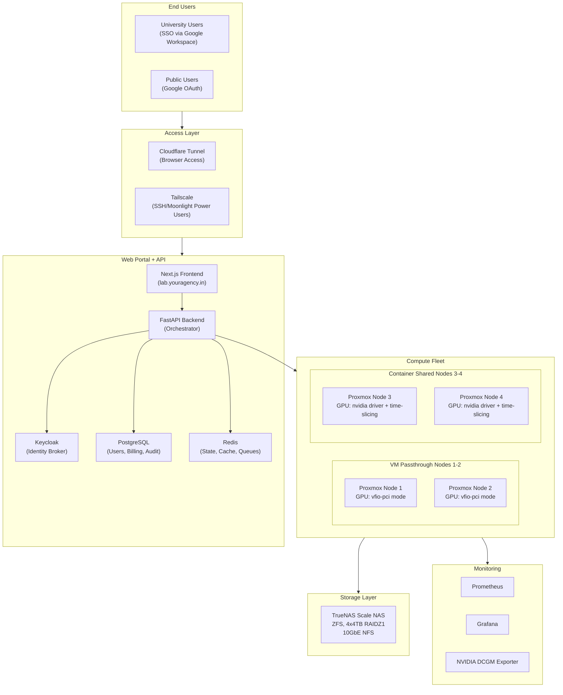
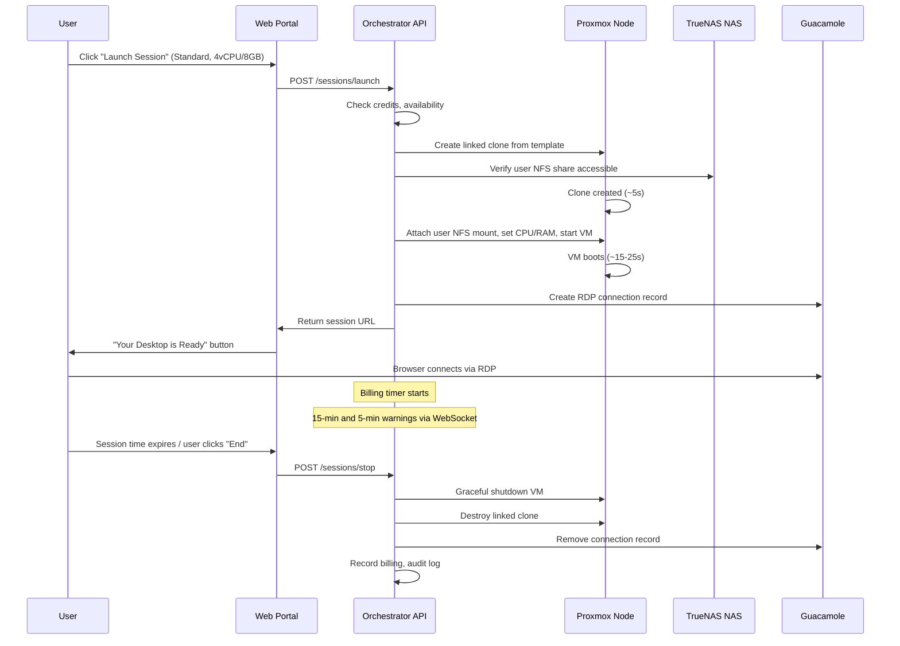

# Lab as a Service (LaaS) Platform -- Architecture and Implementation Plan

---

## Part 1: Critical Issues and False Assumptions Found

Before presenting the architecture, I must surface **critical findings** from research that directly contradict or complicate assumptions in the original proposal. Ignoring these will cause project failure.

### CRITICAL ISSUE 1: GPU State Machine is Architecturally Infeasible as Described

The proposed GPU state machine assumes dynamic runtime switching between `SHARED_LXC` (host nvidia driver loaded, containers share GPU) and `EXCLUSIVE_PASSTHROUGH` (GPU bound to vfio-pci, passed to a single VM).

**These modes are mutually exclusive at the host kernel level:**

- VM passthrough requires blacklisting nvidia drivers and binding to `vfio-pci`
- LXC GPU sharing requires nvidia drivers loaded on the host

Runtime driver rebinding scripts exist but are **fragile and unreliable**, especially on RTX 5090 which has a documented D3cold power management bug (GPU enters deep sleep after VM shutdown and fails to wake -- requires host reboot). References: Proxmox Forum threads on RTX 5090 D3cold lockups, kernel 6.14+ issues.

**Resolution:** Adopt a **static node-role assignment model** instead. Designate 2 nodes for VM passthrough (Tiers 1 and 2) and 2 nodes for LXC/container GPU sharing (Tier 3). Role reassignment happens during planned maintenance windows, not dynamically.

---

### CRITICAL ISSUE 2: NVIDIA MPS is NOT Supported on Consumer GeForce GPUs

The proposal uses CUDA MPS for multi-user GPU sharing in ephemeral containers. MPS is documented for Tesla, Quadro, and datacenter GPUs only. The RTX 5090 is a consumer GPU and is **not officially supported** for MPS.

Additionally, MIG (Multi-Instance GPU) is only available on A100, H100, and Blackwell datacenter SKUs -- not consumer GPUs.

**Resolution:** Use **NVIDIA GPU time-slicing** (via `nvidia-container-toolkit`) for Docker/LXC GPU sharing. Time-slicing works on consumer GPUs via context switching. It provides weaker isolation than MPS/MIG (no hard VRAM partitioning) but is the only viable option for GeForce.

---

### CRITICAL ISSUE 3: Multiple Concurrent GPU Desktop VMs Per Node is IMPOSSIBLE

The proposal states "Multiple users can run stateful GUI sessions simultaneously on the same physical machine (each in their own isolated KVM VM)" with GPU access. This requires NVIDIA vGPU, which is **not available on consumer GeForce GPUs**. You cannot pass one RTX 5090 to multiple VMs simultaneously.

**Reality per node:**

- **ONE** GPU-passthrough VM at a time (exclusive)
- Multiple CPU-only VMs concurrently (no GPU access)
- GPU sharing only in containers (not VMs)

**Resolution:** Tier 2 GPU configs are limited to 1 GPU session per node. CPU-only configs (Starter, Standard) can run concurrently alongside the GPU VM. Users needing GPU must accept scheduling constraints.

---

### CRITICAL ISSUE 4: Windows 11 Pro Licensing Prohibits Commercial VM Hosting

Windows 11 Pro **does not include virtualization rights for commercial hosting**. Offering Windows VMs commercially to university students using retail Pro licenses is a licensing violation.

**Required licenses (any ONE of):**

- **Windows 11 Education A3/A5** (if universities have Microsoft education agreements)
- **Microsoft SPLA** (Services Provider License Agreement) for commercial hosting
- **Windows Server + RDS CALs** (Remote Desktop Services Client Access Licenses)

**Resolution:** Before launch, engage Microsoft licensing (or a licensing reseller) to obtain proper SPLA or education licensing. Budget ~$5-8 per user/month for Windows SPLA. Alternatively, push users toward Linux to reduce licensing cost.

---

### CRITICAL ISSUE 5: Proprietary Software Sublicensing is a Legal Minefield

Pre-installing AutoCAD, MATLAB, Premiere Pro, and Blender in base images for commercial hosting triggers sublicensing obligations:

- **AutoCAD**: Autodesk's virtualization policy requires specific license types for hosted/shared environments
- **MATLAB**: Requires network license server with Campus-Wide or Concurrent licenses
- **Premiere Pro**: Adobe Creative Cloud licenses are per-user and generally prohibit shared hosting
- **Blender**: Free and open-source -- no licensing issues

**Resolution:** The client must secure ISV-specific hosting licenses BEFORE pre-installing software. MATLAB Campus-Wide license through the university is the easiest path. AutoCAD and Premiere Pro require direct ISV agreements. Do NOT pre-install unlicensed software in base images.

---

### CRITICAL ISSUE 6: Ryzen 9950X3D + Proxmox Has Documented Stability Issues

Multiple users report VM crashes, kernel panics, and IOMMU corruption on Zen 5 CPUs with Proxmox VE 8/9. The ASUS ProArt X670E-Creator has known messy IOMMU grouping issues.

**Mitigations:**

- Pin to a stable kernel version (test 6.8.x before 6.14.x+)
- Update to latest AMD microcode and BIOS firmware
- Disable XMP/EXPO; run RAM at JEDEC speeds initially for stability testing
- Apply Proxmox Zen 5 firmware patches (released Jan 2026)
- Plan for potential need for ACS override patches (reduces isolation security)
- Budget 2-4 weeks for hardware stabilization and burn-in testing before production

---

### CRITICAL ISSUE 7: Guacamole Cannot Display GPU-Rendered Content via VNC/SPICE

When a GPU is passed through to a VM, QEMU cannot access its framebuffer. Guacamole using VNC/SPICE will show only software-rendered output.

**Resolution:** Guacamole must connect via **RDP** (not VNC) to Windows VMs. RDP captures GPU-rendered frames correctly. For Linux GPU VMs, use **Sunshine** (inside VM) with **Moonlight** (client) for GPU-accelerated streaming, or Guacamole via VNC with X11 virtual framebuffer (software rendering only).

---

### Additional Overlooked Considerations

- **Internet bandwidth**: 20+ concurrent remote desktop streams at 5-15 Mbps each = 100-300 Mbps upstream minimum. Verify ISP plan.
- **UPS/Power**: 4 machines at ~800W each = 3.2kW+ total. UPS is essential for graceful shutdown.
- **Physical cooling**: 3.2kW of heat in a room requires dedicated cooling (mini-split AC or data center cooling).
- **Backup of Proxmox configuration and templates**: Not just user data on NAS.
- **Base image update strategy**: How to update software in base images without disrupting active users.
- **Anti-abuse**: Preventing crypto mining, DDoS relay, and other misuse in user VMs/containers.
- **PCIe bandwidth**: X670E runs RTX 5090 at PCIe 4.0 x16 (not 5.0). Performance impact is ~2-5% for most workloads -- acceptable.

---

## Part 2: Revised Architecture

### 2.1 High-Level Architecture




### 2.2 Node Role Assignment


| Node   | Role             | GPU Mode      | Workloads                                             |
| ------ | ---------------- | ------------- | ----------------------------------------------------- |
| Node 1 | VM Passthrough   | vfio-pci      | Tier 1 (Full Machine), Tier 2 (GPU VMs), CPU-only VMs |
| Node 2 | VM Passthrough   | vfio-pci      | Tier 1 (Full Machine), Tier 2 (GPU VMs), CPU-only VMs |
| Node 3 | Container Shared | nvidia driver | Tier 3 Ephemeral (Jupyter, Code-Server, SSH with GPU) |
| Node 4 | Container Shared | nvidia driver | Tier 3 Ephemeral (Jupyter, Code-Server, SSH with GPU) |


Role reassignment requires: drain active sessions -> reboot node -> apply new GPU mode -> bring back online. Schedule during low-usage windows (e.g., 2-4 AM).

If demand patterns shift (e.g., more GPU VM demand than ephemeral), reassign one container node to VM passthrough mode during next maintenance window.

### 2.3 Revised Compute Configurations


| Config        | vCPU | RAM  | GPU VRAM    | Mode               | Max Per Node | Notes                               |
| ------------- | ---- | ---- | ----------- | ------------------ | ------------ | ----------------------------------- |
| Starter       | 2    | 4GB  | None        | VM (Tier 2)        | 6-7          | CPU-only, light work                |
| Standard      | 4    | 8GB  | None        | VM (Tier 2)        | 3-4          | CPU-only, office/CAD                |
| Pro           | 4    | 8GB  | 32GB (full) | VM (Tier 2)        | 1            | GPU passthrough, exclusive          |
| Power         | 8    | 16GB | 32GB (full) | VM (Tier 2)        | 1            | GPU passthrough, exclusive          |
| Max           | 8    | 16GB | 32GB (full) | VM (Tier 2)        | 1            | Same GPU, more CPU/RAM              |
| Full Machine  | 14   | 56GB | 32GB (full) | VM (Tier 1)        | 1            | Entire node dedicated               |
| Ephemeral-CPU | 2    | 4GB  | None        | Container (Tier 3) | 6-8          | Jupyter/Code-Server                 |
| Ephemeral-GPU | 2-4  | 8GB  | Time-sliced | Container (Tier 3) | 4-6          | GPU time-sliced, no hard VRAM limit |


**Key change**: GPU configs (Pro/Power/Max) get the FULL 32GB GPU via passthrough because consumer GPUs cannot be partitioned. The "4GB/8GB/16GB VRAM" tiers from the original proposal are not implementable. Pricing differentiation for GPU tiers should be based on CPU/RAM allocation instead.

For ephemeral GPU containers, GPU time-slicing provides fair scheduling but no hard VRAM isolation. Document this to users.

### 2.4 Capacity Estimates (Full Fleet)

- **VM Passthrough Nodes (2)**: Up to 2 concurrent GPU users + 6-8 concurrent CPU-only users
- **Container Shared Nodes (2)**: Up to 8-12 concurrent ephemeral users (4-6 GPU, 4-6 CPU-only)
- **Total concurrent users**: ~16-22 (realistic with 4 nodes)
- **Peak with scheduling**: ~40-60 users/day in 2-4 hour slots

---

## Part 3: Technology Stack

### 3.1 Hypervisor and Virtualization

- **Proxmox VE 9.x** (latest stable) as the hypervisor on all 4 nodes
- **KVM/QEMU** for stateful VMs (Tiers 1 and 2)
- **LXC + Docker** for ephemeral containers (Tier 3)
- **Proxmox API** via `proxmoxer` Python library for automation

### 3.2 GPU Management

- **VM nodes**: GPU bound to `vfio-pci` at boot via `/etc/modprobe.d/vfio.conf`
- **Container nodes**: NVIDIA driver loaded on host, `nvidia-container-toolkit` for Docker GPU access
- **Time-slicing**: Configured via NVIDIA device plugin for fair GPU sharing in containers
- **Hookscripts**: Proxmox hookscripts for pre-start/post-stop GPU health checks
- **Dummy HDMI dongles**: One per RTX 5090 for headless rendering (HDMI 2.1, 4K capable, ~$10 each)
- **D3cold mitigation**: Add `disable_idle_d3=1` to kernel params on VM nodes

### 3.3 Storage

**Per-Node NVMe Layout (2TB):**

```
nvme0n1p1  100GB  EXT4   -> Proxmox OS + swap (reduced from 128GB)
nvme0n1p2  900GB  LVM PV -> VG_STATEFUL (base images + linked clone deltas)
nvme0n1p3  760GB  LVM PV -> VG_EPHEMERAL (container images, scratch)
nvme0n1p4  240GB  EXT4   -> Shared read-only datasets (mounted read-only)
```

**Centralized NAS:**

- **TrueNAS Scale** on a 5th machine (or repurposed existing hardware)
- **ZFS pool**: 4x4TB RAIDZ1 (~12TB usable)
- **User storage**: ZFS datasets with 10GB quota per user (NOT LVM). ZFS quotas are easier to manage than LVM thin volumes on NAS.
  - Path: `/mnt/pool/users/<uid>/` 
  - Quota: `zfs set quota=10G pool/users/<uid>`
- **NFS export**: Per-user directory exported to all 4 nodes over 10GbE
- **Backup**: Daily ZFS snapshots (`zfs-auto-snapshot`), 7 daily + 4 weekly retention

**Base Image Strategy:**

- Windows template: ~80GB qcow2 on VG_STATEFUL (each node)
- Linux template: ~60GB qcow2 on VG_STATEFUL (each node)
- Proxmox linked clones (instant, copy-on-write) for per-session instances
- Templates updated monthly during maintenance window
- User NFS directory mounted as secondary virtio disk inside VM

### 3.4 Networking

**Hardware:**

- 1x **Mikrotik CRS309-1G-8S+** (8-port 10GbE SFP+ managed switch) -- ~$300
- 4x **Intel X550-T1** 10GbE PCIe NIC (one per compute node) -- ~$80 each
- 1x 10GbE NIC for NAS
- DAC (Direct Attach Copper) SFP+ cables for short runs within rack
- 4x HDMI dummy dongles

**VLAN Layout:**

- VLAN 10: Management (Proxmox UI, SSH, IPMI) -- 2.5GbE onboard
- VLAN 20: VM traffic (stateful desktop sessions) -- 10GbE
- VLAN 30: Container traffic (ephemeral sessions) -- 10GbE
- VLAN 40: Storage (NFS to NAS, VM migration) -- 10GbE
- VLAN 50: User-facing services (web portal, Guacamole) -- 10GbE

**External Access:**

- **Cloudflare Tunnel** (`cloudflared`): Primary access for browser users. Routes `lab.youragency.in` to internal reverse proxy. Zero open ports.
- **Tailscale**: Subnet router on a dedicated LXC, advertises VM/container subnets. For SSH and Moonlight power users.
- **Reverse proxy**: Traefik or Caddy, handling TLS termination and routing to Guacamole, web portal, JupyterHub, Code-Server.

### 3.5 Remote Access


| Protocol             | Use Case                 | Source                  | Latency           |
| -------------------- | ------------------------ | ----------------------- | ----------------- |
| Guacamole (RDP)      | Windows GUI VMs          | Browser, zero install   | Medium (~30-50ms) |
| Guacamole (VNC)      | Linux GUI VMs (CPU-only) | Browser, zero install   | Medium            |
| Guacamole (SSH)      | Linux CLI                | Browser, zero install   | Low               |
| Sunshine + Moonlight | GPU-intensive rendering  | Requires client install | Very low (~15ms)  |
| JupyterHub           | Notebooks                | Browser, zero install   | Low               |
| Code-Server          | VS Code in browser       | Browser, zero install   | Low               |


- Guacamole deployed as Docker containers on the NAS or a management LXC
- Sunshine installed inside GPU-passthrough VMs as optional low-latency streaming
- Guacamole connection records auto-managed by the orchestrator via Guacamole's REST API

### 3.6 Authentication

**Keycloak** deployed as YOUR identity broker (universities do NOT need Keycloak):

- **University users**: Keycloak realm per university, configured with Google Workspace as Social Identity Provider (most Indian universities use Google Workspace). User authenticates with `priya@cs.university.ac.in` via Google OAuth/OIDC. Keycloak receives the Google token and issues platform tokens.
- **Public users**: Separate Keycloak realm with Google OAuth social login. Limited to ephemeral-only access.
- **Groups/Roles**: Keycloak groups map to university/department/role. Used for authorization (resource quotas, pricing tiers) not authentication.
- **RBAC**: Admin, University Admin, Student, Researcher, Public user roles.

If a university uses LDAP instead of Google Workspace, Keycloak supports LDAP federation as an identity source -- configure per-university.

### 3.7 Web Portal and API

**Frontend**: Next.js (React) -- server-side rendered, responsive, modern UI

- Dashboard: Storage usage, active sessions, fleet status
- Booking: Select config, schedule time, view availability
- Session: Launch, reconnect, extend, terminate
- Account: OS choice, profile, usage history
- Admin: Fleet overview, user management, billing, audit logs, GPU health

**Backend**: FastAPI (Python)

- **Orchestrator service**: Session lifecycle (create/destroy VMs and containers via Proxmox API)
- **Booking service**: Schedule management, conflict resolution, availability calculation
- **Billing service**: Usage tracking (per-second granularity), invoice generation, Razorpay integration
- **Auth proxy**: Keycloak token validation, RBAC enforcement
- **GPU state service**: Track GPU ownership per node, health monitoring

**Database**: PostgreSQL (users, bookings, billing records, audit logs)
**Cache/State**: Redis (GPU state, session state, rate limiting, job queues)
**Task queue**: Celery with Redis broker (background billing, session cleanup, notifications)

### 3.8 Billing

- Usage tracked per-second, billed per-minute
- **Pre-paid wallet model**: Users add credits (via Razorpay UPI/card/netbanking), deducted in real-time
- Session auto-terminates when credits reach zero (with 5-min warning)
- University bulk pricing: Semester packages purchased by department
- Invoice generation: Monthly PDF invoices with detailed usage breakdown
- **Razorpay Python SDK** for payment processing

### 3.9 Monitoring and Audit

- **Prometheus** + **Grafana**: System metrics, GPU health, fleet utilization
- **NVIDIA DCGM Exporter**: GPU temperature, utilization, VRAM, power draw
- **Node Exporter**: CPU, RAM, disk, network per node
- **Proxmox Exporter**: VM/container status, resource allocation
- **Loki**: Log aggregation from all components
- **Custom audit logger**: Every session event (start, stop, connect, disconnect, warnings) written to PostgreSQL audit table
- **Alerting**: PagerDuty/Slack/email for GPU temperature >85C, disk >90%, node offline, GPU unresponsive

---

## Part 4: Session Lifecycle (Detailed)

### 4.1 Stateful VM Session (Tier 2)




### 4.2 Ephemeral Container Session (Tier 3)

1. User clicks "Launch Ephemeral" -- selects Jupyter/Code-Server/SSH + config
2. Orchestrator finds available container node with resources
3. Creates Docker container: selected image + user NFS mount at `/home/<uid>` + GPU (if selected)
4. Container starts in ~5-10 seconds
5. Returns URL to Jupyter/Code-Server/SSH via Guacamole
6. On session end: container destroyed, scratch wiped, user files persist on NFS
7. Public users: Jupyter notebook file saved to their account in PostgreSQL (like Colab)

---

## Part 5: Implementation Phases

### Phase 0: Hardware Prep and Burn-In (Weeks 1-3)

- Assemble all 4 machines, install Proxmox VE 9 on each
- Update BIOS to latest, apply AMD microcode updates
- Run memtest86 (48+ hours) and GPU stress tests
- Install NVIDIA drivers, test GPU passthrough on one node
- **Validate RTX 5090 D3cold workaround** (`disable_idle_d3=1`)
- Test IOMMU grouping, apply ACS override if needed
- Install 10GbE NICs, configure switch with VLANs
- Set up TrueNAS Scale NAS, create ZFS pool, test NFS performance
- **Decision gate**: If GPU passthrough is unstable, evaluate alternative GPUs or architecture

### Phase 1: Core Infrastructure (Weeks 3-6)

- Configure Proxmox cluster (4 nodes + QDevice on NAS for quorum)
- Set up node roles: 2 VM-passthrough, 2 container-shared
- Create Windows and Linux VM templates with base software
- Configure linked clone provisioning via Proxmox API
- Set up NFS user directories with ZFS quotas
- Test full session lifecycle: clone -> boot -> NFS mount -> use -> destroy
- Deploy Keycloak (Docker on NAS or management LXC)

### Phase 2: Remote Access and Orchestration (Weeks 6-10)

- Deploy Apache Guacamole (Docker on NAS)
- Integrate Guacamole REST API with orchestrator
- Build FastAPI orchestrator: session CRUD, Proxmox API integration
- Build booking/scheduling system
- Configure Cloudflare Tunnel and Tailscale
- Install Sunshine in GPU VM templates for Moonlight option
- Test end-to-end remote desktop: user -> Cloudflare -> Guacamole -> RDP -> VM

### Phase 3: Web Portal and Auth (Weeks 10-14)

- Build Next.js web portal (dashboard, booking, session management)
- Integrate Keycloak authentication (university Google Workspace + public Google OAuth)
- Build admin panel (fleet overview, user management)
- Implement user registration flow with OS choice
- Build session reconnection logic

### Phase 4: Billing, Monitoring, and Polish (Weeks 14-18)

- Integrate Razorpay billing (wallet top-up, real-time deduction)
- Deploy Prometheus + Grafana monitoring stack
- Configure DCGM exporter, node exporter, Proxmox exporter
- Build audit logging system
- Implement session warnings and graceful shutdown
- Implement OS switch with DELETE confirmation and data wipe
- Implement rate limiting and anti-abuse measures

### Phase 5: Beta Testing and Hardening (Weeks 18-22)

- Onboard 10-20 beta users from one university
- Load testing: simulate maximum concurrent sessions
- Security audit: container escape testing, VLAN isolation verification
- Performance tuning: NFS caching, Guacamole settings, GPU driver stability
- Documentation: user guides, admin runbooks, troubleshooting guides

### Phase 6: Production Launch (Week 22+)

- Gradual rollout to additional universities
- Public user access (ephemeral only)
- 24/7 monitoring and on-call setup

---

## Part 6: Risk Register


| Risk                           | Severity | Likelihood | Mitigation                                                   |
| ------------------------------ | -------- | ---------- | ------------------------------------------------------------ |
| RTX 5090 D3cold GPU lockup     | High     | Medium     | `disable_idle_d3=1`, GPU health watchdog, auto-reboot script |
| Ryzen 9950X3D kernel panics    | High     | Medium     | Pin stable kernel, burn-in testing, BIOS/microcode updates   |
| Windows licensing violation    | Critical | High       | Obtain SPLA or education licenses BEFORE launch              |
| Software sublicensing lawsuit  | Critical | Medium     | Obtain ISV hosting licenses, remove unlicensed software      |
| NFS latency affecting UX       | Medium   | Medium     | 10GbE, tune NFS settings, local scratch for heavy I/O        |
| IOMMU grouping issues on X670E | Medium   | High       | ACS override patch, test thoroughly during Phase 0           |
| GPU time-slicing unfairness    | Low      | Medium     | Set CUDA_MPS_ACTIVE_THREAD_PERCENTAGE per container, monitor |
| Single NAS failure             | High     | Low        | ZFS snapshots, offsite backup, consider NAS HA               |


---

## Part 7: Costs Estimate (One-Time + Monthly)

**One-Time Hardware Additions:**

- 4x Intel X550-T1 10GbE NIC: ~$320
- 1x Mikrotik CRS309 switch: ~$300
- SFP+ DAC cables (6x): ~$60
- 4x HDMI dummy dongles: ~$40
- NAS hardware (if not existing): ~$1500-3000
- **Total: ~$2,200-3,700**

**Monthly Operating Costs:**

- Internet (dedicated/business line, 500Mbps+ symmetric): ~$3,000-5,000/month (India)
- Electricity (~4kW average, 24/7): ~$8,000-12,000/month (India, commercial rate)
- Domain and Cloudflare: ~$20/month
- Windows SPLA licensing (est. 50 users): ~$250-400/month
- Software ISV licenses: varies by vendor
- Proxmox subscription (optional, for enterprise support): ~$400/year per node

---

## Part 8: Key Architectural Decisions Summary

1. **Static node roles** over dynamic GPU switching -- reliability over flexibility
2. **GPU time-slicing** over MPS -- only option for consumer GPUs
3. **One GPU session per VM node** -- hardware limitation, not a design choice
4. **Guacamole via RDP** for Windows GPU VMs -- only protocol that captures GPU framebuffer
5. **ZFS datasets with quotas on NAS** over LVM thin volumes -- simpler management, native snapshots
6. **Proxmox linked clones** for session lifecycle -- instant CoW copies, native support
7. **Keycloak as identity broker** -- you host it, federate with university Google Workspace
8. **Pre-paid wallet billing** -- simplest model for metered compute
9. **Separate VG_STATEFUL/VG_EPHEMERAL** -- hard disk partition isolation is sound and retained
10. **Cloudflare Tunnel as primary access** -- zero open ports, DDoS protection, works through firewalls

