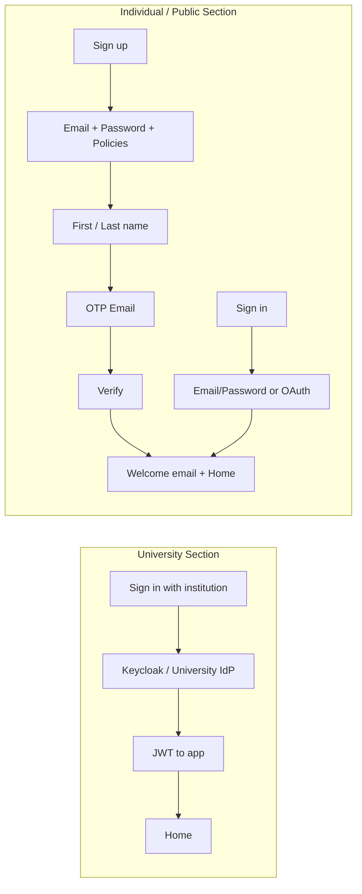

# LaaS Sign-in / Sign-up Flow — Implementation Plan

## Context summary

- **Project**: Lab as a Service (LaaS) — remote GPU/compute for university members (SSO) and public users (sign-up/sign-in). See [project_context_Beta.txt](project_context_Beta.txt) and [laas_tech_stack_365cc328.plan.md](.cursor/plans/laas_tech_stack_365cc328.plan.md).
- **Current state**: No application code (clean slate). Monitoring and POC infra are in [monitoring_setup_files/](monitoring_setup_files/) and [Important_docs/LaaS_POC_Runbook_v2.txt](Important_docs/LaaS_POC_Runbook_v2.txt).
- **Database**: PostgreSQL + MongoDB (per your choice). Auth, users, orgs, roles, and billing-critical data in PostgreSQL; document-style/session metadata can live in MongoDB where it fits.
- **SMTP**: Gmail sender using credentials from [monitoring_setup_files/laas-monitoring/.env](monitoring_setup_files/laas-monitoring/.env) (lines 28–29). Application will need its own `.env` (e.g. under `apps/api` or root) with `SMTP_USERNAME` / `SMTP_PASSWORD` (and optionally `SMTP_HOST`, `SMTP_FROM`) — do not duplicate secrets in repo; reference one source or env.

---

## 1. Two named auth sections

| Section                      | Name (suggested)                                                   | Behavior                                                                                                                                                              |
| ---------------------------- | ------------------------------------------------------------------ | --------------------------------------------------------------------------------------------------------------------------------------------------------------------- |
| **University / Institution** | e.g. "Sign in with your institution" or "University / Institution" | **Sign-in only** via official university identity (SSO). No sign-up form; user selects institution (or is deep-linked) and is sent to university IdP.                 |
| **Individual / Public**      | e.g. "Individual / Public" or "Create account"                     | Full **sign-up** (email, password, first name, last name, policy checklists, OTP verification, welcome email) and **sign-in** (email/password + OAuth Google/GitHub). |

Entry point: single landing/auth page that clearly offers both sections (e.g. two cards or two primary CTAs). No deviation from this split.

---

## 2. University SSO (sign-in only)

**How it works (high level):**

- Universities typically expose **SAML 2.0** (e.g. Shibboleth, InCommon) or **OIDC** (e.g. Google Workspace). Keycloak acts as the **Service Provider (SP)** for SAML or **Relying Party** for OIDC.
- **Flow**: User clicks “Sign in with your institution” → select (or redirect to) university → redirect to university IdP → user logs in with university credentials → IdP posts back SAML assertion / OIDC tokens to Keycloak → Keycloak creates or links user and issues **our** JWT (RS256) → app receives JWT and redirects to home.

**Implementation responsibilities:**

- **Keycloak**: One realm (e.g. `laas-university`) with:
  - Identity provider(s): SAML 2.0 and/or OIDC per university. Add IdPs by importing metadata (SAML Entity Descriptor) or configuring OIDC endpoints. Map IdP attributes to Keycloak user profile (e.g. email, name, groups).
  - Optional: multiple IdPs (one per university) with a “picker” or `kc_idp_hint` for deep links.
- **Backend (NestJS)**: Validate Keycloak-issued JWT (RS256, Keycloak’s JWKS), map token claims to internal user/org/role (e.g. create/link user in PostgreSQL on first login), enforce RBAC.
- **Frontend (Next.js)**: “Sign in with your institution” → redirect to Keycloak with appropriate `kc_idp_hint` or realm so Keycloak shows IdP selection or goes straight to the chosen university IdP. No sign-up form for this path.

**Research / setup tasks:**

- Document required IdP metadata (SAML: Entity ID, SSO URL, certificate; OIDC: issuer, authorization/token/userinfo endpoints). For MVP, configure at least one test IdP (e.g. Keycloak-as-IdP in another realm, or a university test IdP if provided).
- Do not implement custom SAML/OIDC from scratch; use Keycloak’s federation only.

---

## 3. Individual / Public — design and flows

**Design reference:** The provided screens (sign-in, sign-up, verification, policy modals, first/last name step) are the single source of truth. Implementation must match layout, elements, and behavior with no deviations.

**Suggested placement of assets:**

- **Design reference**: [Design-Ref/SignUp-SignIn](Design-Ref/SignUp-SignIn) (or equivalent path where your PNGs live) for pixel reference.
- **Left-panel images**: Use an **Image_Assets** folder (e.g. `apps/web/public/Image_Assets` or `apps/web/assets/Image_Assets`). Populate with the multiple images you want; the app will pick one at random on each load of the sign-up/sign-in section.

**Copy and branding:**

- **No GMI logo.** Use LaaS/product logo and name only.
- **Left panel bottom text**: Replace with a short, project-specific tagline (e.g. one headline + one subtitle) that reflects LaaS (remote lab, GPU compute, research, education). Example direction: “Your lab, anywhere.” / “High-performance compute and GPU labs, on demand.” Final copy can be tuned later; implementation should use a single config or constant so you can change it in one place.

**Flows to implement:**

1. **Sign-in**
  - Two-column layout: left = rotating image + tagline; right = “Welcome to [LaaS]”, email, password, “Forgot your password?”, “Sign in”, OR divider, Google/GitHub OAuth, “Don’t have an account? Sign up”, footer links (Need help?, Contact Support, User Policy, User Content Disclaimer, Console Terms of Service).
  - OAuth: Google and GitHub only; backend uses Keycloak social/identity brokering or app-level OAuth with Keycloak.
2. **Sign-up**
  - Same two-column layout. Right: “Create an Account”, subtitle, email, password (with strength rules: 8+ chars, 1 number, 1 lowercase, 1 uppercase, allowed chars only), then **three checkboxes**:
    - “I agree with [Product]’s Policy” (link opens policy view)
    - “I agree with the User Content Disclaimer” (link opens policy view)
    - “I agree with the Console Terms of Service” (link opens policy view)
  - On **clicking a link** (or checkbox label): open the **policy modal** (info view) for that document. Policy content: scrollable; **scroll-to-end** behavior: only when the user has scrolled to the bottom (or used the “scroll to end” helper button), show “I have read and agree to [Policy name]” checkbox and “Confirm” button. Confirm closes modal and marks that policy as agreed in the form state.
  - **Helper button**: A “scroll to end” control (e.g. down arrow or “Scroll to end”) inside the modal that programmatically scrolls the content to the bottom so the footer appears.
  - After all three policies are agreed, “Sign up” becomes valid. On submit: do **not** create account yet; go to **first name / last name** step (same two-column shell, right side: “First name”, “Last name”, “Continue” / “Back”). Then **email verification** step.
3. **Email verification**
  - Right panel: “Your Verification Code”, “Enter the code from your email:”, display of the email used at sign-up, **6 single-character OTP inputs**, “Didn’t get the email? Resend email”, “Verify” and “Cancel”.
  - Backend: On sign-up submit (after first/last name), create user in “pending verification” state, generate 6-digit OTP, store hash + expiry in DB (e.g. PostgreSQL), send OTP email via Gmail SMTP (use credentials from your .env; app config points to same or copied env vars). On “Verify”, check OTP → mark email verified → create session → redirect to home and trigger **welcome email**.
4. **Welcome email**
  - Sent once after successful verification (or first login after sign-up). Use same Gmail SMTP. Content can be simple (e.g. “Welcome to LaaS…”); template and copy can be changed later.

**Policy content:** Hardcoded for now (e.g. Acceptable Use Policy, User Content Disclaimer, Console ToS as static text or constants). You’ll replace with real content later; structure the modal and state so swapping content is easy.

---

## 3.1 Gaps and considerations (learnings)

The following were identified during plan review; implement explicitly to avoid oversight.

**OAuth buttons:** Design reference shows three buttons; requirement is **Google and GitHub only**. Implement exactly two OAuth buttons. Do not add a third social or magic-link button unless explicitly added later.

**Password rules — "Use only allowed characters":** Besides 8+ chars, 1 number, 1 lowercase, 1 uppercase, the design includes "Use only allowed characters." Define allowed characters explicitly (e.g. ASCII printable, or letters + digits + a fixed set of symbols) and document in shared Zod schema and backend validation so UI (green check / red X) and API stay in sync.

**Persisting policy consents:** When the user is created (after OTP verification), insert rows into `user_policy_consents` for each policy agreed during sign-up (`policy_slug`: e.g. `acceptable_use`, `user_content_disclaimer`, `console_tos`), with `agreed_at` and `ip_address`. Store agreed policy slugs in sign-up state so they are available at user creation.

**Public organization and role:** Seed (or migration) must ensure one organization with `org_type = 'public'` (e.g. name "Public", slug "public"). On creating a public user (after OTP verification or OAuth link), set `users.default_org_id` to that org and insert `user_org_roles` with the `public_user` role for that org.

**storage_uid:** On user creation (public or university), generate an immutable `storage_uid` (e.g. `u_` + short random string or UUID segment) and persist. Uniqueness enforced by DB (see [laas_enterprise_database_design_1560fd47.plan.md](.cursor/plans/laas_enterprise_database_design_1560fd47.plan.md)).

**JWT issuer for public users:** Tech stack expects Keycloak as single signer. For the custom flow (name step, OTP, welcome email), two options: **(A)** After OTP verification, create user in PostgreSQL then create user in Keycloak via Admin API and use Keycloak token endpoint to obtain Keycloak-issued JWT (single issuer). **(B)** NestJS issues its own JWT for email/password public users; Keycloak issues JWT for university SSO and public OAuth (dual issuer). Prefer Option A; fall back to Option B if Keycloak Admin API or theme work blocks.

**Resend OTP and Cancel:** Backend resend endpoint must enforce rate limit (e.g. max 3 resends per 15 minutes per email/user); frontend shows cooldown or "Resend available in X min." **Cancel** on verification step: navigate back to sign-in (or previous step); do not create/update user until Verify is used.

**Forgot password:** For MVP with Option A (Keycloak as single issuer), implement "Forgot password?" as a link to Keycloak account management URL. If using Option B, add OTP-based or link-based reset flow.

**Image_Assets folder:** Create `Image_Assets` under frontend static assets (e.g. `apps/web/public/Image_Assets`). Implement "pick one image at random on each load" for the sign-up/sign-in section. Add 1–2 placeholder images or a fallback so the UI never shows a broken image when the folder is empty.

**Design reference source:** PNGs in [Design-Ref/SignUp-SignIn](Design-Ref/SignUp-SignIn) (e.g. TOS.png, SignUp.png, SignUp-Verification.png) are the pixel reference. Match two-column layout, left = rotating image + tagline (no GMI logo), right = form; sign-in, sign-up, name step, verification, and policy modals as described in the design.

**University SSO — MVP:** For MVP, configure one test IdP (e.g. second Keycloak realm as IdP, or university test IdP if provided). Document required IdP metadata: SAML (Entity ID, SSO URL, certificate); OIDC (issuer, authorization/token/userinfo endpoints). No custom SAML/OIDC from scratch — Keycloak federation only.

---

## 4. Tech stack and repo layout

- **Frontend**: Next.js 15 (App Router), React 19, Tailwind CSS 4, shadcn/ui. Lives in `**apps/web`** (or equivalent “UI” folder).
- **Backend**: NestJS 11 (Fastify), Prisma (PostgreSQL). Lives in `**apps/api`** (or equivalent “Backend” folder).
- **Auth**: Keycloak 26.x (self-hosted) — realms for university SSO and for public (local registration + Google/GitHub). JWT RS256, validated by NestJS.
- **Databases**: PostgreSQL (users, orgs, roles, OTP store, billing-related); MongoDB (optional for session metadata, logs, or other document data — schema to be defined where used).
- **Monorepo**: Root contains `apps/web`, `apps/api`, and optionally `packages/shared` (e.g. Zod schemas, shared types). UI and backend are separate folders as requested.

Best practices:

- Reusable UI components (buttons, inputs, modals, two-column auth layout, OTP inputs) under `apps/web/components` (or `components/ui` and `components/auth`).
- Shared validation and DTOs: Zod schemas in `packages/shared` or duplicated in api/web with a single source of truth; API documentation (OpenAPI/Swagger) from NestJS.
- Env: `.env.example` for both apps with all required keys (no secrets); SMTP and Keycloak URLs/realms in env.

---

## 5. Implementation order (high level)

1. **Monorepo and env**
  - Create repo structure: `apps/web`, `apps/api`, `packages/shared` (if used). Root or per-app `docker-compose` for PostgreSQL, MongoDB, Redis, Keycloak (and optional MailHog for dev).
  - Add `.env.example` for API (e.g. `DATABASE_URL`, `KEYCLOAK_ISSUER`, `KEYCLOAK_JWKS_URI`, `SMTP_`*, `GOOGLE_CLIENT_`*, `GITHUB_CLIENT_*`, `MONGODB_URI` if used).
2. **Keycloak**
  - Deploy Keycloak (e.g. Docker). Create realm for public users: local registration, email verification, Google and GitHub identity providers. Create realm (or IdP config) for university SSO; configure one test IdP (SAML or OIDC) for development.
3. **Backend — auth and users**
  - PostgreSQL schema (Prisma): users (id, email, first_name, last_name, email_verified_at, keycloak_id, storage_uid, auth_type, oauth_provider, default_org_id, etc.), otp_verifications, user_policy_consents, refresh_tokens, and org/role tables for RBAC. Seed: roles (including `public_user`), one organization with `org_type = 'public'`. If using MongoDB, add a small module for the chosen collections (e.g. session metadata) and document the schema.
  - NestJS: Auth module — JWT guard (RS256, JWKS from Keycloak; or dual issuer if Option B). Auth endpoints: register (public: email, password, first name, last name, policy slugs agreed), send-otp, resend-otp (rate limit: e.g. max 3 per 15 min per email/user), verify-otp, login (email/password or token exchange after OAuth), refresh. On user creation: set `storage_uid`, `default_org_id` (public org), insert `user_org_roles` (public_user), insert `user_policy_consents` from sign-up state. User creation/linking for university SSO on first JWT validation (by Keycloak sub).
  - OTP: Generate 6-digit code, store hash + expiry in PostgreSQL; verify-otp marks user verified, creates/links user in Keycloak if Option A, then trigger welcome email.
  - Email: SMTP transport (Nodemailer or similar) using Gmail credentials from env; send OTP and welcome emails.
4. **Frontend — Individual/Public**
  - Auth layout: Two-column component (left: image + tagline; right: slot for form). Left image: random choice from `Image_Assets` on mount (create folder under `apps/web/public/Image_Assets` with fallback if empty); tagline from config.
  - Pages: Sign-in, Sign-up (step 1: email/password + checkboxes), Sign-up step 2 (first/last name), Sign-up step 3 (OTP). Use Next.js App Router routes (e.g. `/signin`, `/signup`, `/signup/name`, `/signup/verify`). OTP step: Resend with cooldown; Cancel → back to sign-in or previous step.
  - Policy modals: Three modals (or one modal with three content variants). Content scrollable; detect “scroll to end” (or use helper button to scroll to bottom); show “I have read…” checkbox and “Confirm” only when at bottom; on Confirm, close and set “agreed” for that policy in sign-up state.
  - Forms: React Hook Form + Zod; password strength checklist as in design (include "allowed characters" rule per shared schema); OTP inputs (6 boxes, auto-focus next).
  - OAuth: “Sign in with Google” / “Sign in with GitHub” redirect to Keycloak (or direct to providers with Keycloak brokering). Callback handled by Next.js route; exchange code for tokens and set session (e.g. HTTP-only cookie or NextAuth session). (Implement exactly two OAuth buttons: Google and GitHub only.)
5. **Frontend — University SSO**
  - Entry: “Sign in with your institution” → redirect to Keycloak with university realm or `kc_idp_hint`. No sign-up UI; after login, Keycloak redirects back with code; frontend exchanges code (or receives tokens) and stores session, then redirect to home.
6. **Polish**
  - Forgot password: link from sign-in → Keycloak account console or a simple “reset password” flow (Keycloak or custom). Footer links can be placeholders (e.g. “User Policy” opens same policy modal) until real pages exist.
  - Responsive: Two-column stacks on small screens if needed; modals and OTP inputs remain usable.
  - Accessibility: Labels, focus order, and keyboard support for modals and OTP inputs.

---

## 6. Diagram (auth flows)

---

## 7. Out of scope for this plan

- Full RBAC and org/role assignment (only the minimal user record and “logged in” state needed for sign-in/sign-up).
- Forgot password implementation detail (link to Keycloak or stub).
- Actual university IdP metadata (handled per-institution during Keycloak setup).
- Production secrets management (use env and a single source for SMTP/Keycloak; no hardcoding).

---

## 8. Deliverables checklist

- Monorepo with `apps/web`, `apps/api`, and optional `packages/shared`; docker-compose for PG, Mongo, Redis, Keycloak.
- Keycloak: public realm (registration, Google/GitHub, email verification or app-driven OTP + user sync); university realm/IdP config (one test IdP); document IdP metadata requirements (SAML/OIDC).
- Backend: Prisma schema (Phase 1 auth tables including users, otp_verifications, user_policy_consents, refresh_tokens); seed (roles, public org); auth endpoints (register, send-otp, resend-otp with rate limit, verify-otp with user + consent creation, login, OAuth callback); JWT validation (Keycloak ± app issuer); SMTP (OTP + welcome); storage_uid and public_user assignment on create.
- Frontend: Two-section entry (University SSO | Individual/Public), sign-in and sign-up pages matching design, policy modals with scroll-to-end and helper button, first/last name step, OTP step (Resend + Cancel), rotating left-panel images from Image_Assets (folder + fallback), no GMI logo, LaaS tagline, only Google and GitHub OAuth, password rules including "allowed characters" (defined in Zod + API).
- Reusable components and env documentation (README or .env.example) for both apps.

