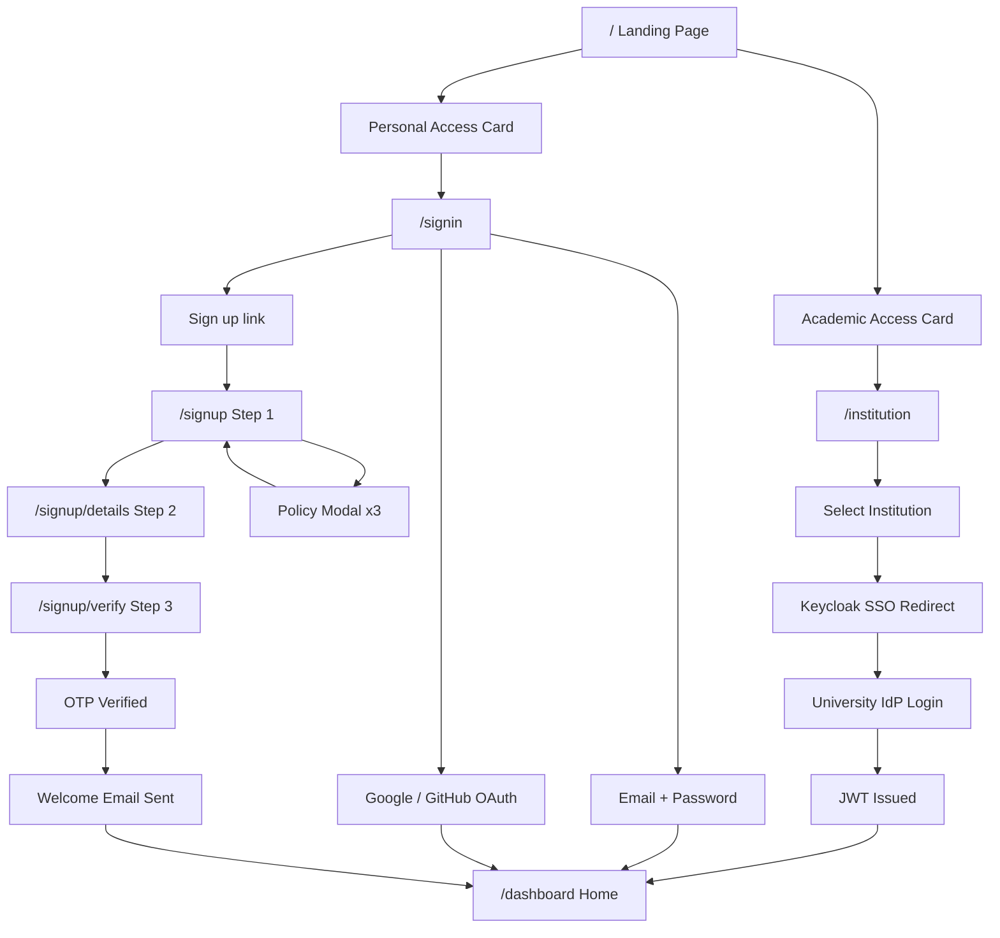

# LaaS Sign-in / Sign-up Flow -- Implementation Plan

## Context summary

- **Project**: Lab as a Service (LaaS) -- remote GPU/compute for university members (SSO) and public users (sign-up/sign-in). See [project_context_Beta.txt](project_context_Beta.txt) and [laas_tech_stack_365cc328.plan.md](.cursor/plans/laas_tech_stack_365cc328.plan.md).
- **Current state**: No application code (clean slate). Monitoring and POC infra are in [monitoring_setup_files/](monitoring_setup_files/) and [Important_docs/LaaS_POC_Runbook_v2.txt](Important_docs/LaaS_POC_Runbook_v2.txt).
- **Database design**: [laas_enterprise_database_design_1560fd47.plan.md](.cursor/plans/laas_enterprise_database_design_1560fd47.plan.md) -- 60+ tables across 12 domains. Auth-relevant domains: Identity/Multi-Tenancy, Users/RBAC, Auth/Security.
- **Database**: PostgreSQL 17 (primary, ACID-critical) + MongoDB 8.x (telemetry). Auth, users, orgs, roles, OTP, policy consents, billing in PostgreSQL. Session events and WebRTC snapshots in MongoDB.
- **SMTP**: Gmail sender using credentials from [monitoring_setup_files/laas-monitoring/.env](monitoring_setup_files/laas-monitoring/.env) (lines 28-29). Each app gets its own `.env` with `SMTP_USERNAME` / `SMTP_PASSWORD` / `SMTP_HOST` / `SMTP_FROM`.
- **Design reference**: PNGs in [Design-Ref/SignUp-SignIn](Design-Ref/SignUp-SignIn) -- `signin.png`, `SignUp.png`, `SingUp1.png`, `SignUp2.png`, `SignUp3.png`, `SignUp-Verification.png`, `TOS.png`, `TOS1.png`. These are the pixel-level source of truth.
- **Image assets**: [Image_Assets/](Image_Assets/) contains 4 images: `side-light-1.png`, `side-light-2.png`, `side-dark-1.png`, `side-dark-2.png` for the left panel.

---

## 1. Two named auth sections


| Section                      | Name                  | Behavior                                                                                                                                                                    |
| ---------------------------- | --------------------- | --------------------------------------------------------------------------------------------------------------------------------------------------------------------------- |
| **University / Institution** | **"Academic Access"** | **Sign-in only** via official university identity (SSO). No sign-up form; user selects institution from a searchable list and is redirected to university IdP via Keycloak. |
| **Individual / Public**      | **"Personal Access"** | Full **sign-up** (email, password, first name, last name, policy checklists, OTP verification, welcome email) and **sign-in** (email/password + OAuth Google/GitHub).       |


**Entry point**: Auth selection landing page at `/` with two prominent cards, one per section. No left-panel image on this page -- full-width centered layout with LaaS text-mark.

---

## 2. Project structure (no monorepo, no docker-compose)

Frontend and backend are **separate standalone projects** in their own top-level folders. No monorepo tooling (no Turborepo, no Nx, no shared `package.json` at root). No `docker-compose` for dev services -- databases and Keycloak are installed/run individually.

```
LaaS/
├── frontend/                          # Next.js 15 standalone app
│   ├── public/
│   │   └── images/                    # Copy of Image_Assets (4 images)
│   ├── src/
│   │   ├── app/
│   │   │   ├── layout.tsx             # Root layout (fonts, global styles)
│   │   │   ├── page.tsx               # Auth selection landing page
│   │   │   ├── (auth)/
│   │   │   │   ├── layout.tsx         # Two-column AuthLayout wrapper
│   │   │   │   ├── signin/
│   │   │   │   │   └── page.tsx       # Individual sign-in
│   │   │   │   ├── signup/
│   │   │   │   │   ├── page.tsx       # Step 1: email + password + policies
│   │   │   │   │   ├── details/
│   │   │   │   │   │   └── page.tsx   # Step 2: first name + last name
│   │   │   │   │   └── verify/
│   │   │   │   │       └── page.tsx   # Step 3: OTP verification
│   │   │   │   └── institution/
│   │   │   │       └── page.tsx       # University SSO selector
│   │   │   └── globals.css
│   │   ├── components/
│   │   │   ├── ui/                    # shadcn/ui components
│   │   │   ├── auth/                  # Auth-specific components
│   │   │   │   ├── left-panel.tsx
│   │   │   │   ├── sign-in-form.tsx
│   │   │   │   ├── sign-up-form.tsx
│   │   │   │   ├── name-step-form.tsx
│   │   │   │   ├── otp-input.tsx
│   │   │   │   ├── otp-verification.tsx
│   │   │   │   ├── password-strength-indicator.tsx
│   │   │   │   ├── policy-modal.tsx
│   │   │   │   ├── policy-checkbox.tsx
│   │   │   │   ├── oauth-buttons.tsx
│   │   │   │   ├── institution-selector.tsx
│   │   │   │   ├── footer-links.tsx
│   │   │   │   └── auth-section-card.tsx
│   │   │   └── icons/                 # SVG icon components (logo, Google, GitHub)
│   │   ├── lib/
│   │   │   ├── validations.ts         # Zod schemas (password, email, name, OTP)
│   │   │   ├── api.ts                 # API client layer (mock now, real later)
│   │   │   └── utils.ts               # cn() helper from shadcn
│   │   ├── stores/
│   │   │   └── signup-store.ts        # Zustand store for multi-step sign-up state
│   │   ├── config/
│   │   │   ├── policies.ts            # Hardcoded policy content (3 policies)
│   │   │   ├── constants.ts           # App name, taglines, image paths
│   │   │   └── institutions.ts        # Mock institution list for SSO
│   │   └── types/
│   │       └── auth.ts                # TypeScript types for auth flows
│   ├── .env.example
│   ├── .env.local                     # (gitignored) local overrides
│   ├── package.json
│   ├── tailwind.config.ts
│   ├── tsconfig.json
│   ├── next.config.ts
│   ├── components.json                # shadcn/ui config
│   └── README.md
│
├── backend/                           # NestJS 11 standalone app (built after UI validation)
│   ├── src/
│   │   ├── main.ts
│   │   ├── app.module.ts
│   │   ├── auth/                      # Auth module (register, login, OTP, OAuth, JWT)
│   │   ├── users/                     # Users module (CRUD, profile)
│   │   ├── mail/                      # Mail module (SMTP, templates)
│   │   ├── common/                    # Guards, interceptors, decorators, filters
│   │   └── prisma/                    # Prisma service and module
│   ├── prisma/
│   │   ├── schema.prisma              # PostgreSQL schema
│   │   ├── seed.ts                    # Seed roles, public org, permissions
│   │   └── migrations/
│   ├── templates/                     # Email HTML templates (Handlebars)
│   ├── .env.example
│   ├── package.json
│   ├── tsconfig.json
│   ├── nest-cli.json
│   └── README.md
```

---

## 3. University SSO -- Academic Access (sign-in only)

**How it works (high level):**

- Universities typically expose **SAML 2.0** (e.g. Shibboleth, InCommon) or **OIDC** (e.g. Google Workspace). Keycloak acts as the **Service Provider (SP)** for SAML or **Relying Party** for OIDC.
- **Flow**: User clicks "Academic Access" on landing page -> `/institution` -> selects university from searchable list -> redirect to Keycloak with `kc_idp_hint` for that university -> Keycloak redirects to university IdP -> user logs in with university credentials -> IdP posts back SAML assertion / OIDC tokens to Keycloak -> Keycloak creates or links user and issues **our** JWT (RS256) -> app receives JWT and redirects to home.

**Implementation responsibilities:**

- **Keycloak**: One realm (e.g. `laas-university`) with:
  - Identity provider(s): SAML 2.0 and/or OIDC per university. Add IdPs by importing metadata (SAML Entity Descriptor) or configuring OIDC endpoints. Map IdP attributes to Keycloak user profile (e.g. email, name, groups).
  - Multiple IdPs (one per university) with a "picker" or `kc_idp_hint` for deep links.
- **Backend (NestJS)**: Validate Keycloak-issued JWT (RS256, Keycloak's JWKS), map token claims to internal user/org/role (create/link user in PostgreSQL on first login via Keycloak `sub` claim), enforce RBAC.
- **Frontend (Next.js)**: `/institution` page with searchable institution list -> redirect to Keycloak with `kc_idp_hint`. No sign-up form for this path.

**Frontend UI (`/institution`):**

1. **Heading**: "Sign in with your Institution"
2. **Subtitle**: "Select your university or institution to continue with SSO."
3. **Search/select input**: Searchable dropdown of institutions (mock data: 3-5 universities like "K.S.R. College of Engineering", "IIT Madras", "Anna University"). Uses shadcn `Command` or `Popover` + search.
4. **"Continue with SSO"** button -- black filled, full-width (disabled until institution selected)
5. **"Back"** button -- outlined, navigates to `/`
6. **Info text**: "You will be redirected to your institution's login page."
7. **Footer links**
8. On submit (mock for UI phase): Show loading, then toast "Redirecting to [Institution Name]..." and redirect to `/dashboard` after 2 seconds.

**MVP setup tasks:**

- Document required IdP metadata (SAML: Entity ID, SSO URL, certificate; OIDC: issuer, authorization/token/userinfo endpoints).
- For MVP, configure at least one test IdP (e.g. Keycloak-as-IdP in another realm, or a university test IdP if provided).
- Do not implement custom SAML/OIDC from scratch; use Keycloak's federation only.

---

## 4. Individual / Public -- Personal Access (design and flows)

**Design reference:** The provided screens in [Design-Ref/SignUp-SignIn](Design-Ref/SignUp-SignIn) are the single source of truth. Implementation must match layout, elements, and behavior with no deviations.

**Branding:**

- **No GMI logo.** Use "LaaS" text-mark in a clean sans-serif font (bold, white on left panel).
- **Left panel bottom text** (headline + subtitle, configurable in `config/constants.ts`):
  - **Headline**: "Your lab. Any machine. Anywhere."
  - **Subtitle**: "Enterprise-grade GPU compute and remote research environments, on demand."

---

### 4.1 Two-column auth layout (shared by all auth pages)

Wraps `/signin`, `/signup/`*, `/institution`. Defined as `(auth)/layout.tsx` route group.

- **Left panel (~48% width)**: Full-height background image with gradient overlay at bottom. LaaS text logo top-left (white). Tagline (headline + subtitle) at bottom-left over gradient.
- **Right panel (~52% width)**: White background, vertically centered content area with max-width constraint, X close button at top-right (navigates to `/`).
- **Image rotation**: On each mount of the auth layout (or on each route change within the group), pick a random image from the 4 images in `public/images/`. For light images (`side-light-`*) use dark text on the overlay; for dark images (`side-dark-`*) use white text. Detection: filename contains "light" or "dark".
- **Responsive**: Below `md` breakpoint (768px), hide left panel entirely; right panel goes full-width. Modals and OTP inputs remain usable at all sizes.
- **Accessibility**: Proper focus order, keyboard navigation for all interactive elements, ARIA labels on modals.

---

### 4.2 Sign-in (`/signin`) -- design ref: `signin.png`

Right-panel content:

1. **Heading**: "Welcome to LaaS"
2. **Subtitle**: "Enter your email below to login to your account."
3. **Email** input (label: "Email", placeholder: "Enter your email")
4. **Password** label with **"Forgot your password?"** link aligned right, then input (placeholder: "Enter your password") with visibility toggle eye icon
5. **"Sign in"** button -- black filled, full-width
6. **"OR"** divider (horizontal rule with centered "OR" text)
7. **OAuth buttons**: Google and GitHub only (two icon buttons in outlined/bordered style, side by side). **Exactly two buttons** -- design shows three but requirement overrides to two.
8. **"Don't have an account? Sign up"** -- "Sign up" is a link to `/signup`
9. **Footer links**: "Need help?" | "Contact Support" | "User Policy" | "User Content Disclaimer" | "Console Terms of Service" -- small text, centered

**Behavior**: Validation via Zod (email format, password non-empty). On submit: mock API call with loading spinner on button, then redirect to `/dashboard` (placeholder). On error: toast notification via Sonner.

---

### 4.3 Sign-up step 1 (`/signup`) -- design ref: `SignUp.png`, `SingUp1.png`, `SignUp2.png`, `SignUp3.png`

Right-panel content:

1. **Heading**: "Create an Account"
2. **Subtitle**: "Enter email to access your account and enjoy our services."
3. **Email** input (label: "Email", placeholder: "Enter your email")
4. **Password** input (label: "Password", placeholder: "Enter your password") with visibility toggle
5. **Password strength checklist** (appears once password field has focus or any value):
  - Each rule: green checkmark icon when satisfied, red X icon when not
  - Rules (derived from shared Zod schema):
    - "At least 8 characters"
    - "At least 1 number"
    - "At least 1 lowercase letter"
    - "At least 1 uppercase letter"
    - "Use only allowed characters"
  - **Allowed characters** (defined once in `lib/validations.ts`, shared with backend): `a-zA-Z0-9` and `!@#$%^&*()_+-=[]{};':"\|,.<>/?`~` and space
6. **Three policy checkboxes**:
  - "I agree with **LaaS's Policy**" (bold underlined link opens policy modal)
  - "I agree with the **User Content Disclaimer**" (bold underlined link opens policy modal)
  - "I agree with the **Console Terms of Service**" (bold underlined link opens policy modal)
  - On submit without all checked: red text below each unchecked checkbox: "You must agree to the terms and conditions to continue."
7. **"Sign up"** button -- black filled, full-width
8. **"OR"** divider
9. **OAuth buttons**: Google + GitHub (same style as sign-in)
10. **"Already have an account? Sign In"** -- "Sign In" links to `/signin`
11. **Footer links** (same as sign-in)

**Behavior**: On valid submit (all password rules met, all policies agreed), store email, password, and agreed policy slugs in Zustand store -> navigate to `/signup/details`. Do NOT create user yet.

---

### 4.4 Policy modal -- design ref: `TOS.png`, `TOS1.png`

Triggered by clicking a policy link text on the sign-up page. Uses shadcn `Dialog` component.

- **Header**: Policy title (e.g., "Acceptable Use Policy"), effective date, last updated date (italic)
- **Body**: Scrollable content area with hardcoded policy text from `config/policies.ts`. Three policies:
  - "Acceptable Use Policy" (maps to checkbox "LaaS's Policy", slug `acceptable_use`)
  - "User Content Disclaimer" (slug `user_content_disclaimer`)
  - "Console Terms of Service" (slug `console_tos`)
- **Scroll-to-end helper button**: A small floating down-arrow button at the bottom-right of the scroll area. On click: smooth-scrolls the content to the bottom. Hides once user is at the bottom.
- **Footer** (only visible after scrolling to the bottom -- stays visible even if user scrolls back up):
  - Checkbox: "I have read and agree to the [Policy Name]"
  - "Confirm" button (enabled only when checkbox is checked)
- **Close (X) button** top-right: closes modal without confirming
- **Scroll detection**: `scrollTop + clientHeight >= scrollHeight - 10`. Once reached, set `reachedEnd = true` permanently for that modal instance.

**On Confirm**: close modal, mark that policy as agreed in sign-up form state, auto-check the corresponding checkbox on the sign-up form.

**Policy content**: Hardcoded in `config/policies.ts` as structured objects with `title`, `slug`, `effectiveDate`, `lastUpdated`, and `content` (string or React nodes). Swapping content later is a single-file change.

---

### 4.5 Name step (`/signup/details`) -- replaces "Create an Organization" from design ref

Right-panel content:

1. **Heading**: "Complete Your Profile"
2. **Subtitle**: "Tell us a bit about yourself to get started."
3. **First Name** input (label: "First Name", placeholder: "Enter your first name")
4. **Last Name** input (label: "Last Name", placeholder: "Enter your last name")
5. **"Continue"** button -- black filled, full-width
6. **"Back"** button -- outlined, full-width (navigates to `/signup`, preserves Zustand state)
7. **Footer links**

**Behavior**: On submit: store first/last name in Zustand -> navigate to `/signup/verify`.

**Route guard**: If no email/password in Zustand store (e.g. user navigated directly), redirect back to `/signup`.

---

### 4.6 OTP verification (`/signup/verify`) -- design ref: `SignUp-Verification.png`

Right-panel content:

1. **Heading**: "Your Verification Code"
2. **Subtitle**: "Enter the code from your email :"
3. **Email display**: Shows the email from sign-up state (e.g., "[punith.vs@gktech.ai](mailto:punith.vs@gktech.ai)")
4. **6 OTP input boxes**: Single digit each, auto-advance on input, backspace moves to previous box. Styled as individual bordered boxes with focused state.
5. **"Didn't get the email? Resend email"** -- "Resend email" as a link/button. Shows cooldown timer after click ("Resend available in 60s"). Max 3 resends.
6. **"Verify"** button -- black filled, full-width (disabled/grayed until all 6 digits entered)
7. **"Cancel"** button -- outlined, full-width (clears entire Zustand sign-up state, navigates to `/signin`)
8. **Footer links**

**Behavior (mock for UI phase)**: On verify: simulate 1.5s delay -> success toast "Account created successfully!" -> clear Zustand store -> redirect to `/dashboard` (placeholder). For the mock, any 6-digit code works.

**Route guard**: If no email in Zustand store, redirect to `/signup`.

---

### 4.7 Welcome email

Sent once after successful OTP verification (backend concern). Content: simple "Welcome to LaaS" template with user's first name. Uses same Gmail SMTP. Template stored in `backend/templates/welcome.hbs`. Copy can be changed later.

---

## 5. Multi-step sign-up state management

### Zustand store (`stores/signup-store.ts`)

```typescript
interface SignupState {
  email: string;
  password: string;
  agreedPolicies: {
    acceptable_use: boolean;
    user_content_disclaimer: boolean;
    console_tos: boolean;
  };
  firstName: string;
  lastName: string;
  currentStep: 1 | 2 | 3;
  setStep1: (email: string, password: string, policies: SignupState['agreedPolicies']) => void;
  setStep2: (firstName: string, lastName: string) => void;
  setPolicy: (slug: keyof SignupState['agreedPolicies'], agreed: boolean) => void;
  reset: () => void;
}
```

Persist to `sessionStorage` via Zustand `persist` middleware so a page refresh does not lose the multi-step form data. Clear on successful verification or cancel.

---

## 6. Shared validation (`lib/validations.ts`)

Zod schemas defined once, reusable by both frontend and backend (copy or shared package later):

- **Email**: `z.string().email("Invalid email address")`
- **Password**: Composite schema with individual `.refine()` checks so the UI can show per-rule pass/fail:
  - `min(8)` -- "At least 8 characters"
  - `regex(/[0-9]/)` -- "At least 1 number"
  - `regex(/[a-z]/)` -- "At least 1 lowercase letter"
  - `regex(/[A-Z]/)` -- "At least 1 uppercase letter"
  - `regex(/^[a-zA-Z0-9!@#$%^&*()_+\-=\[\]{};':"\\|,.<>\/?` ~]+$/)` -- "Use only allowed characters"
- **Name**: `z.string().min(1, "Required").max(100)`
- **OTP**: `z.string().length(6).regex(/^\d+$/, "Must be 6 digits")`

---

## 7. Auth selection landing page (`/`)

Clean, centered page with the LaaS text-mark and two prominent cards:

- **Card 1: "Academic Access"** -- Icon (e.g. graduation cap). Subtitle: "Sign in with your university or institution credentials." CTA button: "Continue with Institution" -> navigates to `/institution`.
- **Card 2: "Personal Access"** -- Icon (e.g. user). Subtitle: "Create an account or sign in with email." CTA button: "Continue" -> navigates to `/signin`.

Minimal, premium design. No left-panel image on this page -- full-width centered layout. LaaS text-mark at top.

---

## 8. Gaps, considerations, and learnings

The following were identified during plan review and must be implemented explicitly.

**OAuth buttons:** Design reference shows three icon buttons; requirement is **Google and GitHub only**. Implement exactly two OAuth buttons. Do not add a third social or magic-link button unless explicitly added later.

**Password rules -- "Use only allowed characters":** Besides 8+ chars, 1 number, 1 lowercase, 1 uppercase, the design includes "Use only allowed characters." Allowed characters are defined explicitly in `lib/validations.ts` (letters + digits + a fixed set of symbols) and documented. The Zod schema is the single source of truth; backend validation must use the identical regex.

**Persisting policy consents (backend):** When the user is created (after OTP verification), insert rows into `user_policy_consents` for each policy agreed during sign-up (`policy_slug`: `acceptable_use`, `user_content_disclaimer`, `console_tos`), with `agreed_at` and `ip_address`. The frontend stores agreed policy slugs in the Zustand sign-up state so they are available at user creation time.

**Public organization and role (backend seed):** Seed (or migration) must ensure one organization with `org_type = 'public'` (name "Public", slug "public"). On creating a public user (after OTP verification or OAuth link), set `users.default_org_id` to that org and insert `user_org_roles` with the `public_user` role.

**storage_uid (backend):** On user creation (public or university), generate an immutable `storage_uid` (e.g. `u`_ + nanoid/UUID segment). Uniqueness enforced by DB unique constraint (see [laas_enterprise_database_design_1560fd47.plan.md](.cursor/plans/laas_enterprise_database_design_1560fd47.plan.md)).

**JWT issuer for public users:** Tech stack expects Keycloak as single signer. Two options:

- **(A) Preferred**: After OTP verification, create user in PostgreSQL, then create user in Keycloak via Admin API and use Keycloak token endpoint to obtain Keycloak-issued JWT (single issuer).
- **(B) Fallback**: NestJS issues its own JWT for email/password public users; Keycloak issues JWT for university SSO and public OAuth (dual issuer). Use if Keycloak Admin API or theme work blocks progress.

**Resend OTP and Cancel:** Backend resend endpoint must enforce rate limit (max 3 resends per 15 minutes per email). Frontend shows cooldown timer ("Resend available in Xs") and disables the link. **Cancel** on verification step: clears entire Zustand sign-up state, navigates to `/signin`. Do not create/update user until Verify succeeds.

**Forgot password:** For MVP with Option A (Keycloak as single issuer), implement "Forgot password?" as a redirect to Keycloak account management URL. If using Option B, add OTP-based or link-based reset flow.

**Image_Assets and fallback:** Copy `Image_Assets/` contents to `frontend/public/images/`. Implement random image selection on each load. Include a CSS fallback background gradient so the UI never shows a broken image if the folder is empty or an image fails to load.

**Image text color adaptation:** Images have "light" and "dark" variants (filename contains `side-light-`* or `side-dark-`*). Light images need dark overlay text; dark images need white overlay text. Detect from filename.

**Multi-step state persistence:** Zustand with `sessionStorage` persistence middleware. Prevents data loss on accidental page refresh during sign-up. State is cleared on successful verification, cancel, or browser tab close.

**Loading states and error handling:** All form submissions show a loading spinner on the submit button (disabled during load). Errors display as toast notifications (Sonner). Network errors show a generic "Something went wrong" toast.

**Responsive design:** Left panel hidden below `md` (768px) breakpoint. All forms, modals, and OTP inputs remain fully functional and well-spaced on mobile widths.

**Accessibility:** Labels on all inputs, `aria-label` on icon buttons, focus trap in modals, keyboard support for OTP inputs (arrow keys, backspace), visible focus rings.

**API client layer:** All API calls go through `lib/api.ts` functions (e.g. `signIn()`, `signUp()`, `verifyOtp()`, `resendOtp()`). For the UI phase, these are mocked with `setTimeout`. When the backend is built, only `lib/api.ts` changes -- no component changes.

---

## 9. Tech stack

### Frontend (built first)


| Concern        | Technology                                    | Version |
| -------------- | --------------------------------------------- | ------- |
| Framework      | Next.js 15 (App Router, Server Components)    | 15.x    |
| UI Library     | shadcn/ui + Radix primitives + Tailwind CSS 4 | Latest  |
| State (client) | Zustand (multi-step sign-up form)             | Latest  |
| Forms          | React Hook Form + Zod                         | Latest  |
| Icons          | Lucide React                                  | Latest  |
| Toast          | Sonner (via shadcn)                           | Latest  |
| Fonts          | Inter or Geist via `next/font/google`         | -       |


### Backend (built after UI validation)


| Concern          | Technology                                       | Version |
| ---------------- | ------------------------------------------------ | ------- |
| Framework        | NestJS 11 + Fastify adapter                      | 11.x    |
| ORM (PostgreSQL) | Prisma                                           | 6.x     |
| ODM (MongoDB)    | Mongoose                                         | 8.x     |
| Auth             | Keycloak 26.x (self-hosted)                      | 26.x    |
| JWT              | RS256 (Keycloak JWKS or app-signed)              | -       |
| Email            | @nestjs-modules/mailer (Nodemailer + Handlebars) | Latest  |
| Validation       | Zod (or class-validator)                         | 3.x     |
| Cache            | Redis 7.4+                                       | 7.4+    |


### Colors and styling (from design reference)

- Primary buttons: `bg-black text-white hover:bg-gray-900`
- Secondary/outlined buttons: `bg-white border border-gray-300 text-black`
- Inputs: `border border-gray-300 rounded-md bg-white` with `focus:ring-2 focus:ring-black`
- Error text: `text-red-500`
- Success checks: `text-green-600`
- Failed checks: `text-red-500`
- Background: `bg-white`
- Footer text: `text-gray-500 text-xs`

---

## 10. Implementation order

### Phase 1: Frontend (UI only) -- build and validate first

1. **Scaffold** -- `npx create-next-app@latest frontend` with App Router, TypeScript, Tailwind CSS 4. Init shadcn/ui. Install zustand, react-hook-form, @hookform/resolvers, zod, lucide-react. Copy `Image_Assets/`* to `frontend/public/images/`.
2. **Config and types** -- Create `config/constants.ts` (app name, taglines, image paths), `config/policies.ts` (3 hardcoded policies), `config/institutions.ts` (mock university list), `types/auth.ts`, `lib/validations.ts` (Zod schemas), `lib/api.ts` (mock API functions), `lib/utils.ts` (cn helper).
3. **shadcn components** -- Install: button, input, checkbox, dialog, label, separator, command, sonner. Create `icons/` with LaaS logo, Google icon, GitHub icon SVGs.
4. **Auth layout** -- Build `(auth)/layout.tsx` with two-column design. Build `left-panel.tsx` (random image, gradient, logo, tagline) and right-panel shell with X close. Test image rotation and text color adaptation.
5. **Landing page** -- Build `/` with two section cards (Academic Access, Personal Access).
6. **Sign-in page** -- Build `/signin` matching `signin.png` exactly.
7. **Sign-up store** -- Create Zustand store with sessionStorage persistence.
8. **Sign-up page** -- Build `/signup` matching `SignUp*.png` exactly, including password strength indicator and policy checkboxes.
9. **Policy modal** -- Build reusable modal with scroll detection, helper button, read-and-agree footer. Test with all 3 policies.
10. **Name step** -- Build `/signup/details` with first/last name. Add route guard.
11. **OTP verification** -- Build `/signup/verify` with 6-digit OTP input, resend cooldown, verify/cancel. Add route guard.
12. **Institution page** -- Build `/institution` with searchable selector and mock SSO flow.
13. **Polish** -- Responsive testing, focus management, keyboard navigation, loading states, toasts, overall alignment review against all 8 design reference screenshots.

### Phase 2: Backend + Database (after UI is approved)

1. **Backend scaffold** -- `npx @nestjs/cli new backend` with Fastify adapter. Install Prisma, Mongoose, passport, bcrypt, nodemailer, etc.
2. **Database schema** -- Prisma schema for Phase 1 auth tables: `users`, `user_profiles`, `otp_verifications`, `user_policy_consents`, `refresh_tokens`, `login_history`, `organizations`, `roles`, `permissions`, `role_permissions`, `user_org_roles`. Seed: 9 roles, public org, initial permissions. Run migrations.
3. **Auth module** -- JWT guard (RS256, JWKS from Keycloak or app-signed). Endpoints:
  - `POST /auth/register` (email, password, firstName, lastName, agreedPolicies[])
    - `POST /auth/send-otp` (email)
    - `POST /auth/resend-otp` (email) -- rate limit: max 3 per 15 min
    - `POST /auth/verify-otp` (email, code) -- on success: mark verified, assign storage_uid, default_org_id, public_user role, insert policy consents, trigger welcome email
    - `POST /auth/login` (email, password)
    - `POST /auth/refresh` (refresh token)
    - `GET /auth/oauth/google/callback`
    - `GET /auth/oauth/github/callback`
4. **Email module** -- Gmail SMTP transport. Templates: OTP email, welcome email. Handlebars HTML templates in `backend/templates/`.
5. **Keycloak setup** -- Deploy Keycloak 26.x. Public realm with local registration + Google + GitHub identity providers. University realm with one test IdP.

### Phase 3: Integration

1. **Wire frontend to backend** -- Replace mock API calls in `lib/api.ts` with real fetch calls to NestJS endpoints. Test full end-to-end: sign-up -> OTP -> welcome email -> sign-in -> OAuth -> SSO.

---

## 11. Diagram (auth flows)




---

## 12. Dependencies (frontend)

```
next 15.x
react 19.x
react-dom 19.x
tailwindcss 4.x
@tailwindcss/postcss
react-hook-form
@hookform/resolvers
zod
zustand
lucide-react
class-variance-authority
clsx
tailwind-merge
sonner
```

shadcn/ui components (installed via CLI): `button`, `input`, `checkbox`, `dialog`, `label`, `separator`, `command`, `sonner`

---

## 13. Out of scope for this plan

- Full RBAC and org/role assignment beyond initial public_user setup
- Billing, wallet, subscription flows
- Session booking and compute config selection
- Forgot password full implementation (link to Keycloak or stub for MVP)
- Actual university IdP metadata (handled per-institution during Keycloak setup)
- Production secrets management (use env files; no hardcoding)
- Mentorship platform (Phase 3)
- Academic/LMS features (labs, assignments, grading)

---

## 14. Deliverables checklist

**Phase 1 (UI):**

- Standalone `frontend/` Next.js 15 project with Tailwind CSS 4 and shadcn/ui
- Auth selection landing page with Academic Access and Personal Access cards
- Two-column auth layout with rotating left-panel images (4 images from Image_Assets), LaaS text logo, and project tagline
- Sign-in page pixel-matching `signin.png` (email, password, forgot link, Google + GitHub OAuth, footer)
- Sign-up page pixel-matching `SignUp*.png` (email, password with 5-rule strength indicator, 3 policy checkboxes with validation)
- Policy modal pixel-matching `TOS.png`/`TOS1.png` (scrollable, scroll-to-end detection, helper button, read-and-agree + confirm footer)
- Name step (first name + last name, replacing "Create an Organization" from design ref)
- OTP verification page pixel-matching `SignUp-Verification.png` (6-digit input, resend with cooldown, verify/cancel)
- Institution SSO page (searchable selector, mock redirect)
- Zustand store with sessionStorage for multi-step state
- Zod validation schemas (password rules including allowed characters)
- Mock API layer (`lib/api.ts`) structured for easy backend swap
- Responsive design (left panel hidden on mobile)
- Loading states, toast notifications, route guards
- `.env.example` and README

**Phase 2 (Backend):**

- Standalone `backend/` NestJS 11 project with Fastify adapter
- Prisma schema (Phase 1 auth tables per DB design doc); seed (roles, public org, permissions)
- Auth endpoints: register, send-otp, resend-otp (rate-limited), verify-otp (with user creation, consent storage, storage_uid, role assignment), login, refresh, OAuth callbacks
- JWT validation (Keycloak JWKS or app-signed RS256)
- Gmail SMTP for OTP and welcome emails (Handlebars templates)
- Keycloak 26.x configured: public realm (local + Google + GitHub), university realm (one test IdP)

**Phase 3 (Integration):**

- Frontend wired to real backend APIs
- Full end-to-end testing of all auth flows

